# 🚀 协同编辑与版本回溯系统

> **Collaborative Editing & Version History System**
>
> 专为独立全栈开发者设计，基于 Vibe Coding（AI 辅助开发）理念，利用 CRDT 实现工业级实时协同编辑与类 Git 版本管理。

---

## 目录

- [🚀 协同编辑与版本回溯系统](#-协同编辑与版本回溯系统)
  - [目录](#目录)
  - [项目简介](#项目简介)
  - [技术栈总览](#技术栈总览)
  - [系统架构](#系统架构)
    - [整体架构图](#整体架构图)
    - [协作网关 (The Hub)](#协作网关-the-hub)
    - [数据流向 (Data Pipeline)](#数据流向-data-pipeline)
  - [协同算法核心](#协同算法核心)
    - [CRDT 与 Yjs](#crdt-与-yjs)
    - [用户感知 (Awareness)](#用户感知-awareness)
  - [版本管理系统](#版本管理系统)
    - [核心逻辑：状态向量哈希](#核心逻辑状态向量哈希)
    - [编辑器状态机](#编辑器状态机)
    - [版本回溯流程](#版本回溯流程)
    - [可视化差异比对](#可视化差异比对)
  - [数据模型设计](#数据模型设计)
    - [ER 关系图](#er-关系图)
    - [Prisma Schema 概览](#prisma-schema-概览)
  - [富文本分块与组件化](#富文本分块与组件化)
    - [文档模型](#文档模型)
    - [自定义节点](#自定义节点)
    - [三层架构](#三层架构)
    - [组件化渲染策略](#组件化渲染策略)
  - [工程化设计](#工程化设计)
    - [Monorepo 结构](#monorepo-结构)
    - [环境配置](#环境配置)
    - [.cursorrules 要点](#cursorrules-要点)
  - [开发排期](#开发排期)
  - [Vibe Coding 提效指南](#vibe-coding-提效指南)
    - [核心原则](#核心原则)
    - [AI 提示词参考](#ai-提示词参考)
  - [附录：关键概念速查](#附录关键概念速查)

---

## 项目简介

本系统是一个**实时多人协同文档编辑器**，具备以下核心能力：

| 能力 | 描述 |
|------|------|
| 🔄 实时协同 | 多用户同时编辑同一文档，毫秒级同步 |
| 👁️ 协作感知 | 实时光标追踪、选区高亮、在线头像 |
| 📜 版本回溯 | 类 Git 的版本管理，基于 CRDT 状态向量 |
| 🔍 差异比对 | 可视化 Diff，红绿高亮展示版本变更 |
| 🧩 富文本组件化 | 自定义块（Task、AI 生成块等） |

---

## 技术栈总览

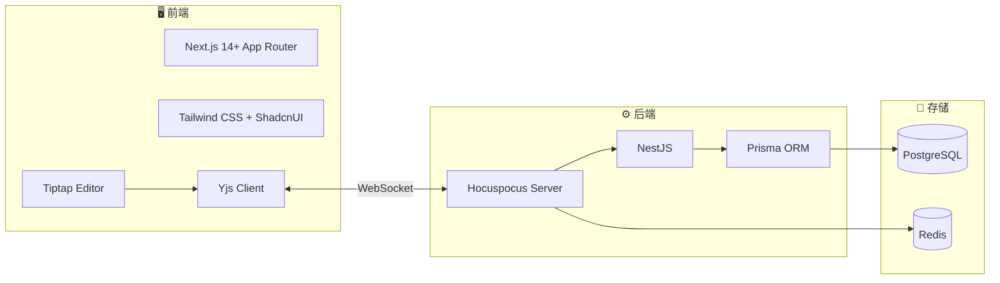

| 层级 | 技术 | 选型理由 |
|------|------|----------|
| **前端框架** | Next.js 14+ (App Router) | RSC 支持，文档详情页 SSR 渲染 |
| **UI 组件** | Tailwind CSS + ShadcnUI | 现代化交互，AI 生成友好 |
| **编辑器内核** | Tiptap (ProseMirror) | 无头编辑器，与 Yjs 深度集成 |
| **协同引擎** | Yjs (CRDT - YATA 算法) | 最强最终一致性方案，无需手动处理冲突 |
| **后端框架** | NestJS | 模块化架构，TypeScript 原生支持 |
| **协同中继** | Hocuspocus | Tiptap 官方 Yjs 协同服务，钩子式开发 |
| **ORM** | Prisma | 类型安全，AI 识别 Schema 效果最佳 |
| **主存储** | PostgreSQL (BYTEA) | 二进制存储 Yjs 文档，版本回溯基石 |
| **缓存/消息** | Redis | WebSocket 扩展与消息总线 |

> **选型原则**：同构 TypeScript、黑盒化一致性、类型安全。

---

## 系统架构

### 整体架构图

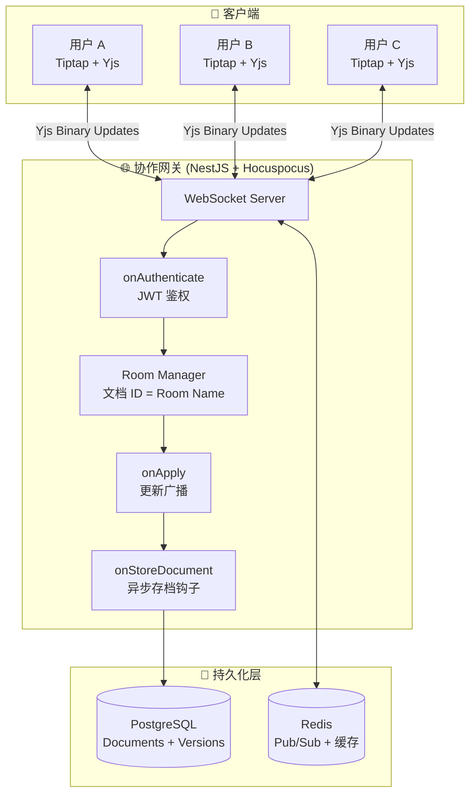

### 协作网关 (The Hub)

Hocuspocus 作为 WebSocket 网关集成在 NestJS 中，提供以下核心钩子：

| 钩子 | 职责 | 说明 |
|------|------|------|
| `onAuthenticate` | 鉴权 | 校验 JWT，判断用户读/写权限 |
| `onConnect` | 连接管理 | 用户加入房间，初始化 Awareness |
| `onApply` | 更新处理 | 接收并广播 Yjs 二进制 Update |
| `onStoreDocument` | 持久化 | 将 Yjs 副本以 BYTEA 存入 PostgreSQL |
| `onDisconnect` | 断连清理 | 清除用户 Awareness 状态 |

**房间管理**：以 `documentId` 作为 Room Name，实现文档间的物理隔离。

### 数据流向 (Data Pipeline)

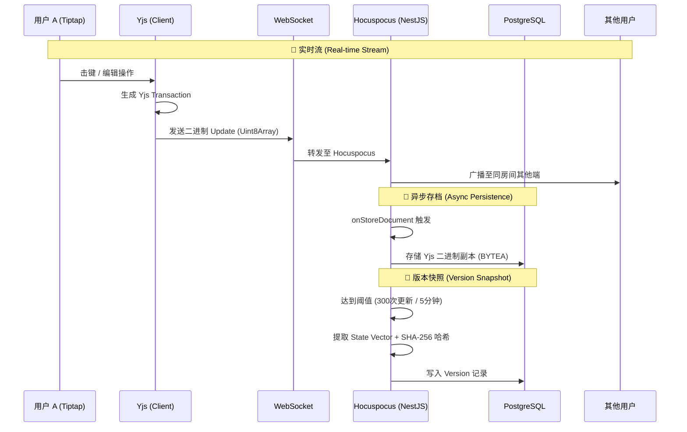

---

## 协同算法核心

### CRDT 与 Yjs

> **核心原则：100% 信任 Yjs 的 YATA 算法，无需手动处理冲突。**

Yjs 采用 CRDT（无冲突复制数据类型）中的 YATA 算法，保证：

- **最终一致性**：无论操作到达顺序如何，所有客户端最终收敛到相同状态
- **意图保留**：通过 Tiptap 的 Collaboration 扩展，加粗、链接等样式在并发编辑时不会出现"索引漂移"
- **离线支持**：断网期间的操作会在重连后自动合并

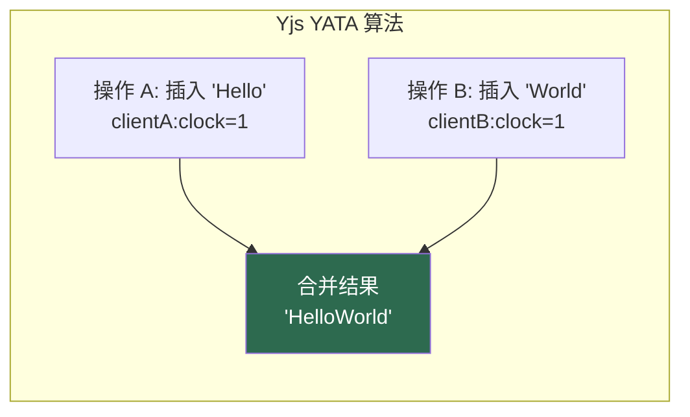

### 用户感知 (Awareness)

Awareness 协议独立于文档同步，用于传递"非持久化"的协作状态：

| 功能 | 实现方式 |
|------|----------|
| 🖱️ 实时光标 | 广播光标位置坐标，前端渲染彩色光标 |
| 🔲 选区高亮 | 同步选中区域，以半透明色块展示 |
| 👤 协作者头像 | 在文档顶部展示当前在线用户列表 |

---

## 版本管理系统

> 在 CRDT 体系下，版本不再是简单的文件快照，而是 **DAG（有向无环图）** 中的特定状态点。这是一种基于"数学参考点"而非"物理快照"的版本管理方式，能极大降低存储压力（一个版本记录仅需几十字节），且能完美处理高并发下的版本回溯冲突。

### 核心逻辑：状态向量哈希

> 在 Git 中，哈希值基于文件内容；但在 Yjs/CRDT 中，最稳定且能唯一标识版本的"指纹"是 **状态向量 (State Vector)**。

**状态向量哈希**：状态向量记录了每个客户端 (`clientID`) 已处理到的逻辑时钟 (`clock`)。将这个 Map 对象（例如 `{ clientA: 105, clientB: 42 }`）进行 SHA-256 哈希，即可生成一个类似于 Git Commit ID 的哈希值。

**为什么这样做？** 状态向量不随内容格式变化而变化，它是数学上的"一致性坐标"。只要两个客户端的状态向量一致，其文档内容必然一致。

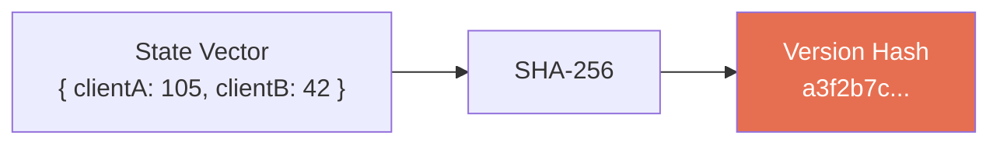

**与 Git 的对比：**

| 维度 | Git | 本系统 (Yjs CRDT) |
|------|-----|-------------------|
| 哈希来源 | 文件内容 | 状态向量 (State Vector) |
| 版本结构 | 线性链表 / 分支树 | DAG (有向无环图) |
| 冲突处理 | 手动 Merge | 自动收敛 (YATA) |
| 存储开销 | 完整快照 / Delta | 几十字节状态向量 |
| 回退方式 | 物理重置 HEAD 指针 | 生成逆向 Update 包 |

### 编辑器状态机

系统维护三种编辑器状态，控制前端的展示与交互行为：

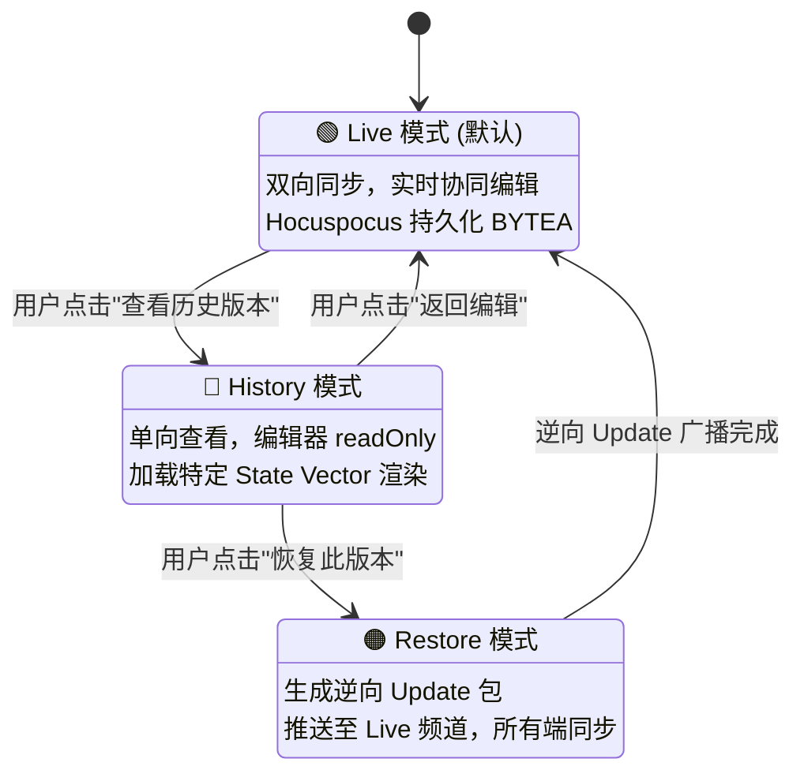

**各状态详解：**

| 状态 | 行为 | 数据流 | 编辑器 |
|------|------|--------|--------|
| **Live** | 双向同步 | Tiptap 事务 → Yjs Updates → 广播 | 可编辑 |
| **History** | 单向查看 | 加载历史 State Vector → 渲染快照 | `readOnly` |
| **Restore** | 逆向回退 | 计算差异 → 生成逆向 Update → 推送 Live | 自动切换 |

> **关键点**：在分布式系统中，不能像 Git 那样物理"重置"指针，而是要生成一条"回到过去"的新指令。计算 `TargetSnapshot` 与 `CurrentState` 的差异，生成逆向 Update 包并推送到 Live 频道，所有在线协作者会同步看到文档"变回了过去的样子"，且历史链条保持连续性。

### 版本回溯流程

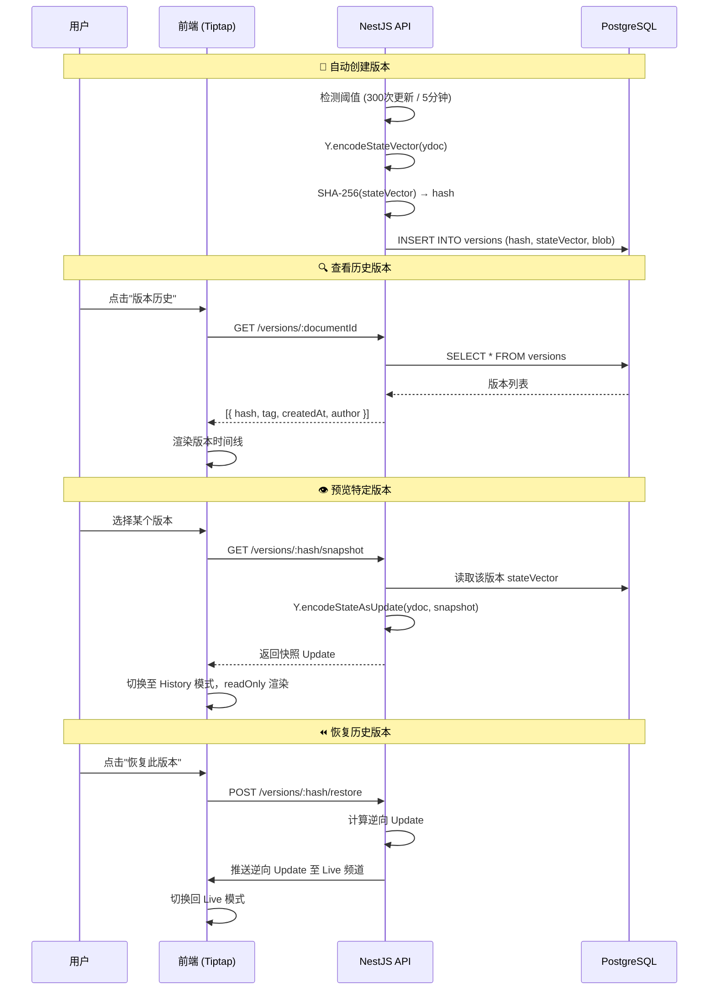

### 可视化差异比对

使用 Tiptap 的 `SnapshotCompare` 扩展实现块级别的可视化 Diff：

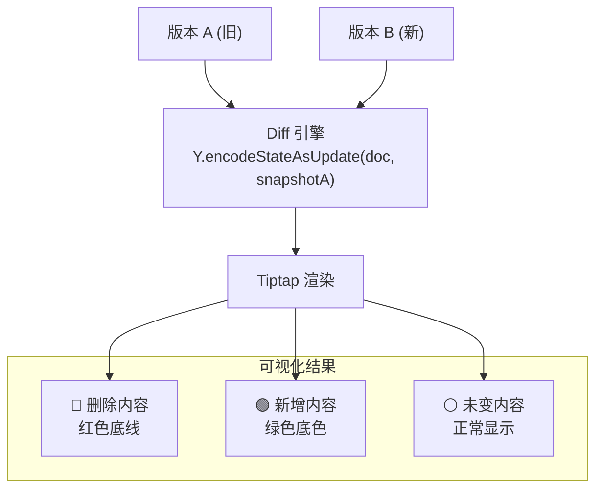

**块级别比对**：由于每个块都有唯一的 UUID（通过 Tiptap 的 `UniqueID` 扩展），回退版本时块的 ID 保持不变，仅内容和属性还原，避免了 React 列表渲染时的 Key 冲突。

---

## 数据模型设计

### ER 关系图

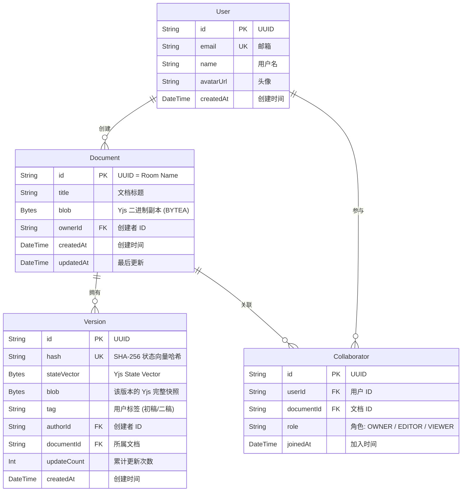

### Prisma Schema 概览

```prisma prisma/schema.prisma
model Document {
  id        String   @id @default(uuid())
  title     String   @default("Untitled")
  blob      Bytes    // Yjs 二进制副本 (BYTEA)
  ownerId   String
  owner     User     @relation(fields: [ownerId], references: [id])
  versions  Version[]
  collaborators Collaborator[]
  createdAt DateTime @default(now())
  updatedAt DateTime @updatedAt
}

model Version {
  id          String   @id @default(uuid())
  hash        String   @unique // SHA-256(stateVector)
  stateVector Bytes    // Yjs State Vector
  blob        Bytes    // 该版本完整快照
  tag         String?  // 用户自定义标签
  authorId    String
  documentId  String
  document    Document @relation(fields: [documentId], references: [id])
  updateCount Int      @default(0)
  createdAt   DateTime @default(now())
}

model Collaborator {
  id         String   @id @default(uuid())
  userId     String
  documentId String
  role       Role     @default(EDITOR)
  user       User     @relation(fields: [userId], references: [id])
  document   Document @relation(fields: [documentId], references: [id])
  joinedAt   DateTime @default(now())

  @@unique([userId, documentId])
}

enum Role {
  OWNER
  EDITOR
  VIEWER
}
```

> **关键设计**：`Document.blob` 存储 Yjs 的实时二进制副本，`Version.blob` 存储版本快照。**绝不存储 HTML 字符串**，否则版本回溯会变成灾难。

---

## 富文本分块与组件化

### 文档模型

放弃传统 HTML 存储，采用 **JSON Tree** 作为文档模型：

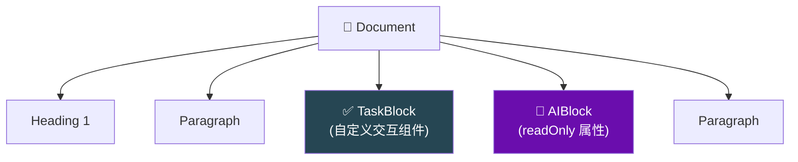

### 自定义节点

| 节点类型 | 说明 | 特殊属性 |
|----------|------|----------|
| **TaskBlock** | 独立交互式任务组件 | `checked`, `assignee` |
| **AIBlock** | AI 生成内容块 | `readOnly: true`，生成期间禁止手动修改 |
| **标准节点** | Heading / Paragraph / List 等 | Tiptap 内置 |

### 三层架构

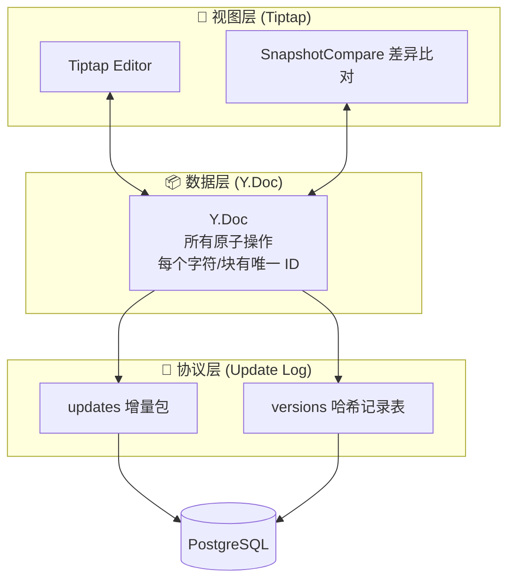

### 组件化渲染策略

- **文档详情页**：使用 Next.js 的 React Server Components (RSC) 渲染，减少客户端 JS 体积
- **编辑区**：仅在编辑区域开启客户端 Hydration，挂载 Tiptap 实例
- **历史预览**：`readOnly` 模式，无需 WebSocket 连接

---

## 工程化设计

### Monorepo 结构

```
collab-docs/
├── apps/
│   ├── web/                    # Next.js 14+ 前端
│   │   ├── app/
│   │   │   ├── (auth)/         # 登录/注册
│   │   │   ├── documents/      # 文档列表
│   │   │   ├── editor/[id]/    # 编辑器页面
│   │   │   └── api/            # Next.js API Routes
│   │   ├── components/
│   │   │   ├── editor/         # Tiptap 编辑器组件
│   │   │   ├── version/        # 版本历史 UI
│   │   │   └── ui/             # ShadcnUI 组件
│   │   └── lib/
│   │       ├── yjs/            # Yjs 客户端配置
│   │       └── awareness/      # Awareness 协议
│   │
│   └── server/                 # NestJS 后端
│       ├── src/
│       │   ├── auth/           # 认证模块 (JWT)
│       │   ├── document/       # 文档 CRUD 模块
│       │   ├── collaboration/  # Hocuspocus 网关模块
│       │   ├── version/        # 版本管理模块
│       │   └── prisma/         # Prisma 服务模块
│       └── prisma/
│           └── schema.prisma
│
├── packages/
│   └── shared/                 # 共享类型定义
│       ├── dto/                # 数据传输对象
│       └── types/              # 通用类型
│
├── docker-compose.yml          # PostgreSQL + Redis
├── pnpm-workspace.yaml
├── .cursorrules                # AI 开发规范
└── README.md
```

### 环境配置

```yaml docker-compose.yml
version: '3.8'
services:
  postgres:
    image: postgres:16-alpine
    environment:
      POSTGRES_DB: collab_docs
      POSTGRES_USER: dev
      POSTGRES_PASSWORD: dev_password
    ports:
      - "5432:5432"
    volumes:
      - pgdata:/var/lib/postgresql/data

  redis:
    image: redis:7-alpine
    ports:
      - "6379:6379"

volumes:
  pgdata:
```

### .cursorrules 要点

```text .cursorrules
- 使用 NestJS 官方推荐的模块化结构 (Module / Controller / Service)
- Prisma 类型通过 @prisma/client 自动导出，禁止手动定义重复类型
- 所有 DTO 放在 packages/shared/dto 中，前后端共享
- Yjs 二进制数据使用 Uint8Array 类型，数据库使用 BYTEA 存储
- WebSocket 网关统一使用 Hocuspocus 钩子，禁止手写底层协议
- 版本哈希使用 SHA-256(stateVector)，禁止基于内容哈希
```

---

## 开发排期

> **总周期：4 周 / 1 个月极速版**，排期前重后轻。

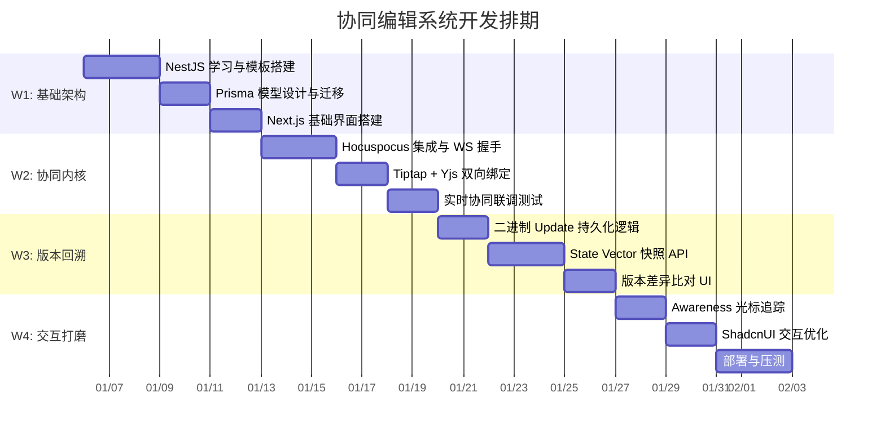

| 阶段 | 周期 | 核心任务 | Vibe 重点 |
|------|------|----------|-----------|
| **W1: 基础架构** | 7 天 | NestJS Module/Controller/Service 模板；Prisma 模型；Next.js 基础界面 | 学习成本期，大量使用 AI 生成模板 |
| **W2: 协同内核** | 7 天 | Hocuspocus + Yjs 集成；WebSocket 网关握手；Tiptap 实时双向绑定 | 攻坚期，核心功能落地 |
| **W3: 版本回溯** | 7 天 | 二进制 Update 持久化；Yjs Snapshot API；版本差异比对 UI | 逻辑期，算法实现 |
| **W4: 交互打磨** | 7 天 | Awareness 光标追踪；ShadcnUI 现代交互；部署至 Vercel/Docker 并压测 | 体验期，产品化 |

---

## Vibe Coding 提效指南

### 核心原则

> **不要自己写 WebSocket 协议。** 直接用 Hocuspocus——它把 Yjs 的二进制同步封装成了简单的钩子（`onConnect`, `onApply`, `onStoreDocument`），你只需要写业务逻辑。

> **二进制存取。** PostgreSQL 的 `BYTEA` 类型是存储 Yjs 文档的最佳方式，**千万不要存 HTML 字符串**，否则版本回溯会变成一场灾难。

### AI 提示词参考

**基础架构搭建：**
```
请按照 NestJS 官方推荐的模块化结构，为我生成一个处理文档同步的 Gateway，
集成 Hocuspocus 库，并连接我已有的权限守卫。
```

**存储逻辑：**
```
请在 NestJS 中使用 Prisma 建立两个模型：Document 存二进制 blob，Version 存 stateVector。
当 Hocuspocus 触发 onStoreDocument 且达到 50 次更新时，请帮我实现一个逻辑：
提取当前 Y.Doc 的状态向量，计算 SHA-256 哈希，并将其作为一个新版本记录到 Version 表中。
```

**版本回退逻辑：**
```
我需要一个功能：给出一个版本的哈希值，从数据库读取其 stateVector，
然后利用 Yjs 的 encodeStateAsUpdate 函数生成该版本的快照。
请写一个前端函数，让我的 Tiptap 编辑器临时显示这个快照内容而不影响远程数据库。
```

**差异比对：**
```
这是 Yjs 的文档版本快照逻辑，请帮我实现一个算法，
对比两个 Uint8Array 快照并在 Tiptap 中高亮差异。
```

---

## 附录：关键概念速查

| 概念 | 解释 |
|------|------|
| **CRDT** | 无冲突复制数据类型，保证分布式环境下数据最终一致 |
| **YATA** | Yjs 使用的 CRDT 算法，专为文本协同优化 |
| **State Vector** | 记录每个客户端已处理到的逻辑时钟，是版本的"数学坐标" |
| **Awareness** | 独立于文档的协作状态协议（光标、选区、在线状态） |
| **Hocuspocus** | Tiptap 官方的 Yjs WebSocket 服务端，钩子式 API |
| **BYTEA** | PostgreSQL 的二进制数据类型，用于存储 Yjs 文档 |
| **DAG** | 有向无环图，CRDT 版本历史的组织结构 |

---

<p align="center">
  <em>Built with 💜 Vibe Coding — AI-Assisted Development</em>
</p>