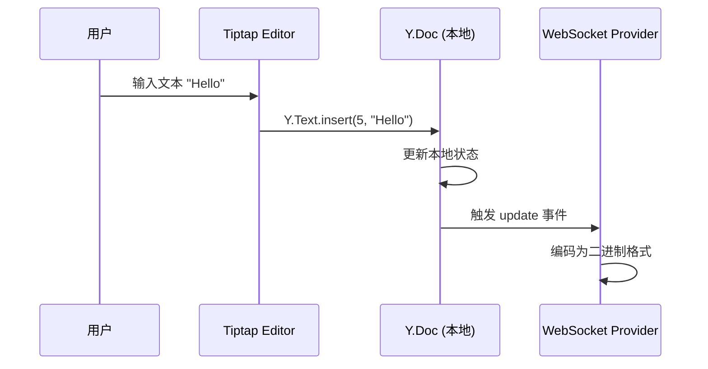
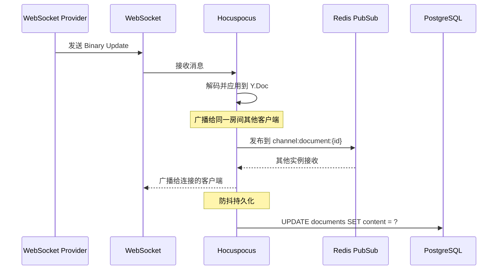
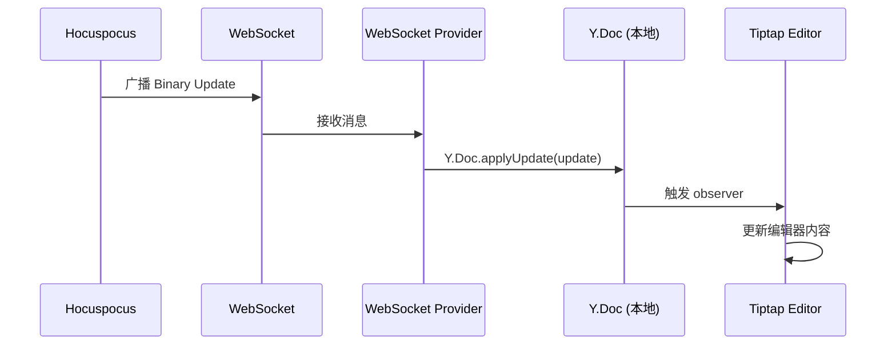
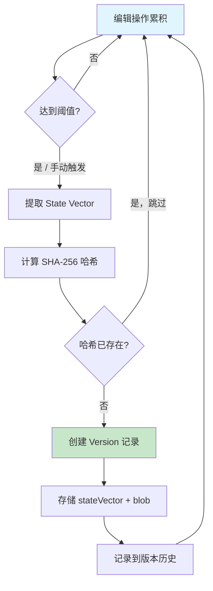
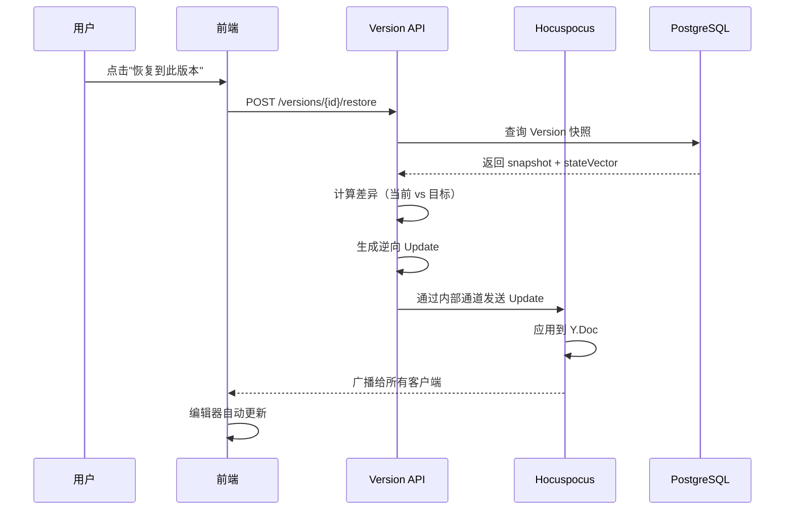
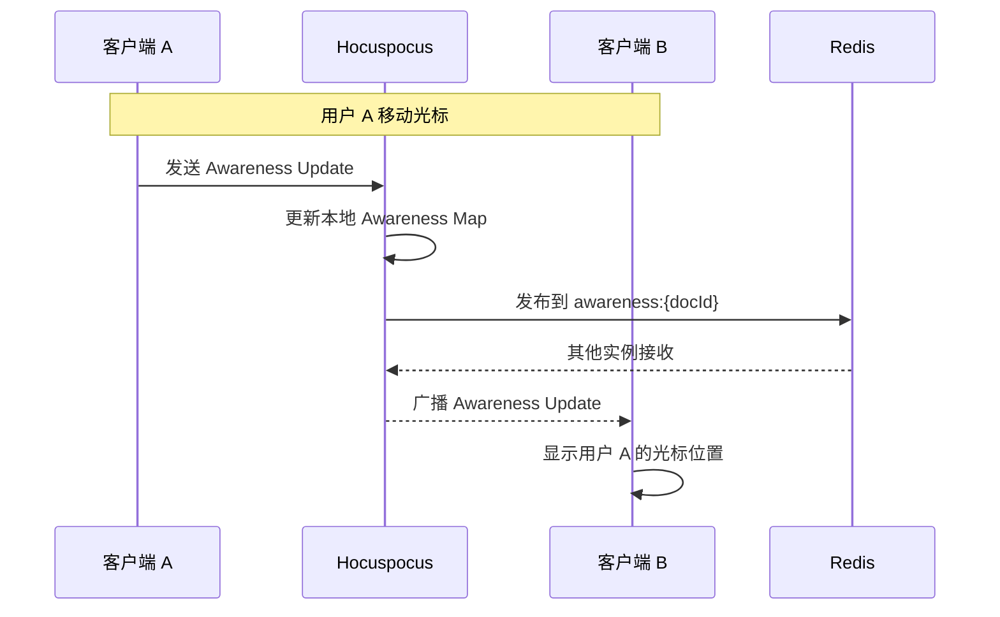
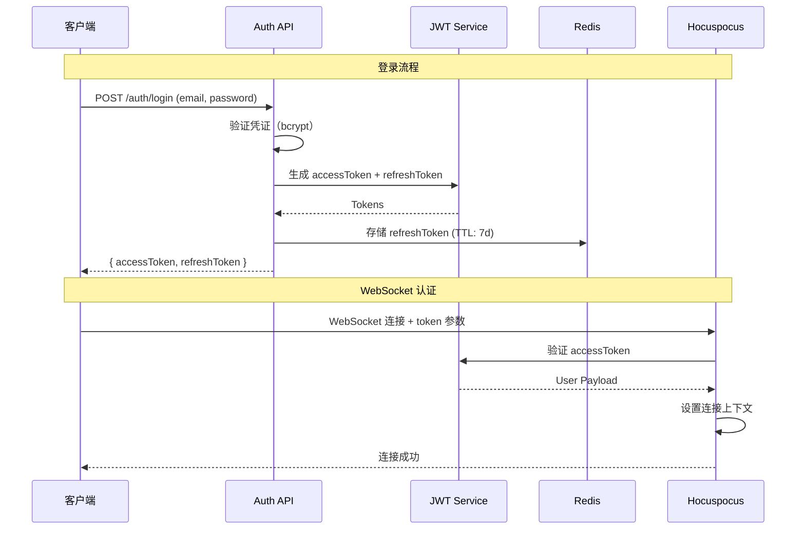
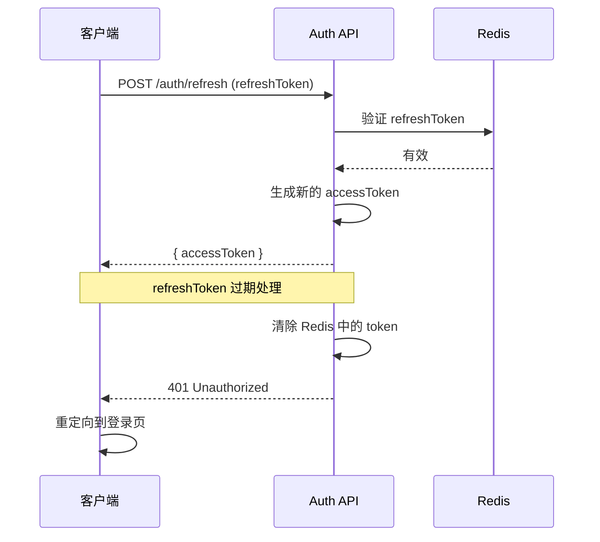
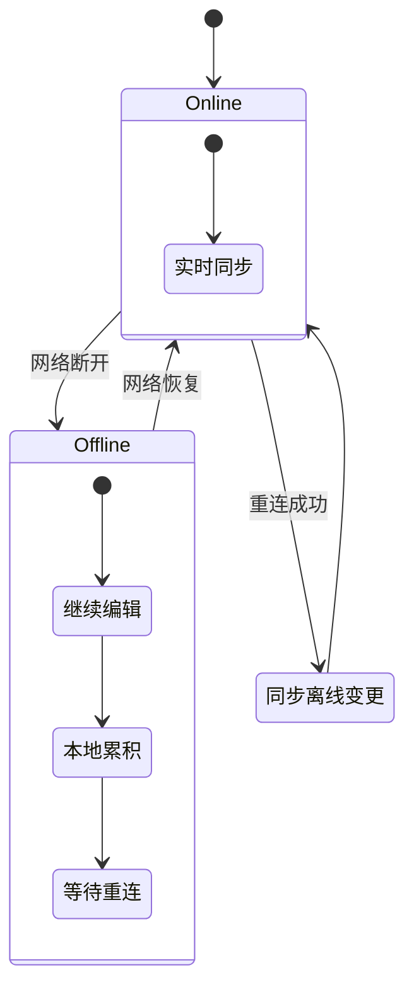

# 数据流向设计

## 概述

本文档描述协同文档编辑系统中数据的流动方式，包括：

- 客户端与服务端的同步流程
- Yjs 更新的传播机制
- 版本快照的创建与恢复
- Awareness 状态的广播

## 数据流总览

```
┌─────────────────────────────────────────────────────────────────────┐
│                          数据流向图                                  │
├─────────────────────────────────────────────────────────────────────┤
│                                                                     │
│  用户输入                                                            │
│     │                                                               │
│     ▼                                                               │
│  ┌──────┐    ┌──────────┐    ┌─────────────┐    ┌──────────┐      │
│  │Tiptap│───▶│ Y.Doc    │───▶│ WebSocket   │───▶│Hocuspocus│      │
│  │Editor│    │(本地状态) │    │ Provider    │    │  Server  │      │
│  └──────┘    └──────────┘    └─────────────┘    └──────────┘      │
│     │                                                 │            │
│     │              ┌──────────────────────────────────┘            │
│     │              │                                               │
│     │              ▼                                               │
│     │        ┌──────────┐    ┌──────────┐    ┌──────────┐        │
│     │        │  Redis   │◀──▶│PostgreSQL│    │  其他    │        │
│     │        │ (PubSub) │    │ (持久化) │    │  客户端  │        │
│     │        └──────────┘    └──────────┘    └──────────┘        │
│     │              │                           │                  │
│     └──────────────┴───────────────────────────┘                  │
│                  UI 更新（通过 Yjs 观察者）                         │
│                                                                     │
└─────────────────────────────────────────────────────────────────────┘
```

## 实时编辑数据流

### 1. 本地编辑流程



### 2. 同步到服务端



### 3. 接收远程更新



## 版本管理数据流

### 版本快照创建



### 版本恢复流程



## Awareness 数据流

### 状态广播



### Awareness 数据结构

```typescript
interface AwarenessState {
    // 用户信息
    clientId: number;
    user: {
        id: string;
        name: string;
        color: string;
        avatar?: string;
    };

    // 编辑状态
    cursor?: {
        from: number;
        to: number;
    };

    selection?: {
        from: number;
        to: number;
        anchor: number;
        head: number;
    };

    // 元数据
    isEditing: boolean;
    lastActive: number;
}
```

## 认证数据流

### JWT 认证流程



### Token 刷新



## 数据持久化策略

### 写入策略

| 场景         | 策略     | 说明               |
| ------------ | -------- | ------------------ |
| **实时编辑** | 防抖写入 | 2 秒无新变更后写入 |
| **版本快照** | 立即写入 | 用户主动创建时     |
| **用户断开** | 立即写入 | 确保数据不丢失     |
| **服务关闭** | 优雅关闭 | 等待所有写入完成   |

### 写入流程

```typescript
// Hocuspocus 钩子配置
const server = Server.configure({
    async onStoreDocument({ documentName, document, context }) {
        const state = Buffer.from(encodeStateAsUpdate(document));

        // 使用乐观锁防止并发写入
        const lockKey = `lock:document:${documentName}`;
        const acquired = await redis.set(lockKey, '1', 'PX', 5000, 'NX');

        if (!acquired) {
            // 等待锁释放或超时
            await waitForLock(lockKey, 3000);
        }

        try {
            await prisma.document.update({
                where: { id: documentName },
                data: {
                    content: state,
                    updatedAt: new Date(),
                },
            });
        } finally {
            await redis.del(lockKey);
        }
    },
});
```

## 错误处理与重试

### 客户端重试策略

```typescript
// 指数退避重连
const reconnectConfig = {
    maxRetries: 10,
    baseDelay: 1000, // 1 秒
    maxDelay: 30000, // 30 秒
    backoffFactor: 1.5,
};

function calculateDelay(attempt: number): number {
    const delay = Math.min(
        reconnectConfig.maxDelay,
        reconnectConfig.baseDelay * Math.pow(reconnectConfig.backoffFactor, attempt)
    );
    return delay + Math.random() * 1000; // 添加抖动
}
```

### 离线编辑同步



## 性能优化数据流

### 增量同步

```typescript
// 只同步差异部分
interface SyncRequest {
    documentId: string;
    clientStateVector: number[]; // 客户端已知状态
}

interface SyncResponse {
    update: Uint8Array | null; // 增量更新
    fullSync: boolean; // 是否需要全量同步
}

// 服务端逻辑
async function handleSync(request: SyncRequest): Promise<SyncResponse> {
    const document = await loadDocument(request.documentId);
    const serverStateVector = encodeStateVector(document);

    const clientSV = new Uint8Array(request.clientStateVector);

    // 检查是否需要全量同步
    if (!isStateVectorCompatible(clientSV, serverStateVector)) {
        return {
            update: encodeStateAsUpdate(document),
            fullSync: true,
        };
    }

    // 增量同步
    const diff = encodeStateAsUpdate(document, clientSV);
    return {
        update: diff,
        fullSync: false,
    };
}
```

### 压缩传输

```typescript
// 使用 zlib 压缩大更新
import { deflateSync, inflateSync } from 'zlib';

function compressUpdate(update: Uint8Array): Buffer {
    if (update.length > 1024) {
        return deflateSync(Buffer.from(update));
    }
    return Buffer.from(update);
}

function decompressUpdate(data: Buffer): Uint8Array {
    // 尝试解压，失败则返回原数据
    try {
        return inflateSync(data);
    } catch {
        return data;
    }
}
```

## 相关文档

- [协同机制总览](../05-collaboration/README.md)
- [版本管理逻辑](../04-backend/version-management.md)
- [WebSocket 网关](../04-backend/hocuspocus-gateway.md)
