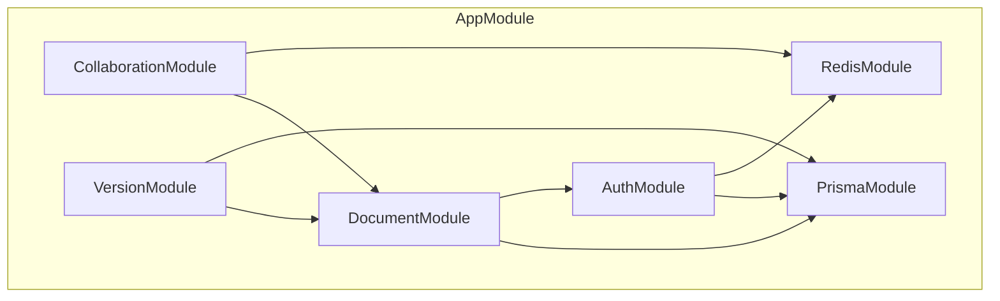

# 整体架构设计

## 系统架构图

```
┌─────────────────────────────────────────────────────────────────┐
│                        客户端层 (Client)                         │
│  ┌─────────────────────────────────────────────────────────┐   │
│  │  Next.js 15 App Router                                  │   │
│  │  ├── React Server Components (SSR)                     │   │
│  │  ├── Tiptap Editor (Client Component)                  │   │
│  │  ├── Yjs Provider (WebSocket)                          │   │
│  │  └── Awareness State Manager                           │   │
│  └─────────────────────────────────────────────────────────┘   │
└─────────────────────────────────────────────────────────────────┘
                              │ WebSocket (Yjs Binary)
                              ▼
┌─────────────────────────────────────────────────────────────────┐
│                      网关层 (Gateway)                            │
│  ┌─────────────────────────────────────────────────────────┐   │
│  │  NestJS 11 + Hocuspocus 3                               │   │
│  │  ├── onAuthenticate (JWT验证)                          │   │
│  │  ├── onConnect (房间管理)                              │   │
│  │  ├── onApply (更新广播)                                │   │
│  │  ├── onStoreDocument (持久化)                          │   │
│  │  └── onDisconnect (清理)                               │   │
│  └─────────────────────────────────────────────────────────┘   │
└─────────────────────────────────────────────────────────────────┘
                              │
                              ▼
┌─────────────────────────────────────────────────────────────────┐
│                      服务层 (Service)                            │
│  ┌──────────────┐  ┌──────────────┐  ┌──────────────┐         │
│  │ AuthService  │  │ DocService   │  │ VersionSvc   │         │
│  └──────────────┘  └──────────────┘  └──────────────┘         │
└─────────────────────────────────────────────────────────────────┘
                              │
                              ▼
┌─────────────────────────────────────────────────────────────────┐
│                      数据层 (Data)                               │
│  ┌──────────────────┐           ┌──────────────────┐          │
│  │ PostgreSQL 17    │           │ Redis 8          │          │
│  │ ├── Documents    │           │ ├── Session Cache│          │
│  │ ├── Versions     │           │ ├── Pub/Sub      │          │
│  │ └── Collaborators│           │ └── Rate Limit   │          │
│  └──────────────────┘           └──────────────────┘          │
└─────────────────────────────────────────────────────────────────┘
```

## 客户端架构

### 组件层次

```
App (Next.js App Router)
├── Layout (Server Component)
│   ├── AuthProvider (Session Management)
│   └── ThemeProvider (UI Theme)
│
└── Document Page (Server Component)
    ├── DocumentHeader (Server Component)
    │   ├── DocumentTitle
    │   ├── VersionSelector
    │   └── CollaboratorAvatars
    │
    └── Editor Container (Client Component)
        ├── CollaborationProvider (Yjs Context)
        │   ├── WebSocketProvider
        │   └── AwarenessProvider
        │
        └── TiptapEditor (Client Component)
            ├── MenuBar
            ├── EditorContent
            └── StatusBar
```

### 状态管理

```typescript
// 状态层次结构
interface AppState {
    // 服务端状态（通过 React Query / SWR）
    document: Document;
    versions: Version[];
    collaborators: Collaborator[];

    // 客户端状态（通过 Zustand）
    ui: {
        sidebarOpen: boolean;
        activeVersion: string | null;
        previewMode: boolean;
    };

    // 协同状态（通过 Yjs）
    ydoc: Y.Doc;
    awareness: Awareness;
}
```

## 网关层架构

### Hocuspocus 集成

```typescript
// hocuspocus.config.ts
import { Server } from '@hocuspocus/server';
import { Database } from '@hocuspocus/extension-database';
import { Redis } from '@hocuspocus/extension-redis';
import { Logger } from '@hocuspocus/extension-logger';

const server = Server.configure({
    port: parseInt(process.env.HOCUSPOCUS_PORT || '1234'),

    // 扩展配置
    extensions: [
        new Logger(),
        new Redis({
            host: process.env.REDIS_HOST,
            port: parseInt(process.env.REDIS_PORT || '6379'),
        }),
        new Database({
            fetch: async ({ documentName }) => {
                // 从 PostgreSQL 加载文档
                return await documentService.loadDocument(documentName);
            },
            store: async ({ documentName, state }) => {
                // 持久化到 PostgreSQL
                await documentService.saveDocument(documentName, state);
            },
        }),
    ],

    // 认证钩子
    async onAuthenticate({ token, documentName }) {
        const user = await authService.verifyToken(token);
        const hasAccess = await documentService.checkAccess(documentName, user.id);
        if (!hasAccess) {
            throw new Error('Unauthorized');
        }
        return { user };
    },

    // 连接钩子
    async onConnect({ documentName, context }) {
        await documentService.recordConnection(documentName, context.user.id);
    },

    // 断开钩子
    async onDisconnect({ documentName, context }) {
        await documentService.recordDisconnection(documentName, context.user.id);
    },
});

server.listen();
```

## 服务层架构

### 模块依赖关系



### 核心服务职责

| 服务                     | 职责                 | 关键方法                                       |
| ------------------------ | -------------------- | ---------------------------------------------- |
| **AuthService**          | 用户认证、Token 管理 | `login()`, `verifyToken()`, `refreshToken()`   |
| **DocumentService**      | 文档 CRUD、权限检查  | `create()`, `loadDocument()`, `saveDocument()` |
| **VersionService**       | 版本快照、回溯       | `createSnapshot()`, `restore()`, `diff()`      |
| **CollaborationService** | 协作者管理           | `joinRoom()`, `leaveRoom()`, `getAwareness()`  |

## 数据层架构

### PostgreSQL Schema

```prisma
// prisma/schema.prisma

model User {
  id        String   @id @default(cuid())
  email     String   @unique
  password  String
  name      String?
  createdAt DateTime @default(now())
  updatedAt DateTime @updatedAt

  documents     Document[]
  collaborations Collaborator[]
}

model Document {
  id          String   @id @default(cuid())
  title       String
  content     Bytes?   // Yjs 二进制状态
  ownerId     String
  owner       User     @relation(fields: [ownerId], references: [id])
  createdAt   DateTime @default(now())
  updatedAt   DateTime @updatedAt

  collaborators Collaborator[]
  versions      Version[]
}

model Collaborator {
  id         String   @id @default(cuid())
  documentId String
  document   Document @relation(fields: [documentId], references: [id])
  userId     String
  user       User     @relation(fields: [userId], references: [id])
  role       Role     @default(VIEWER)

  @@unique([documentId, userId])
}

model Version {
  id          String   @id @default(cuid())
  documentId  String
  document    Document @relation(fields: [documentId], references: [id])
  snapshot    Bytes    // Yjs 快照
  stateVector Bytes    // 状态向量
  hash        String   @unique // SHA-256
  message     String?  // 版本描述
  creatorId   String
  createdAt   DateTime @default(now())
}

enum Role {
  OWNER
  EDITOR
  VIEWER
}
```

### Redis 数据结构

```
# 会话缓存
session:{userId} -> JSON.stringify(userSession)
TTL: 7 days

# 文档锁（版本创建时）
lock:document:{documentId}:version -> 1
TTL: 30 seconds

# 在线用户
awareness:{documentId} -> Set<{userId, cursor, selection}>

# Pub/Sub 频道
channel:document:{documentId} -> Yjs Updates
```

## 水平扩展设计

### 多实例部署

```
                    ┌─────────────────┐
                    │   Load Balancer │
                    │   (Nginx/ALB)   │
                    └────────┬────────┘
                             │
              ┌──────────────┼──────────────┐
              │              │              │
              ▼              ▼              ▼
        ┌─────────┐    ┌─────────┐    ┌─────────┐
        │ Node 1  │    │ Node 2  │    │ Node 3  │
        │Hocuspocus│   │Hocuspocus│   │Hocuspocus│
        └────┬────┘    └────┬────┘    └────┬────┘
             │              │              │
             └──────────────┼──────────────┘
                            │
                    ┌───────┴───────┐
                    │               │
                    ▼               ▼
              ┌──────────┐   ┌──────────┐
              │PostgreSQL│   │  Redis   │
              │  (Primary)│   │(Pub/Sub) │
              └──────────┘   └──────────┘
```

### Redis Pub/Sub 同步

```typescript
// 跨实例消息同步
redis.subscribe('channel:document:*', (message) => {
    const { documentId, update } = JSON.parse(message);
    // 广播给本实例的所有连接客户端
    broadcastToLocalClients(documentId, update);
});
```

## 故障恢复设计

### 客户端重连

```typescript
// y-websocket 重连策略
const provider = new WebsocketProvider('wss://collab.example.com', documentId, ydoc, {
    connect: true,
    maxBackoffTime: 30000, // 最大退避时间
    backoffFactor: 1.5,
});

provider.on('status', (event) => {
    if (event.status === 'disconnected') {
        // 显示离线提示
        // 本地编辑继续
    }
    if (event.status === 'connected') {
        // 同步离线期间的变更
    }
});
```

### 服务端恢复

- **无状态设计**：Hocuspocus 实例无本地状态
- **数据持久化**：每次变更后立即写入 PostgreSQL
- **Redis 主从**：配置 Redis Sentinel 实现高可用

## 相关文档

- [数据流向设计](./data-flow.md)
- [安全设计](../02-security/README.md)
- [部署架构](../06-deployment/README.md)
