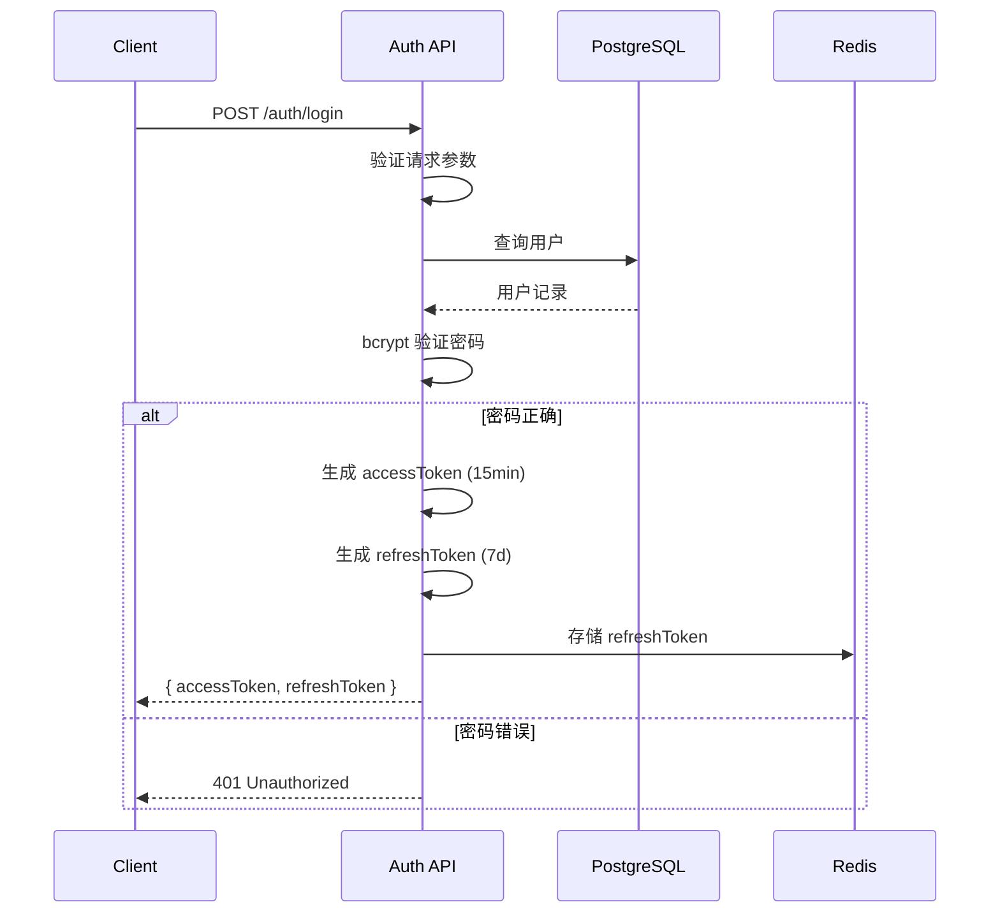
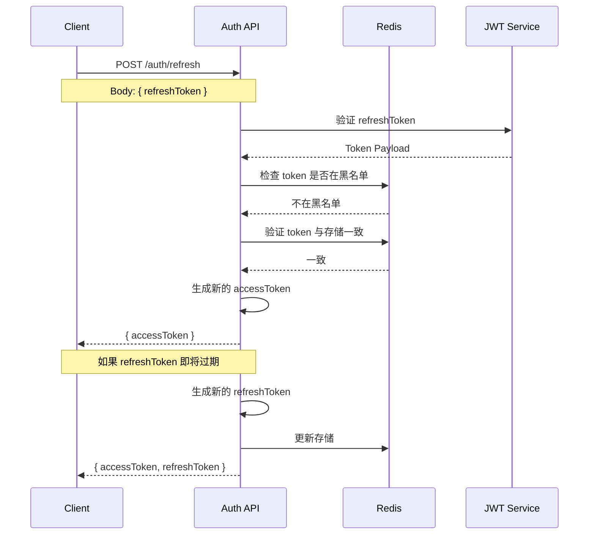

# JWT 认证机制

## 概述

本系统使用 **JWT（JSON Web Token）** 实现无状态认证，配合 **Refresh Token** 机制实现安全的会话管理。

## 认证流程

### 登录流程



### Token 结构

#### Access Token

```json
{
  "header": {
    "alg": "HS256",
    "typ": "JWT"
  },
  "payload": {
    "sub": "user_123",
    "email": "user@example.com",
    "name": "John Doe",
    "role": "user",
    "iat": 1709827200,
    "exp": 1709828100
  },
  "signature": "..."
}
```

#### Refresh Token

```json
{
  "payload": {
    "sub": "user_123",
    "type": "refresh",
    "iat": 1709827200,
    "exp": 1710432000
  }
}
```

### Token 刷新流程



## WebSocket 认证

### 连接认证

```typescript
// 客户端
const wsProvider = new WebsocketProvider(
  'wss://collab.example.com',
  documentId,
  ydoc,
  {
    params: {
      token: accessToken,  // 通过 URL 参数传递
    },
  }
);

// 或通过首次消息传递
wsProvider.on('open', () => {
  wsProvider.send({
    type: 'auth',
    token: accessToken,
  });
});
```

### 服务端验证

```typescript
// Hocuspocus 配置
const server = Server.configure({
  async onAuthenticate({ token, documentName }) {
    if (!token) {
      throw new Error('Token required');
    }

    try {
      const payload = await jwtService.verifyAsync(token);

      // 检查 token 是否在黑名单
      const isBlacklisted = await redis.get(`blacklist:${token}`);
      if (isBlacklisted) {
        throw new Error('Token revoked');
      }

      // 检查文档访问权限
      const hasAccess = await documentService.checkAccess(
        documentName,
        payload.sub
      );

      if (!hasAccess) {
        throw new Error('Access denied');
      }

      return {
        user: {
          id: payload.sub,
          email: payload.email,
          name: payload.name,
        },
      };
    } catch (error) {
      throw new Error('Invalid token');
    }
  },
});
```

## 代码实现

### NestJS Auth Module

```typescript
// auth/auth.module.ts
import { Module } from '@nestjs/common';
import { JwtModule } from '@nestjs/jwt';
import { PassportModule } from '@nestjs/passport';
import { AuthService } from './auth.service';
import { AuthController } from './auth.controller';
import { JwtStrategy } from './strategies/jwt.strategy';
import { PrismaModule } from '../prisma/prisma.module';
import { RedisModule } from '../redis/redis.module';

@Module({
  imports: [
    PrismaModule,
    RedisModule,
    PassportModule.register({ defaultStrategy: 'jwt' }),
    JwtModule.registerAsync({
      useFactory: () => ({
        secret: process.env.JWT_SECRET,
        signOptions: {
          expiresIn: process.env.JWT_EXPIRES_IN || '15m',
        },
      }),
    }),
  ],
  controllers: [AuthController],
  providers: [AuthService, JwtStrategy],
  exports: [AuthService, JwtModule],
})
export class AuthModule {}
```

### Auth Service

```typescript
// auth/auth.service.ts
import { Injectable, UnauthorizedException } from '@nestjs/common';
import { JwtService } from '@nestjs/jwt';
import { PrismaService } from '../prisma/prisma.service';
import { RedisService } from '../redis/redis.service';
import * as bcrypt from 'bcrypt';

@Injectable()
export class AuthService {
  constructor(
    private prisma: PrismaService,
    private jwtService: JwtService,
    private redis: RedisService,
  ) {}

  async login(email: string, password: string) {
    const user = await this.prisma.user.findUnique({
      where: { email },
    });

    if (!user) {
      throw new UnauthorizedException('Invalid credentials');
    }

    const isPasswordValid = await bcrypt.compare(password, user.password);
    if (!isPasswordValid) {
      throw new UnauthorizedException('Invalid credentials');
    }

    const tokens = await this.generateTokens(user.id, user.email, user.name);

    // 存储 refresh token
    await this.redis.set(
      `refresh:${user.id}`,
      tokens.refreshToken,
      'EX',
      7 * 24 * 60 * 60, // 7 天
    );

    return tokens;
  }

  async refresh(refreshToken: string) {
    try {
      const payload = await this.jwtService.verifyAsync(refreshToken);

      if (payload.type !== 'refresh') {
        throw new UnauthorizedException('Invalid token type');
      }

      // 验证 token 是否与存储一致
      const storedToken = await this.redis.get(`refresh:${payload.sub}`);
      if (storedToken !== refreshToken) {
        throw new UnauthorizedException('Token mismatch');
      }

      const user = await this.prisma.user.findUnique({
        where: { id: payload.sub },
      });

      if (!user) {
        throw new UnauthorizedException('User not found');
      }

      return this.generateTokens(user.id, user.email, user.name);
    } catch (error) {
      throw new UnauthorizedException('Invalid refresh token');
    }
  }

  async logout(userId: string, token: string) {
    // 将当前 access token 加入黑名单
    const payload = this.jwtService.decode(token) as any;
    const ttl = payload.exp - Math.floor(Date.now() / 1000);

    if (ttl > 0) {
      await this.redis.set(`blacklist:${token}`, '1', 'EX', ttl);
    }

    // 删除 refresh token
    await this.redis.del(`refresh:${userId}`);
  }

  private async generateTokens(userId: string, email: string, name: string) {
    const accessToken = this.jwtService.sign({
      sub: userId,
      email,
      name,
    });

    const refreshToken = this.jwtService.sign(
      {
        sub: userId,
        type: 'refresh',
      },
      {
        expiresIn: process.env.REFRESH_TOKEN_EXPIRES_IN || '7d',
      },
    );

    return { accessToken, refreshToken };
  }
}
```

### Auth Controller

```typescript
// auth/auth.controller.ts
import { Controller, Post, Body, UseGuards, Req } from '@nestjs/common';
import { AuthService } from './auth.service';
import { JwtAuthGuard } from './guards/jwt-auth.guard';

@Controller('auth')
export class AuthController {
  constructor(private authService: AuthService) {}

  @Post('login')
  async login(@Body() loginDto: { email: string; password: string }) {
    return this.authService.login(loginDto.email, loginDto.password);
  }

  @Post('refresh')
  async refresh(@Body('refreshToken') refreshToken: string) {
    return this.authService.refresh(refreshToken);
  }

  @UseGuards(JwtAuthGuard)
  @Post('logout')
  async logout(@Req() req: any) {
    const token = req.headers.authorization?.replace('Bearer ', '');
    await this.authService.logout(req.user.sub, token);
    return { message: 'Logged out successfully' };
  }
}
```

### JWT Strategy

```typescript
// auth/strategies/jwt.strategy.ts
import { Injectable, UnauthorizedException } from '@nestjs/common';
import { PassportStrategy } from '@nestjs/passport';
import { ExtractJwt, Strategy } from 'passport-jwt';
import { RedisService } from '../../redis/redis.service';

@Injectable()
export class JwtStrategy extends PassportStrategy(Strategy) {
  constructor(private redis: RedisService) {
    super({
      jwtFromRequest: ExtractJwt.fromAuthHeaderAsBearerToken(),
      ignoreExpiration: false,
      secretOrKey: process.env.JWT_SECRET,
    });
  }

  async validate(payload: any) {
    return {
      id: payload.sub,
      email: payload.email,
      name: payload.name,
    };
  }
}
```

## 前端集成

### Token 存储

```typescript
// lib/auth/token.ts
const ACCESS_TOKEN_KEY = 'access_token';
const REFRESH_TOKEN_KEY = 'refresh_token';

export function storeTokens(accessToken: string, refreshToken: string) {
  // Access token 可以存内存或 sessionStorage
  sessionStorage.setItem(ACCESS_TOKEN_KEY, accessToken);

  // Refresh token 建议使用 httpOnly cookie（服务端设置）
  // 如果必须前端存储，使用 localStorage（有 XSS 风险）
  localStorage.setItem(REFRESH_TOKEN_KEY, refreshToken);
}

export function getAccessToken(): string | null {
  return sessionStorage.getItem(ACCESS_TOKEN_KEY);
}

export function getRefreshToken(): string | null {
  return localStorage.getItem(REFRESH_TOKEN_KEY);
}

export function clearTokens() {
  sessionStorage.removeItem(ACCESS_TOKEN_KEY);
  localStorage.removeItem(REFRESH_TOKEN_KEY);
}
```

### 自动刷新

```typescript
// lib/auth/axios-interceptor.ts
import axios from 'axios';
import { getAccessToken, getRefreshToken, storeTokens, clearTokens } from './token';

const api = axios.create({
  baseURL: process.env.NEXT_PUBLIC_API_URL,
});

// 请求拦截器：添加 token
api.interceptors.request.use((config) => {
  const token = getAccessToken();
  if (token) {
    config.headers.Authorization = `Bearer ${token}`;
  }
  return config;
});

// 响应拦截器：处理 token 过期
let isRefreshing = false;
let failedQueue: any[] = [];

api.interceptors.response.use(
  (response) => response,
  async (error) => {
    const originalRequest = error.config;

    if (error.response?.status === 401 && !originalRequest._retry) {
      if (isRefreshing) {
        return new Promise((resolve) => {
          failedQueue.push({ resolve, config: originalRequest });
        });
      }

      originalRequest._retry = true;
      isRefreshing = true;

      try {
        const refreshToken = getRefreshToken();
        const response = await axios.post('/api/auth/refresh', {
          refreshToken,
        });

        const { accessToken, refreshToken: newRefreshToken } = response.data;
        storeTokens(accessToken, newRefreshToken);

        // 重试失败的请求
        failedQueue.forEach(({ resolve, config }) => {
          config.headers.Authorization = `Bearer ${accessToken}`;
          resolve(api(config));
        });

        return api(originalRequest);
      } catch (refreshError) {
        clearTokens();
        window.location.href = '/login';
        return Promise.reject(refreshError);
      } finally {
        isRefreshing = false;
        failedQueue = [];
      }
    }

    return Promise.reject(error);
  }
);

export default api;
```

## 安全配置

### 环境变量

```bash
# .env
JWT_SECRET=your-256-bit-secret-key-here
JWT_EXPIRES_IN=15m
REFRESH_TOKEN_EXPIRES_IN=7d
```

### 生成安全密钥

```bash
# 生成 256 位随机密钥
node -e "console.log(require('crypto').randomBytes(32).toString('base64'))"
```

## 相关文档

- [权限控制](./authorization.md)
- [安全最佳实践](./security-best-practices.md)
- [环境变量配置](../06-deployment/environment.md)
