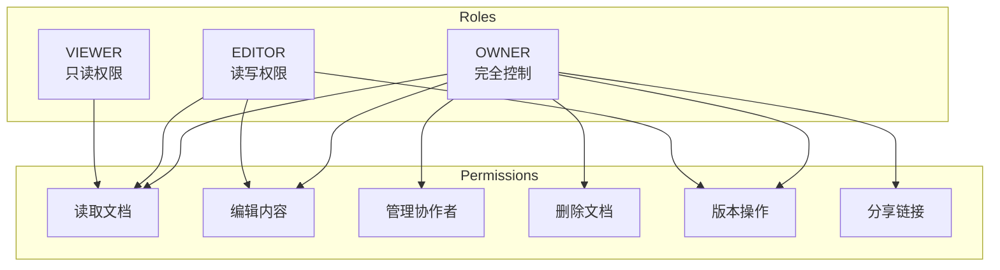

# 权限控制（RBAC）

## 概述

本系统采用 **RBAC（基于角色的访问控制）** 模型，为文档协作提供细粒度的权限管理。

## 角色定义

### 角色层级



### 权限矩阵

| 操作 | OWNER | EDITOR | VIEWER |
|------|:-----:|:------:|:------:|
| 查看文档 | ✅ | ✅ | ✅ |
| 编辑内容 | ✅ | ✅ | ❌ |
| 创建版本 | ✅ | ✅ | ❌ |
| 恢复版本 | ✅ | ✅ | ❌ |
| 邀请协作者 | ✅ | ❌ | ❌ |
| 移除协作者 | ✅ | ❌ | ❌ |
| 修改角色 | ✅ | ❌ | ❌ |
| 删除文档 | ✅ | ❌ | ❌ |
| 转移所有权 | ✅ | ❌ | ❌ |

## 数据模型

### Prisma Schema

```prisma
enum Role {
  OWNER
  EDITOR
  VIEWER
}

model Collaborator {
  id         String   @id @default(cuid())
  documentId String
  document   Document @relation(fields: [documentId], references: [id], onDelete: Cascade)
  userId     String
  user       User     @relation(fields: [userId], references: [id], onDelete: Cascade)
  role       Role     @default(VIEWER)
  createdAt  DateTime @default(now())
  updatedAt  DateTime @updatedAt

  @@unique([documentId, userId])
  @@index([userId])
}

model Document {
  id          String   @id @default(cuid())
  title       String
  content     Bytes?
  ownerId     String
  owner       User     @relation("OwnerDocuments", fields: [ownerId], references: [id])
  // ... 其他字段

  collaborators Collaborator[]
}
```

## 代码实现

### 权限守卫

```typescript
// common/guards/roles.guard.ts
import { Injectable, CanActivate, ExecutionContext } from '@nestjs/common';
import { Reflector } from '@nestjs/core';
import { RolesService } from './roles.service';

@Injectable()
export class RolesGuard implements CanActivate {
  constructor(
    private reflector: Reflector,
    private rolesService: RolesService,
  ) {}

  async canActivate(context: ExecutionContext): Promise<boolean> {
    const requiredRole = this.reflector.getAllAndOverride<string>(
      'requiredRole',
      [context.getHandler(), context.getClass()],
    );

    if (!requiredRole) {
      return true; // 无角色要求，允许访问
    }

    const request = context.switchToHttp().getRequest();
    const user = request.user;
    const documentId = request.params.documentId || request.body.documentId;

    if (!user || !documentId) {
      return false;
    }

    const userRole = await this.rolesService.getUserRole(documentId, user.id);

    return this.isRoleSufficient(userRole, requiredRole);
  }

  private isRoleSufficient(userRole: string, requiredRole: string): boolean {
    const roleHierarchy = {
      OWNER: 3,
      EDITOR: 2,
      VIEWER: 1,
    };

    return (roleHierarchy[userRole] || 0) >= (roleHierarchy[requiredRole] || 0);
  }
}
```

### 角色装饰器

```typescript
// common/decorators/roles.decorator.ts
import { SetMetadata } from '@nestjs/common';

export const RequiredRole = (role: string) => SetMetadata('requiredRole', role);
```

### 角色服务

```typescript
// roles/roles.service.ts
import { Injectable, ForbiddenException } from '@nestjs/common';
import { PrismaService } from '../prisma/prisma.service';

@Injectable()
export class RolesService {
  constructor(private prisma: PrismaService) {}

  async getUserRole(documentId: string, userId: string): Promise<string | null> {
    // 检查是否是文档所有者
    const document = await this.prisma.document.findUnique({
      where: { id: documentId },
      select: { ownerId: true },
    });

    if (document?.ownerId === userId) {
      return 'OWNER';
    }

    // 检查协作者角色
    const collaborator = await this.prisma.collaborator.findUnique({
      where: {
        documentId_userId: { documentId, userId },
      },
      select: { role: true },
    });

    return collaborator?.role || null;
  }

  async requireRole(
    documentId: string,
    userId: string,
    requiredRole: 'OWNER' | 'EDITOR' | 'VIEWER',
  ): Promise<void> {
    const userRole = await this.getUserRole(documentId, userId);

    if (!userRole) {
      throw new ForbiddenException('Access denied');
    }

    const roleHierarchy = { OWNER: 3, EDITOR: 2, VIEWER: 1 };

    if (roleHierarchy[userRole] < roleHierarchy[requiredRole]) {
      throw new ForbiddenException('Insufficient permissions');
    }
  }

  async addCollaborator(
    documentId: string,
    userId: string,
    role: 'EDITOR' | 'VIEWER',
    requesterId: string,
  ) {
    // 只有 OWNER 可以添加协作者
    await this.requireRole(documentId, requesterId, 'OWNER');

    return this.prisma.collaborator.create({
      data: {
        documentId,
        userId,
        role,
      },
    });
  }

  async updateRole(
    documentId: string,
    userId: string,
    newRole: 'OWNER' | 'EDITOR' | 'VIEWER',
    requesterId: string,
  ) {
    const requesterRole = await this.getUserRole(documentId, requesterId);

    // 只有 OWNER 可以修改角色
    if (requesterRole !== 'OWNER') {
      throw new ForbiddenException('Only owner can change roles');
    }

    // 不能修改所有者的角色
    const document = await this.prisma.document.findUnique({
      where: { id: documentId },
      select: { ownerId: true },
    });

    if (document?.ownerId === userId) {
      throw new ForbiddenException('Cannot change owner role');
    }

    return this.prisma.collaborator.update({
      where: {
        documentId_userId: { documentId, userId },
      },
      data: { role: newRole },
    });
  }

  async removeCollaborator(
    documentId: string,
    userId: string,
    requesterId: string,
  ) {
    await this.requireRole(documentId, requesterId, 'OWNER');

    return this.prisma.collaborator.delete({
      where: {
        documentId_userId: { documentId, userId },
      },
    });
  }

  async transferOwnership(
    documentId: string,
    newOwnerId: string,
    currentOwnerId: string,
  ) {
    // 验证当前用户是所有者
    const document = await this.prisma.document.findUnique({
      where: { id: documentId },
      select: { ownerId: true },
    });

    if (document?.ownerId !== currentOwnerId) {
      throw new ForbiddenException('Only owner can transfer ownership');
    }

    // 使用事务更新所有权
    return this.prisma.$transaction([
      // 更新文档所有者
      this.prisma.document.update({
        where: { id: documentId },
        data: { ownerId: newOwnerId },
      }),
      // 将原所有者添加为协作者（如果还不是）
      this.prisma.collaborator.upsert({
        where: {
          documentId_userId: { documentId, userId: currentOwnerId },
        },
        create: {
          documentId,
          userId: currentOwnerId,
          role: 'OWNER',
        },
        update: {
          role: 'OWNER',
        },
      }),
      // 更新新所有者的角色
      this.prisma.collaborator.upsert({
        where: {
          documentId_userId: { documentId, userId: newOwnerId },
        },
        create: {
          documentId,
          userId: newOwnerId,
          role: 'OWNER',
        },
        update: {
          role: 'OWNER',
        },
      }),
    ]);
  }
}
```

### 控制器使用

```typescript
// documents/documents.controller.ts
import { Controller, Get, Post, Body, Param, UseGuards } from '@nestjs/common';
import { JwtAuthGuard } from '../auth/guards/jwt-auth.guard';
import { RolesGuard } from '../common/guards/roles.guard';
import { RequiredRole } from '../common/decorators/roles.decorator';
import { CurrentUser } from '../common/decorators/current-user.decorator';

@Controller('documents')
@UseGuards(JwtAuthGuard, RolesGuard)
export class DocumentsController {
  constructor(
    private documentsService: DocumentsService,
    private rolesService: RolesService,
  ) {}

  @Get(':documentId')
  @RequiredRole('VIEWER') // 任何有访问权限的人都可以查看
  async getDocument(@Param('documentId') documentId: string) {
    return this.documentsService.findById(documentId);
  }

  @Post(':documentId/save')
  @RequiredRole('EDITOR') // 需要 EDITOR 或更高权限
  async saveDocument(
    @Param('documentId') documentId: string,
    @Body() updateDto: { content: Buffer },
  ) {
    return this.documentsService.updateContent(documentId, updateDto.content);
  }

  @Post(':documentId/versions')
  @RequiredRole('EDITOR')
  async createVersion(
    @Param('documentId') documentId: string,
    @Body() versionDto: { message?: string },
    @CurrentUser() user: any,
  ) {
    return this.documentsService.createVersion(documentId, versionDto.message, user.id);
  }

  @Post(':documentId/collaborators')
  @RequiredRole('OWNER') // 只有 OWNER 可以管理协作者
  async addCollaborator(
    @Param('documentId') documentId: string,
    @Body() collaboratorDto: { userId: string; role: 'EDITOR' | 'VIEWER' },
    @CurrentUser() user: any,
  ) {
    return this.rolesService.addCollaborator(
      documentId,
      collaboratorDto.userId,
      collaboratorDto.role,
      user.id,
    );
  }

  @Delete(':documentId')
  @RequiredRole('OWNER')
  async deleteDocument(@Param('documentId') documentId: string) {
    return this.documentsService.delete(documentId);
  }
}
```

## Hocuspocus 权限集成

```typescript
// hocuspocus.config.ts
import { Server } from '@hocuspocus/server';
import { RolesService } from './roles/roles.service';

const server = Server.configure({
  async onAuthenticate({ token, documentName }) {
    const user = await verifyToken(token);

    // 检查用户是否有任何访问权限
    const role = await rolesService.getUserRole(documentName, user.id);

    if (!role) {
      throw new Error('Access denied');
    }

    return {
      user,
      role, // 将角色信息传递给其他钩子
    };
  },

  async onChange({ documentName, context, update }) {
    // 检查是否有写权限
    if (context.role === 'VIEWER') {
      throw new Error('Read-only access');
    }
  },
});
```

## 前端权限检查

```typescript
// hooks/use-permissions.ts
import { useQuery } from '@tanstack/react-query';

interface PermissionResult {
  role: 'OWNER' | 'EDITOR' | 'VIEWER' | null;
  canRead: boolean;
  canWrite: boolean;
  canManage: boolean;
  canDelete: boolean;
}

export function usePermissions(documentId: string): PermissionResult {
  const { data } = useQuery({
    queryKey: ['permissions', documentId],
    queryFn: () => api.get(`/documents/${documentId}/permissions`),
  });

  const role = data?.role;

  return {
    role,
    canRead: !!role,
    canWrite: role === 'OWNER' || role === 'EDITOR',
    canManage: role === 'OWNER',
    canDelete: role === 'OWNER',
  };
}
```

### 条件渲染

```tsx
// components/document-toolbar.tsx
import { usePermissions } from '@/hooks/use-permissions';

export function DocumentToolbar({ documentId }: { documentId: string }) {
  const { canWrite, canManage } = usePermissions(documentId);

  return (
    <div className="flex items-center gap-2">
      {canWrite && <SaveButton />}
      {canWrite && <CreateVersionButton />}
      {canManage && <ShareButton />}
      {canManage && <SettingsButton />}
    </div>
  );
}
```

## 审计日志

```typescript
// 审计日志记录
interface AuditLog {
  id: string;
  action: string;
  documentId: string;
  userId: string;
  details: Record<string, any>;
  createdAt: Date;
}

// 记录关键操作
async function logAction(
  action: string,
  documentId: string,
  userId: string,
  details: Record<string, any> = {},
) {
  await prisma.auditLog.create({
    data: {
      action,
      documentId,
      userId,
      details,
    },
  });
}

// 使用示例
await logAction('collaborator.added', documentId, requesterId, {
  addedUserId: newCollaboratorId,
  role: 'EDITOR',
});
```

## 相关文档

- [JWT 认证机制](./authentication.md)
- [安全最佳实践](./security-best-practices.md)
- [API 接口文档](../04-backend/api-reference.md)
