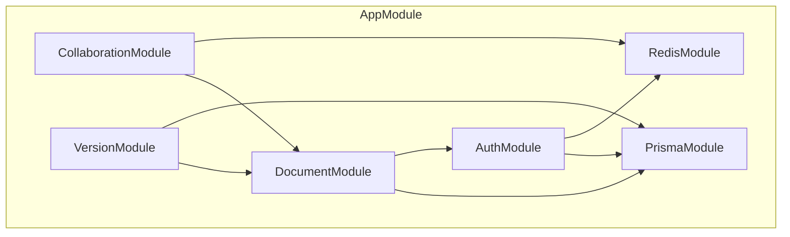

# 后端开发文档

## 概述

本文档描述协同文档编辑系统的后端架构，基于 **NestJS 11** 构建，集成 **Hocuspocus 3** 作为协同中继网关。

## 技术栈

| 技术       | 版本 | 用途        |
| ---------- | ---- | ----------- |
| NestJS     | 11+  | 后端框架    |
| Hocuspocus | 3.x  | 协同网关    |
| Prisma     | 6+   | ORM         |
| PostgreSQL | 17   | 主数据库    |
| Redis      | 8+   | 缓存/PubSub |

## 文档目录

| 文档                                             | 说明                 |
| ------------------------------------------------ | -------------------- |
| [architecture.md](./architecture.md)             | **后端架构详细设计** |
| [nestjs-modules.md](./nestjs-modules.md)         | NestJS 模块设计      |
| [hocuspocus-gateway.md](./hocuspocus-gateway.md) | Hocuspocus 网关      |
| [prisma-schema.md](./prisma-schema.md)           | 数据模型设计         |
| [version-management.md](./version-management.md) | 版本管理逻辑         |
| [api-reference.md](./api-reference.md)           | API 接口文档         |

## 项目结构

```
backend/
├── src/
│   ├── modules/                # 业务模块
│   │   ├── auth/              # 认证模块
│   │   ├── documents/         # 文档模块
│   │   ├── versions/          # 版本模块
│   │   └── collaboration/     # 协同模块
│   │
│   ├── common/                # 公共模块
│   │   ├── decorators/        # 装饰器
│   │   ├── guards/            # 守卫
│   │   ├── interceptors/      # 拦截器
│   │   ├── filters/           # 过滤器
│   │   └── pipes/             # 管道
│   │
│   ├── config/                # 配置
│   ├── prisma/                # Prisma 服务
│   ├── redis/                 # Redis 服务
│   └── hocuspocus/            # Hocuspocus 配置
│
├── prisma/
│   ├── schema.prisma          # 数据模型
│   └── migrations/            # 迁移文件
│
├── test/                      # 测试
├── .env                       # 环境变量
├── nest-cli.json              # NestJS 配置
├── tsconfig.json              # TypeScript 配置
└── package.json               # 依赖
```

## 模块设计



## API 设计原则

### RESTful API

- 使用标准 HTTP 方法
- 资源命名使用复数形式
- 版本化 API（/api/v1/）
- 统一的响应格式

### 响应格式

```typescript
// 成功响应
interface SuccessResponse<T> {
    success: true;
    data: T;
    meta?: {
        page?: number;
        limit?: number;
        total?: number;
    };
}

// 错误响应
interface ErrorResponse {
    success: false;
    error: {
        code: string;
        message: string;
        details?: Record<string, unknown>;
    };
}
```

## 相关文档

- [系统架构](../01-architecture/README.md)
- [安全设计](../02-security/README.md)
- [协同核心](../05-collaboration/README.md)
