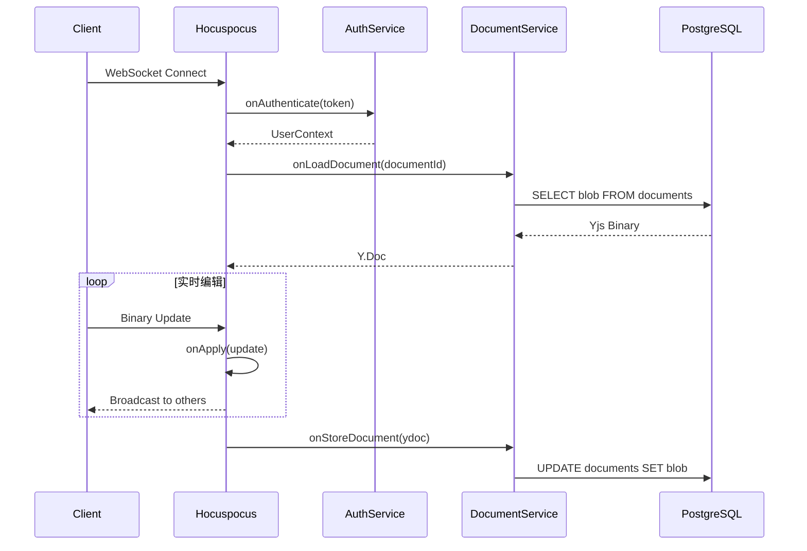

# Hocuspocus 网关

## 概述

Hocuspocus 是 Tiptap 官方的协同后端，作为 WebSocket 网关处理 Yjs 文档的实时同步。本文档描述其配置和集成方式。

## 架构位置

```
┌─────────────────────────────────────────────────────────────────┐
│                      网关层 (Gateway)                            │
│  ┌─────────────────────────────────────────────────────────┐   │
│  │  NestJS 11 + Hocuspocus 3                               │   │
│  │  ├── onAuthenticate (JWT验证)                          │   │
│  │  ├── onConnect (房间管理)                              │   │
│  │  ├── onApply (更新广播)                                │   │
│  │  ├── onStoreDocument (持久化)                          │   │
│  │  └── onDisconnect (清理)                               │   │
│  └─────────────────────────────────────────────────────────┘   │
└─────────────────────────────────────────────────────────────────┘
```

## 钩子流程



## 安装与配置

### 安装依赖

```bash
pnpm add @hocuspocus/server @hocuspocus/extension-database @hocuspocus/extension-redis @hocuspocus/extension-logger
```

### 基础配置

```typescript
// src/hocuspocus/hocuspocus.config.ts
import { Server } from '@hocuspocus/server';
import { Database } from '@hocuspocus/extension-database';
import { Redis } from '@hocuspocus/extension-redis';
import { Logger } from '@hocuspocus/extension-logger';
import { Injectable, OnModuleInit, OnModuleDestroy } from '@nestjs/common';
import { ConfigService } from '@nestjs/config';
import { JwtService } from '@nestjs/jwt';
import { PrismaService } from '../prisma/prisma.service';
import { RedisService } from '../redis/redis.service';
import { DocumentsService } from '../modules/documents/documents.service';
import * as Y from 'yjs';

@Injectable()
export class HocuspocusService implements OnModuleInit, OnModuleDestroy {
  private server: Server;

  constructor(
    private config: ConfigService,
    private jwt: JwtService,
    private prisma: PrismaService,
    private redis: RedisService,
    private documents: DocumentsService,
  ) {}

  onModuleInit() {
    this.server = Server.configure({
      port: this.config.get('HOCUSPOCUS_PORT', 1234),

      // 扩展配置
      extensions: [
        new Logger(),
        new Redis({
          host: this.config.get('REDIS_HOST', 'localhost'),
          port: this.config.get('REDIS_PORT', 6379),
        }),
        new Database({
          fetch: async ({ documentName }) => {
            const content = await this.documents.loadContent(documentName);
            return content ? new Uint8Array(content) : null;
          },
          store: async ({ documentName, state }) => {
            await this.documents.saveContent(
              documentName,
              Buffer.from(state),
            );
          },
        }),
      ],

      // 认证钩子
      async onAuthenticate({ token, documentName }) {
        if (!token) {
          throw new Error('Authentication required');
        }

        try {
          const payload = this.jwt.verify(token);

          // 检查 token 黑名单
          const isBlacklisted = await this.redis.get(`blacklist:${token}`);
          if (isBlacklisted) {
            throw new Error('Token revoked');
          }

          // 检查文档访问权限
          const hasAccess = await this.checkDocumentAccess(
            documentName,
            payload.sub,
          );

          if (!hasAccess) {
            throw new Error('Access denied');
          }

          return {
            user: {
              id: payload.sub,
              email: payload.email,
              name: payload.name,
            },
          };
        } catch (error) {
          throw new Error('Invalid token');
        }
      },

      // 连接钩子
      async onConnect({ documentName, context }) {
        const userId = context.user.id;

        // 记录连接
        await this.redis.sadd(`connections:${documentName}`, userId);

        // 更新文档最后访问时间
        await this.prisma.document.update({
          where: { id: documentName },
          data: { updatedAt: new Date() },
        });
      },

      // 加载文档钩子
      async onLoadDocument({ documentName, context }) {
        const content = await this.documents.loadContent(documentName);

        if (content) {
          const ydoc = new Y.Doc();
          Y.applyUpdate(ydoc, new Uint8Array(content));
          return ydoc;
        }

        return null;
      },

      // 应用更新钩子
      async onChange({ documentName, context, update }) {
        // 检查写权限
        const role = await this.getUserRole(documentName, context.user.id);

        if (role === 'VIEWER') {
          throw new Error('Read-only access');
        }

        // 发布更新事件（用于其他系统集成）
        await this.redis.publish(
          `document:update:${documentName}`,
          JSON.stringify({
            userId: context.user.id,
            timestamp: Date.now(),
          }),
        );
      },

      // 存储文档钩子（防抖）
      async onStoreDocument({ documentName, document, context }) {
        const state = Y.encodeStateAsUpdate(document);
        await this.documents.saveContent(documentName, Buffer.from(state));
      },

      // 断开连接钩子
      async onDisconnect({ documentName, context }) {
        const userId = context.user.id;

        // 移除连接记录
        await this.redis.srem(`connections:${documentName}`, userId);

        // 清理空的连接集合
        const remaining = await this.redis.client.sCard(
          `connections:${documentName}`,
        );
        if (remaining === 0) {
          await this.redis.del(`connections:${documentName}`);
        }
      },

      // 监听钩子
      async onListen() {
        console.log(
          `Hocuspocus server listening on port ${this.config.get('HOCUSPOCUS_PORT', 1234)}`,
        );
      },

      // 关闭钩子
      async onClose() {
        console.log('Hocuspocus server closed');
      },
    });

    this.server.listen();
  }

  onModuleDestroy() {
    this.server?.destroy();
  }

  private async checkDocumentAccess(
    documentId: string,
    userId: string,
  ): Promise<boolean> {
    const document = await this.prisma.document.findUnique({
      where: { id: documentId },
      select: { ownerId: true },
    });

    if (document?.ownerId === userId) {
      return true;
    }

    const collaborator = await this.prisma.collaborator.findUnique({
      where: {
        documentId_userId: { documentId, userId },
      },
    });

    return !!collaborator;
  }

  private async getUserRole(
    documentId: string,
    userId: string,
  ): Promise<string | null> {
    const document = await this.prisma.document.findUnique({
      where: { id: documentId },
      select: { ownerId: true },
    });

    if (document?.ownerId === userId) {
      return 'OWNER';
    }

    const collaborator = await this.prisma.collaborator.findUnique({
      where: {
        documentId_userId: { documentId, userId },
      },
      select: { role: true },
    });

    return collaborator?.role || null;
  }
}
```

### 模块集成

```typescript
// src/hocuspocus/hocuspocus.module.ts
import { Module } from '@nestjs/common';
import { HocuspocusService } from './hocuspocus.config';
import { PrismaModule } from '../prisma/prisma.module';
import { RedisModule } from '../redis/redis.module';
import { DocumentsModule } from '../modules/documents/documents.module';
import { AuthModule } from '../modules/auth/auth.module';

@Module({
  imports: [PrismaModule, RedisModule, DocumentsModule, AuthModule],
  providers: [HocuspocusService],
  exports: [HocuspocusService],
})
export class HocuspocusModule {}
```

## 钩子详解

### onAuthenticate

认证钩子在 WebSocket 连接建立时触发，用于验证用户身份和权限。

```typescript
async onAuthenticate({ token, documentName, requestHeaders, request }) {
  // 1. 验证 JWT Token
  const payload = await this.verifyToken(token);

  // 2. 检查 Token 黑名单
  const isBlacklisted = await this.redis.get(`blacklist:${token}`);
  if (isBlacklisted) {
    throw new Error('Token revoked');
  }

  // 3. 检查文档访问权限
  const hasAccess = await this.checkAccess(documentName, payload.sub);
  if (!hasAccess) {
    throw new Error('Access denied');
  }

  // 4. 返回用户上下文
  return {
    user: {
      id: payload.sub,
      email: payload.email,
      name: payload.name,
    },
  };
}
```

### onLoadDocument

加载文档钩子在首次访问文档时触发，用于从数据库加载文档状态。

```typescript
async onLoadDocument({ documentName, context }) {
  // 从数据库加载文档
  const content = await this.documents.loadContent(documentName);

  if (content) {
    // 创建 Yjs 文档并应用状态
    const ydoc = new Y.Doc();
    Y.applyUpdate(ydoc, new Uint8Array(content));
    return ydoc;
  }

  // 返回 null 表示创建新文档
  return null;
}
```

### onChange

变更钩子在每次文档更新时触发，用于权限检查和事件发布。

```typescript
async onChange({ documentName, context, update, transaction }) {
  // 1. 检查写权限
  const role = await this.getUserRole(documentName, context.user.id);
  if (role === 'VIEWER') {
    throw new Error('Read-only access');
  }

  // 2. 发布更新事件
  await this.redis.publish(
    `document:update:${documentName}`,
    JSON.stringify({
      userId: context.user.id,
      timestamp: Date.now(),
      updateLength: update.length,
    }),
  );

  // 3. 更新文档元数据
  await this.prisma.document.update({
    where: { id: documentName },
    data: { updatedAt: new Date() },
  });
}
```

### onStoreDocument

存储钩子在文档变更后触发（带防抖），用于持久化文档状态。

```typescript
async onStoreDocument({ documentName, document, context }) {
  // 使用乐观锁防止并发写入
  const lockKey = `lock:document:${documentName}`;
  const acquired = await this.redis.set(lockKey, '1', 'PX', 5000, 'NX');

  if (!acquired) {
    // 等待锁或跳过
    return;
  }

  try {
    // 编码文档状态
    const state = Y.encodeStateAsUpdate(document);

    // 持久化到数据库
    await this.documents.saveContent(documentName, Buffer.from(state));
  } finally {
    await this.redis.del(lockKey);
  }
}
```

### onConnect / onDisconnect

连接/断开钩子用于管理在线用户和 Awareness 状态。

```typescript
async onConnect({ documentName, context }) {
  const userId = context.user.id;

  // 添加到在线用户集合
  await this.redis.sadd(`online:${documentName}`, userId);

  // 更新用户活跃时间
  await this.redis.hset(`user:lastActive`, userId, Date.now().toString());
}

async onDisconnect({ documentName, context }) {
  const userId = context.user.id;

  // 从在线用户集合移除
  await this.redis.srem(`online:${documentName}`, userId);

  // 清理 Awareness 状态
  await this.redis.hdel(`awareness:${documentName}`, userId.toString());
}
```

## 扩展配置

### Redis 扩展

```typescript
import { Redis } from '@hocuspocus/extension-redis';

const redisExtension = new Redis({
  host: 'localhost',
  port: 6379,
  // 可选：用于水平扩展
  identifier: 'server-1',
  // Pub/Sub 前缀
  prefix: 'hocuspocus:',
});
```

### 数据库扩展

```typescript
import { Database } from '@hocuspocus/extension-database';

const databaseExtension = new Database({
  // 获取文档
  fetch: async ({ documentName }) => {
    const doc = await prisma.document.findUnique({
      where: { id: documentName },
      select: { content: true },
    });
    return doc?.content;
  },

  // 存储文档
  store: async ({ documentName, state }) => {
    await prisma.document.update({
      where: { id: documentName },
      data: { content: Buffer.from(state) },
    });
  },
});
```

### 监控扩展

```typescript
import { Monitor } from '@hocuspocus/extension-monitor';

const monitorExtension = new Monitor({
  enabled: true,
  port: 3001, // 监控指标端口
});
```

## 生产配置

### 环境变量

```bash
# .env
HOCUSPOCUS_PORT=1234
HOCUSPOCUS_SECRET=your-secret-key
REDIS_HOST=localhost
REDIS_PORT=6379
```

### 健康检查

```typescript
// src/hocuspocus/health.controller.ts
import { Controller, Get } from '@nestjs/common';
import { HocuspocusService } from './hocuspocus.config';

@Controller('health')
export class HealthController {
  constructor(private hocuspocus: HocuspocusService) {}

  @Get('websocket')
  checkWebSocket() {
    return {
      status: 'ok',
      timestamp: new Date().toISOString(),
    };
  }
}
```

## 相关文档

- [NestJS 模块设计](./nestjs-modules.md)
- [CRDT 与 Yjs 原理](../05-collaboration/crdt-yjs.md)
- [Awareness 协议](../05-collaboration/awareness-protocol.md)
