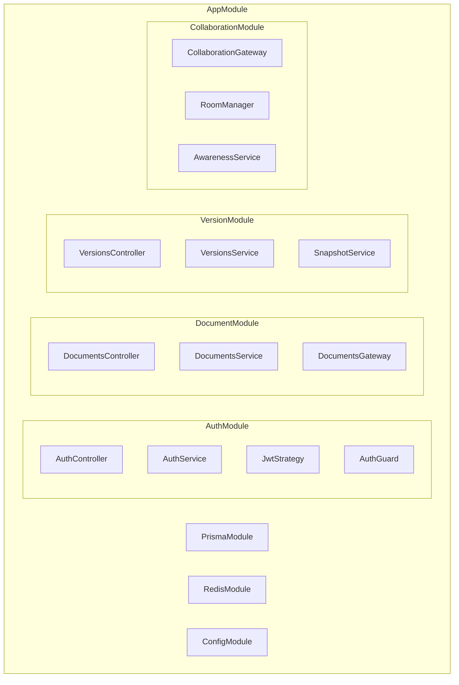

# NestJS 模块设计

## 概述

本文档描述 NestJS 后端的模块设计和核心实现，包括认证、文档、版本和协同模块。

## 模块架构



## 核心模块

### App Module

```typescript
// src/app.module.ts
import { Module } from '@nestjs/common';
import { ConfigModule, ConfigService } from '@nestjs/config';
import { APP_GUARD, APP_FILTER, APP_INTERCEPTOR } from '@nestjs/core';

import { AuthModule } from './modules/auth/auth.module';
import { DocumentsModule } from './modules/documents/documents.module';
import { VersionsModule } from './modules/versions/versions.module';
import { CollaborationModule } from './modules/collaboration/collaboration.module';
import { PrismaModule } from './prisma/prisma.module';
import { RedisModule } from './redis/redis.module';

import { JwtAuthGuard } from './modules/auth/guards/jwt-auth.guard';
import { GlobalExceptionFilter } from './common/filters/global-exception.filter';
import { TransformInterceptor } from './common/interceptors/transform.interceptor';

@Module({
  imports: [
    // 配置模块
    ConfigModule.forRoot({
      isGlobal: true,
      envFilePath: ['.env.local', '.env'],
    }),

    // 基础设施
    PrismaModule,
    RedisModule,

    // 业务模块
    AuthModule,
    DocumentsModule,
    VersionsModule,
    CollaborationModule,
  ],
  providers: [
    // 全局 JWT 认证守卫
    {
      provide: APP_GUARD,
      useClass: JwtAuthGuard,
    },
    // 全局异常过滤器
    {
      provide: APP_FILTER,
      useClass: GlobalExceptionFilter,
    },
    // 全局响应转换拦截器
    {
      provide: APP_INTERCEPTOR,
      useClass: TransformInterceptor,
    },
  ],
})
export class AppModule {}
```

### Auth Module

```typescript
// src/modules/auth/auth.module.ts
import { Module } from '@nestjs/common';
import { JwtModule } from '@nestjs/jwt';
import { PassportModule } from '@nestjs/passport';
import { ConfigModule, ConfigService } from '@nestjs/config';

import { AuthController } from './auth.controller';
import { AuthService } from './auth.service';
import { JwtStrategy } from './strategies/jwt.strategy';
import { PrismaModule } from '../../prisma/prisma.module';
import { RedisModule } from '../../redis/redis.module';

@Module({
  imports: [
    PrismaModule,
    RedisModule,
    PassportModule.register({ defaultStrategy: 'jwt' }),
    JwtModule.registerAsync({
      imports: [ConfigModule],
      useFactory: (config: ConfigService) => ({
        secret: config.get('JWT_SECRET'),
        signOptions: {
          expiresIn: config.get('JWT_EXPIRES_IN', '15m'),
        },
      }),
      inject: [ConfigService],
    }),
  ],
  controllers: [AuthController],
  providers: [AuthService, JwtStrategy],
  exports: [AuthService, JwtModule],
})
export class AuthModule {}
```

```typescript
// src/modules/auth/auth.service.ts
import { Injectable, UnauthorizedException } from '@nestjs/common';
import { JwtService } from '@nestjs/jwt';
import { PrismaService } from '../../prisma/prisma.service';
import { RedisService } from '../../redis/redis.service';
import * as bcrypt from 'bcrypt';

@Injectable()
export class AuthService {
  constructor(
    private prisma: PrismaService,
    private jwt: JwtService,
    private redis: RedisService,
  ) {}

  async register(email: string, password: string, name: string) {
    // 检查邮箱是否已存在
    const existing = await this.prisma.user.findUnique({
      where: { email },
    });

    if (existing) {
      throw new UnauthorizedException('Email already registered');
    }

    // 哈希密码
    const hashedPassword = await bcrypt.hash(password, 12);

    // 创建用户
    const user = await this.prisma.user.create({
      data: {
        email,
        password: hashedPassword,
        name,
      },
    });

    // 生成 token
    return this.generateTokens(user.id, user.email, user.name);
  }

  async login(email: string, password: string) {
    const user = await this.prisma.user.findUnique({
      where: { email },
    });

    if (!user) {
      throw new UnauthorizedException('Invalid credentials');
    }

    const isValid = await bcrypt.compare(password, user.password);
    if (!isValid) {
      throw new UnauthorizedException('Invalid credentials');
    }

    return this.generateTokens(user.id, user.email, user.name);
  }

  async refresh(refreshToken: string) {
    try {
      const payload = this.jwt.verify(refreshToken);

      if (payload.type !== 'refresh') {
        throw new UnauthorizedException('Invalid token type');
      }

      // 验证存储的 token
      const stored = await this.redis.get(`refresh:${payload.sub}`);
      if (stored !== refreshToken) {
        throw new UnauthorizedException('Token mismatch');
      }

      const user = await this.prisma.user.findUnique({
        where: { id: payload.sub },
      });

      if (!user) {
        throw new UnauthorizedException('User not found');
      }

      return this.generateTokens(user.id, user.email, user.name);
    } catch {
      throw new UnauthorizedException('Invalid refresh token');
    }
  }

  async logout(userId: string, token: string) {
    // 将 token 加入黑名单
    const payload = this.jwt.decode(token) as any;
    const ttl = payload.exp - Math.floor(Date.now() / 1000);

    if (ttl > 0) {
      await this.redis.set(`blacklist:${token}`, '1', 'EX', ttl);
    }

    // 删除 refresh token
    await this.redis.del(`refresh:${userId}`);
  }

  private async generateTokens(
    userId: string,
    email: string,
    name: string,
  ) {
    const accessToken = this.jwt.sign({
      sub: userId,
      email,
      name,
    });

    const refreshToken = this.jwt.sign(
      { sub: userId, type: 'refresh' },
      { expiresIn: '7d' },
    );

    // 存储 refresh token
    await this.redis.set(
      `refresh:${userId}`,
      refreshToken,
      'EX',
      7 * 24 * 60 * 60,
    );

    return {
      accessToken,
      refreshToken,
      user: { id: userId, email, name },
    };
  }
}
```

### Documents Module

```typescript
// src/modules/documents/documents.module.ts
import { Module } from '@nestjs/common';
import { DocumentsController } from './documents.controller';
import { DocumentsService } from './documents.service';
import { PrismaModule } from '../../prisma/prisma.module';
import { RedisModule } from '../../redis/redis.module';
import { AuthModule } from '../auth/auth.module';

@Module({
  imports: [PrismaModule, RedisModule, AuthModule],
  controllers: [DocumentsController],
  providers: [DocumentsService],
  exports: [DocumentsService],
})
export class DocumentsModule {}
```

```typescript
// src/modules/documents/documents.service.ts
import { Injectable, NotFoundException, ForbiddenException } from '@nestjs/common';
import { PrismaService } from '../../prisma/prisma.service';
import { RedisService } from '../../redis/redis.service';
import * as Y from 'yjs';

@Injectable()
export class DocumentsService {
  constructor(
    private prisma: PrismaService,
    private redis: RedisService,
  ) {}

  async create(userId: string, title: string) {
    return this.prisma.document.create({
      data: {
        title,
        ownerId: userId,
      },
    });
  }

  async findById(documentId: string, userId: string) {
    const document = await this.prisma.document.findUnique({
      where: { id: documentId },
      include: {
        owner: {
          select: { id: true, name: true, email: true },
        },
        collaborators: {
          include: {
            user: {
              select: { id: true, name: true, email: true },
            },
          },
        },
      },
    });

    if (!document) {
      throw new NotFoundException('Document not found');
    }

    // 检查访问权限
    const hasAccess =
      document.ownerId === userId ||
      document.collaborators.some((c) => c.userId === userId);

    if (!hasAccess) {
      throw new ForbiddenException('Access denied');
    }

    return document;
  }

  async findByUser(userId: string, page = 1, limit = 20) {
    const skip = (page - 1) * limit;

    const [documents, total] = await Promise.all([
      this.prisma.document.findMany({
        where: {
          OR: [
            { ownerId: userId },
            { collaborators: { some: { userId } } },
          ],
        },
        skip,
        take: limit,
        orderBy: { updatedAt: 'desc' },
        select: {
          id: true,
          title: true,
          createdAt: true,
          updatedAt: true,
          owner: {
            select: { id: true, name: true },
          },
        },
      }),
      this.prisma.document.count({
        where: {
          OR: [
            { ownerId: userId },
            { collaborators: { some: { userId } } },
          ],
        },
      }),
    ]);

    return {
      documents,
      meta: { page, limit, total },
    };
  }

  async loadContent(documentId: string): Promise<Buffer | null> {
    const document = await this.prisma.document.findUnique({
      where: { id: documentId },
      select: { content: true },
    });

    return document?.content;
  }

  async saveContent(documentId: string, content: Buffer): Promise<void> {
    await this.prisma.document.update({
      where: { id: documentId },
      data: {
        content,
        updatedAt: new Date(),
      },
    });
  }

  async delete(documentId: string, userId: string): Promise<void> {
    const document = await this.prisma.document.findUnique({
      where: { id: documentId },
      select: { ownerId: true },
    });

    if (!document) {
      throw new NotFoundException('Document not found');
    }

    if (document.ownerId !== userId) {
      throw new ForbiddenException('Only owner can delete document');
    }

    await this.prisma.document.delete({
      where: { id: documentId },
    });
  }

  async addCollaborator(
    documentId: string,
    userId: string,
    role: 'EDITOR' | 'VIEWER',
    requesterId: string,
  ) {
    // 检查权限
    const document = await this.prisma.document.findUnique({
      where: { id: documentId },
      select: { ownerId: true },
    });

    if (!document || document.ownerId !== requesterId) {
      throw new ForbiddenException('Only owner can add collaborators');
    }

    return this.prisma.collaborator.create({
      data: { documentId, userId, role },
    });
  }

  async removeCollaborator(
    documentId: string,
    userId: string,
    requesterId: string,
  ) {
    const document = await this.prisma.document.findUnique({
      where: { id: documentId },
      select: { ownerId: true },
    });

    if (!document || document.ownerId !== requesterId) {
      throw new ForbiddenException('Only owner can remove collaborators');
    }

    await this.prisma.collaborator.delete({
      where: {
        documentId_userId: { documentId, userId },
      },
    });
  }
}
```

### Versions Module

```typescript
// src/modules/versions/versions.module.ts
import { Module } from '@nestjs/common';
import { VersionsController } from './versions.controller';
import { VersionsService } from './versions.service';
import { SnapshotService } from './snapshot.service';
import { PrismaModule } from '../../prisma/prisma.module';
import { DocumentsModule } from '../documents/documents.module';

@Module({
  imports: [PrismaModule, DocumentsModule],
  controllers: [VersionsController],
  providers: [VersionsService, SnapshotService],
  exports: [VersionsService],
})
export class VersionsModule {}
```

```typescript
// src/modules/versions/versions.service.ts
import { Injectable, NotFoundException } from '@nestjs/common';
import { PrismaService } from '../../prisma/prisma.service';
import { DocumentsService } from '../documents/documents.service';
import * as Y from 'yjs';
import { createHash } from 'crypto';

@Injectable()
export class VersionsService {
  constructor(
    private prisma: PrismaService,
    private documentsService: DocumentsService,
  ) {}

  async create(
    documentId: string,
    userId: string,
    message?: string,
  ) {
    // 获取当前文档内容
    const content = await this.documentsService.loadContent(documentId);
    if (!content) {
      throw new NotFoundException('Document content not found');
    }

    // 解析 Yjs 文档
    const ydoc = new Y.Doc();
    Y.applyUpdate(ydoc, content);

    // 生成快照
    const snapshot = Y.encodeStateAsUpdate(ydoc);
    const stateVector = Y.encodeStateVector(ydoc);

    // 计算哈希（用于去重）
    const hash = createHash('sha256').update(snapshot).digest('hex');

    // 检查是否已存在相同版本
    const existing = await this.prisma.version.findUnique({
      where: { hash },
    });

    if (existing) {
      return existing;
    }

    // 创建版本
    return this.prisma.version.create({
      data: {
        documentId,
        snapshot: Buffer.from(snapshot),
        stateVector: Buffer.from(stateVector),
        hash,
        message,
        creatorId: userId,
      },
    });
  }

  async findByDocument(documentId: string, page = 1, limit = 20) {
    const skip = (page - 1) * limit;

    const [versions, total] = await Promise.all([
      this.prisma.version.findMany({
        where: { documentId },
        skip,
        take: limit,
        orderBy: { createdAt: 'desc' },
        include: {
          creator: {
            select: { id: true, name: true },
          },
        },
      }),
      this.prisma.version.count({ where: { documentId } }),
    ]);

    return { versions, meta: { page, limit, total } };
  }

  async findById(versionId: string) {
    return this.prisma.version.findUnique({
      where: { id: versionId },
      include: {
        creator: {
          select: { id: true, name: true },
        },
      },
    });
  }

  async restore(versionId: string, documentId: string): Promise<Buffer> {
    const version = await this.prisma.version.findUnique({
      where: { id: versionId },
    });

    if (!version) {
      throw new NotFoundException('Version not found');
    }

    // 获取当前文档
    const currentContent = await this.documentsService.loadContent(documentId);
    if (!currentContent) {
      throw new NotFoundException('Document not found');
    }

    // 创建当前版本的快照（用于撤销）
    await this.create(documentId, 'system', 'Auto-save before restore');

    // 恢复到目标版本
    const restoredContent = version.snapshot;
    await this.documentsService.saveContent(documentId, restoredContent);

    return restoredContent;
  }

  async diff(fromVersionId: string, toVersionId: string) {
    const [from, to] = await Promise.all([
      this.prisma.version.findUnique({
        where: { id: fromVersionId },
      }),
      this.prisma.version.findUnique({
        where: { id: toVersionId },
      }),
    ]);

    if (!from || !to) {
      throw new NotFoundException('Version not found');
    }

    // 解析两个版本
    const fromDoc = new Y.Doc();
    const toDoc = new Y.Doc();

    Y.applyUpdate(fromDoc, from.snapshot);
    Y.applyUpdate(toDoc, to.snapshot);

    // 获取文本内容
    const fromText = fromDoc.getText('content').toString();
    const toText = toDoc.getText('content').toString();

    // 计算差异（简化版，实际应使用 diff 算法）
    return {
      from: { id: fromVersionId, content: fromText },
      to: { id: toVersionId, content: toText },
      changes: computeDiff(fromText, toText),
    };
  }
}

// 简单的 diff 计算
function computeDiff(from: string, to: string) {
  // 实际项目中应使用专业的 diff 库
  const additions: string[] = [];
  const deletions: string[] = [];

  // 简化实现
  if (to.length > from.length) {
    additions.push(to.slice(from.length));
  } else if (from.length > to.length) {
    deletions.push(from.slice(to.length));
  }

  return { additions, deletions };
}
```

### Prisma Module

```typescript
// src/prisma/prisma.module.ts
import { Global, Module } from '@nestjs/common';
import { PrismaService } from './prisma.service';

@Global()
@Module({
  providers: [PrismaService],
  exports: [PrismaService],
})
export class PrismaModule {}
```

```typescript
// src/prisma/prisma.service.ts
import { Injectable, OnModuleInit, OnModuleDestroy } from '@nestjs/common';
import { PrismaClient } from '@prisma/client';

@Injectable()
export class PrismaService
  extends PrismaClient
  implements OnModuleInit, OnModuleDestroy
{
  constructor() {
    super({
      log:
        process.env.NODE_ENV === 'development'
          ? ['query', 'info', 'warn', 'error']
          : ['error'],
    });
  }

  async onModuleInit() {
    await this.$connect();
  }

  async onModuleDestroy() {
    await this.$disconnect();
  }
}
```

### Redis Module

```typescript
// src/redis/redis.module.ts
import { Global, Module } from '@nestjs/common';
import { RedisService } from './redis.service';

@Global()
@Module({
  providers: [RedisService],
  exports: [RedisService],
})
export class RedisModule {}
```

```typescript
// src/redis/redis.service.ts
import { Injectable, OnModuleDestroy } from '@nestjs/common';
import { createClient, RedisClientType } from 'redis';

@Injectable()
export class RedisService implements OnModuleDestroy {
  private client: RedisClientType;

  constructor() {
    this.client = createClient({
      url: process.env.REDIS_URL,
    });

    this.client.connect();
  }

  async onModuleDestroy() {
    await this.client.quit();
  }

  async get(key: string): Promise<string | null> {
    return this.client.get(key);
  }

  async set(
    key: string,
    value: string,
    options?: { EX?: number; PX?: number; NX?: boolean },
  ): Promise<void> {
    if (options?.EX) {
      await this.client.set(key, value, { EX: options.EX });
    } else if (options?.PX) {
      await this.client.set(key, value, { PX: options.PX });
    } else {
      await this.client.set(key, value);
    }
  }

  async del(key: string): Promise<void> {
    await this.client.del(key);
  }

  async incr(key: string): Promise<number> {
    return this.client.incr(key);
  }

  async expire(key: string, seconds: number): Promise<void> {
    await this.client.expire(key, seconds);
  }

  async ttl(key: string): Promise<number> {
    return this.client.ttl(key);
  }

  // Pub/Sub
  async publish(channel: string, message: string): Promise<void> {
    await this.client.publish(channel, message);
  }

  async subscribe(
    channel: string,
    callback: (message: string) => void,
  ): Promise<void> {
    await this.client.subscribe(channel, callback);
  }
}
```

## 公共组件

### 响应转换拦截器

```typescript
// src/common/interceptors/transform.interceptor.ts
import {
  Injectable,
  NestInterceptor,
  ExecutionContext,
  CallHandler,
} from '@nestjs/common';
import { Observable } from 'rxjs';
import { map } from 'rxjs/operators';

export interface Response<T> {
  success: true;
  data: T;
  timestamp: string;
}

@Injectable()
export class TransformInterceptor<T>
  implements NestInterceptor<T, Response<T>>
{
  intercept(
    context: ExecutionContext,
    next: CallHandler,
  ): Observable<Response<T>> {
    return next.handle().pipe(
      map((data) => ({
        success: true,
        data,
        timestamp: new Date().toISOString(),
      })),
    );
  }
}
```

### 全局异常过滤器

```typescript
// src/common/filters/global-exception.filter.ts
import {
  ExceptionFilter,
  Catch,
  ArgumentsHost,
  HttpException,
  HttpStatus,
} from '@nestjs/common';
import { Response } from 'express';

@Catch()
export class GlobalExceptionFilter implements ExceptionFilter {
  catch(exception: unknown, host: ArgumentsHost) {
    const ctx = host.switchToHttp();
    const response = ctx.getResponse<Response>();

    let status = HttpStatus.INTERNAL_SERVER_ERROR;
    let message = 'Internal server error';
    let code = 'INTERNAL_ERROR';
    let details: Record<string, unknown> | undefined;

    if (exception instanceof HttpException) {
      status = exception.getStatus();
      const exceptionResponse = exception.getResponse();

      if (typeof exceptionResponse === 'object' && exceptionResponse !== null) {
        const responseObj = exceptionResponse as Record<string, unknown>;
        message = (responseObj.message as string) || message;
        code = (responseObj.code as string) || code;
        details = responseObj.details as Record<string, unknown>;
      } else {
        message = exception.message;
      }
    }

    // 记录错误
    console.error(exception);

    response.status(status).json({
      success: false,
      error: {
        code,
        message,
        details,
      },
      timestamp: new Date().toISOString(),
    });
  }
}
```

## 相关文档

- [Hocuspocus 网关](./hocuspocus-gateway.md)
- [数据模型设计](./prisma-schema.md)
- [API 接口文档](./api-reference.md)
