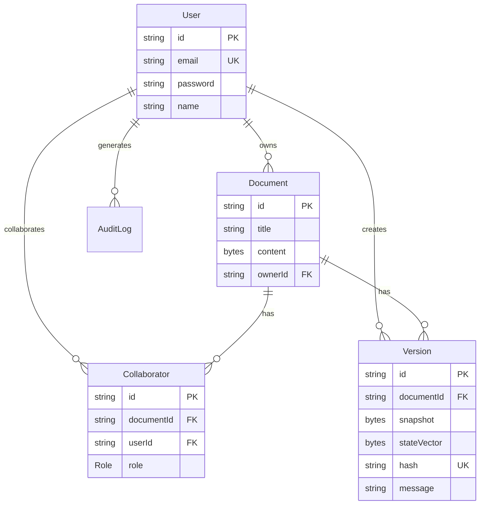

# 数据模型设计

## 概述

本文档描述使用 Prisma 定义的数据模型，涵盖用户、文档、版本和协作者等核心实体。

## Schema 定义

```prisma
// prisma/schema.prisma

generator client {
  provider = "prisma-client-js"
  previewFeatures = ["fullTextSearch", "fullTextIndex"]
}

datasource db {
  provider = "postgresql"
  url      = env("DATABASE_URL")
  directUrl = env("DATABASE_URL")
}

// ==================== 用户相关 ====================

model User {
  id        String   @id @default(cuid())
  email     String   @unique
  password  String
  name      String?
  avatar    String?
  createdAt DateTime @default(now())
  updatedAt DateTime @updatedAt

  // 关联
  ownedDocuments   Document[]      @relation("OwnerDocuments")
  collaborations   Collaborator[]
  createdVersions  Version[]
  auditLogs        AuditLog[]

  @@index([email])
  @@map("users")
}

// ==================== 文档相关 ====================

model Document {
  id          String   @id @default(cuid())
  title       String
  content     Bytes?   // Yjs 二进制状态
  ownerId     String
  owner       User     @relation("OwnerDocuments", fields: [ownerId], references: [id], onDelete: Cascade)
  createdAt   DateTime @default(now())
  updatedAt   DateTime @updatedAt

  // 关联
  collaborators Collaborator[]
  versions      Version[]

  @@index([ownerId])
  @@index([updatedAt])
  @@map("documents")
}

// ==================== 协作者 ====================

model Collaborator {
  id         String   @id @default(cuid())
  documentId String
  document   Document @relation(fields: [documentId], references: [id], onDelete: Cascade)
  userId     String
  user       User     @relation(fields: [userId], references: [id], onDelete: Cascade)
  role       Role     @default(VIEWER)
  createdAt  DateTime @default(now())
  updatedAt  DateTime @updatedAt

  @@unique([documentId, userId])
  @@index([userId])
  @@map("collaborators")
}

enum Role {
  OWNER
  EDITOR
  VIEWER
}

// ==================== 版本管理 ====================

model Version {
  id          String   @id @default(cuid())
  documentId  String
  document    Document @relation(fields: [documentId], references: [id], onDelete: Cascade)
  snapshot    Bytes    // Yjs 快照
  stateVector Bytes    // 状态向量
  hash        String   @unique // SHA-256 哈希
  message     String?  // 版本描述
  creatorId   String
  creator     User     @relation(fields: [creatorId], references: [id])
  createdAt   DateTime @default(now())

  @@index([documentId])
  @@index([createdAt])
  @@map("versions")
}

// ==================== 审计日志 ====================

model AuditLog {
  id         String   @id @default(cuid())
  action     String
  userId     String?
  user       User?    @relation(fields: [userId], references: [id], onDelete: SetNull)
  documentId String?
  ipAddress  String?
  userAgent  String?
  details    Json?
  createdAt  DateTime @default(now())

  @@index([action])
  @@index([userId])
  @@index([documentId])
  @@index([createdAt])
  @@map("audit_logs")
}

// ==================== 会话管理 ====================

model Session {
  id           String   @id @default(cuid())
  userId       String
  token        String   @unique
  userAgent    String?
  ipAddress    String?
  expiresAt    DateTime
  createdAt    DateTime @default(now())

  @@index([userId])
  @@index([token])
  @@index([expiresAt])
  @@map("sessions")
}
```

## 实体关系图



## 数据库迁移

### 创建迁移

```bash
# 创建迁移
pnpm prisma migrate dev --name init

# 应用迁移
pnpm prisma migrate deploy

# 重置数据库
pnpm prisma migrate reset
```

### 种子数据

```typescript
// prisma/seed.ts
import { PrismaClient, Role } from '@prisma/client';
import * as bcrypt from 'bcrypt';

const prisma = new PrismaClient();

async function main() {
    // 创建测试用户
    const password = await bcrypt.hash('password123', 12);

    const user1 = await prisma.user.create({
        data: {
            email: 'alice@example.com',
            password,
            name: 'Alice',
        },
    });

    const user2 = await prisma.user.create({
        data: {
            email: 'bob@example.com',
            password,
            name: 'Bob',
        },
    });

    // 创建测试文档
    const doc = await prisma.document.create({
        data: {
            title: 'Welcome Document',
            ownerId: user1.id,
        },
    });

    // 添加协作者
    await prisma.collaborator.create({
        data: {
            documentId: doc.id,
            userId: user2.id,
            role: Role.EDITOR,
        },
    });

    console.log('Seed data created');
}

main()
    .catch(console.error)
    .finally(() => prisma.$disconnect());
```

## 查询示例

### 文档查询

```typescript
// 获取用户的所有文档（包括协作文档）
async function getUserDocuments(userId: string) {
    return prisma.document.findMany({
        where: {
            OR: [{ ownerId: userId }, { collaborators: { some: { userId } } }],
        },
        include: {
            owner: {
                select: { id: true, name: true, email: true },
            },
            collaborators: {
                include: {
                    user: {
                        select: { id: true, name: true },
                    },
                },
            },
            _count: {
                select: { versions: true },
            },
        },
        orderBy: { updatedAt: 'desc' },
    });
}

// 获取文档详情
async function getDocumentDetail(documentId: string, userId: string) {
    const document = await prisma.document.findUnique({
        where: { id: documentId },
        include: {
            owner: {
                select: { id: true, name: true, email: true },
            },
            collaborators: {
                include: {
                    user: {
                        select: { id: true, name: true, avatar: true },
                    },
                },
            },
        },
    });

    if (!document) return null;

    // 检查访问权限
    const hasAccess =
        document.ownerId === userId || document.collaborators.some((c) => c.userId === userId);

    if (!hasAccess) return null;

    return document;
}
```

### 版本查询

```typescript
// 获取文档版本历史
async function getDocumentVersions(documentId: string, page = 1, limit = 20) {
    const skip = (page - 1) * limit;

    const [versions, total] = await Promise.all([
        prisma.version.findMany({
            where: { documentId },
            skip,
            take: limit,
            orderBy: { createdAt: 'desc' },
            include: {
                creator: {
                    select: { id: true, name: true, avatar: true },
                },
            },
        }),
        prisma.version.count({ where: { documentId } }),
    ]);

    return {
        versions,
        pagination: {
            page,
            limit,
            total,
            totalPages: Math.ceil(total / limit),
        },
    };
}

// 检查版本是否存在
async function checkVersionExists(hash: string): Promise<boolean> {
    const version = await prisma.version.findUnique({
        where: { hash },
        select: { id: true },
    });
    return !!version;
}
```

### 协作者管理

```typescript
// 添加协作者
async function addCollaborator(documentId: string, userId: string, role: Role) {
    return prisma.collaborator.create({
        data: {
            documentId,
            userId,
            role,
        },
        include: {
            user: {
                select: { id: true, name: true, email: true },
            },
        },
    });
}

// 更新协作者角色
async function updateCollaboratorRole(documentId: string, userId: string, role: Role) {
    return prisma.collaborator.update({
        where: {
            documentId_userId: { documentId, userId },
        },
        data: { role },
    });
}

// 移除协作者
async function removeCollaborator(documentId: string, userId: string) {
    return prisma.collaborator.delete({
        where: {
            documentId_userId: { documentId, userId },
        },
    });
}
```

### 审计日志

```typescript
// 记录审计日志
async function logAudit(params: {
    action: string;
    userId?: string;
    documentId?: string;
    ipAddress?: string;
    userAgent?: string;
    details?: Record<string, unknown>;
}) {
    return prisma.auditLog.create({
        data: {
            action: params.action,
            userId: params.userId,
            documentId: params.documentId,
            ipAddress: params.ipAddress,
            userAgent: params.userAgent,
            details: params.details || {},
        },
    });
}

// 查询审计日志
async function getAuditLogs(
    filters: {
        userId?: string;
        documentId?: string;
        action?: string;
        startDate?: Date;
        endDate?: Date;
    },
    page = 1,
    limit = 50
) {
    const where: any = {};

    if (filters.userId) where.userId = filters.userId;
    if (filters.documentId) where.documentId = filters.documentId;
    if (filters.action) where.action = filters.action;
    if (filters.startDate || filters.endDate) {
        where.createdAt = {};
        if (filters.startDate) where.createdAt.gte = filters.startDate;
        if (filters.endDate) where.createdAt.lte = filters.endDate;
    }

    const skip = (page - 1) * limit;

    const [logs, total] = await Promise.all([
        prisma.auditLog.findMany({
            where,
            skip,
            take: limit,
            orderBy: { createdAt: 'desc' },
            include: {
                user: {
                    select: { id: true, name: true, email: true },
                },
            },
        }),
        prisma.auditLog.count({ where }),
    ]);

    return { logs, pagination: { page, limit, total } };
}
```

## 性能优化

### 索引策略

```prisma
// 已定义的索引
@@index([ownerId])        // 按所有者查询
@@index([updatedAt])      // 按更新时间排序
@@index([documentId])     // 按文档关联查询
@@index([createdAt])      // 按创建时间查询
@@index([action])         // 按操作类型查询
```

### 查询优化

```typescript
// 使用 select 减少返回字段
const documents = await prisma.document.findMany({
    select: {
        id: true,
        title: true,
        updatedAt: true,
        // 不返回 content（大字段）
    },
});

// 使用分页
const documents = await prisma.document.findMany({
    skip: (page - 1) * limit,
    take: limit,
});

// 批量操作
await prisma.document.updateMany({
    where: { ownerId: userId },
    data: { updatedAt: new Date() },
});
```

## 相关文档

- [NestJS 模块设计](./nestjs-modules.md)
- [版本管理逻辑](./version-management.md)
- [系统架构](../01-architecture/README.md)
