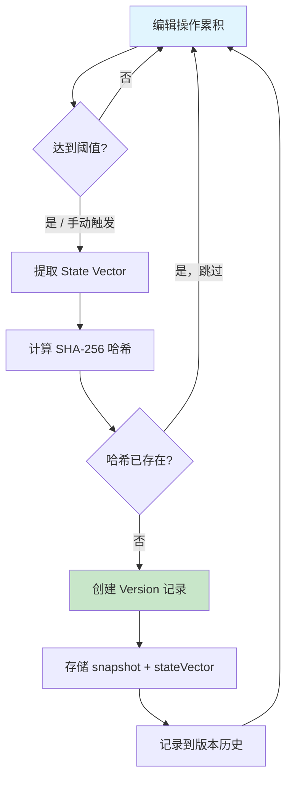
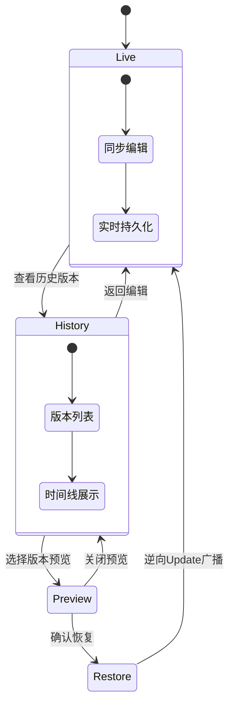

# 版本管理逻辑

## 概述

本文档描述类 Git 版本管理的核心逻辑，包括快照创建、版本回溯和差异对比。

## 版本管理流程



## 核心服务

### SnapshotService

```typescript
// src/modules/versions/snapshot.service.ts
import { Injectable } from '@nestjs/common';
import { PrismaService } from '../../prisma/prisma.service';
import { RedisService } from '../../redis/redis.service';
import * as Y from 'yjs';
import { createHash } from 'crypto';

@Injectable()
export class SnapshotService {
    private readonly AUTO_SNAPSHOT_THRESHOLD = 100; // 操作次数阈值
    private readonly AUTO_SNAPSHOT_INTERVAL = 5 * 60 * 1000; // 5分钟

    constructor(
        private prisma: PrismaService,
        private redis: RedisService
    ) {}

    /**
     * 创建版本快照
     */
    async createSnapshot(
        documentId: string,
        userId: string,
        message?: string,
        isAuto: boolean = false
    ) {
        // 获取锁防止并发创建
        const lockKey = `lock:snapshot:${documentId}`;
        const acquired = await this.redis.set(lockKey, '1', 'PX', 5000, 'NX');

        if (!acquired) {
            throw new Error('Snapshot creation in progress');
        }

        try {
            // 加载文档内容
            const document = await this.prisma.document.findUnique({
                where: { id: documentId },
                select: { content: true },
            });

            if (!document?.content) {
                throw new Error('Document content not found');
            }

            // 解析 Yjs 文档
            const ydoc = new Y.Doc();
            Y.applyUpdate(ydoc, new Uint8Array(document.content));

            // 生成快照
            const snapshot = Y.encodeStateAsUpdate(ydoc);
            const stateVector = Y.encodeStateVector(ydoc);

            // 计算哈希（用于去重）
            const hash = createHash('sha256').update(snapshot).digest('hex');

            // 检查是否已存在相同版本
            const existing = await this.prisma.version.findUnique({
                where: { hash },
            });

            if (existing) {
                return { version: existing, isNew: false };
            }

            // 创建版本记录
            const version = await this.prisma.version.create({
                data: {
                    documentId,
                    snapshot: Buffer.from(snapshot),
                    stateVector: Buffer.from(stateVector),
                    hash,
                    message: message || (isAuto ? 'Auto-saved' : undefined),
                    creatorId: userId,
                },
            });

            // 清理操作计数
            await this.redis.del(`ops:count:${documentId}`);

            return { version, isNew: true };
        } finally {
            await this.redis.del(lockKey);
        }
    }

    /**
     * 检查是否需要自动快照
     */
    async shouldAutoSnapshot(documentId: string): Promise<boolean> {
        // 检查操作次数
        const opsCount = await this.redis.get(`ops:count:${documentId}`);
        if (opsCount && parseInt(opsCount) >= this.AUTO_SNAPSHOT_THRESHOLD) {
            return true;
        }

        // 检查时间间隔
        const lastSnapshot = await this.prisma.version.findFirst({
            where: { documentId },
            orderBy: { createdAt: 'desc' },
            select: { createdAt: true },
        });

        if (lastSnapshot) {
            const elapsed = Date.now() - lastSnapshot.createdAt.getTime();
            if (elapsed >= this.AUTO_SNAPSHOT_INTERVAL) {
                return true;
            }
        }

        return false;
    }

    /**
     * 增加操作计数
     */
    async incrementOpsCount(documentId: string): Promise<void> {
        await this.redis.incr(`ops:count:${documentId}`);
    }
}
```

### VersionsService

```typescript
// src/modules/versions/versions.service.ts
import { Injectable, NotFoundException, ForbiddenException } from '@nestjs/common';
import { PrismaService } from '../../prisma/prisma.service';
import { DocumentsService } from '../documents/documents.service';
import { SnapshotService } from './snapshot.service';
import * as Y from 'yjs';

@Injectable()
export class VersionsService {
    constructor(
        private prisma: PrismaService,
        private documents: DocumentsService,
        private snapshots: SnapshotService
    ) {}

    /**
     * 创建新版本
     */
    async create(documentId: string, userId: string, message?: string) {
        // 检查写权限
        const role = await this.documents.getUserRole(documentId, userId);
        if (!role || role === 'VIEWER') {
            throw new ForbiddenException('Write access required');
        }

        return this.snapshots.createSnapshot(documentId, userId, message);
    }

    /**
     * 获取版本列表
     */
    async findByDocument(documentId: string, page = 1, limit = 20) {
        const skip = (page - 1) * limit;

        const [versions, total] = await Promise.all([
            this.prisma.version.findMany({
                where: { documentId },
                skip,
                take: limit,
                orderBy: { createdAt: 'desc' },
                include: {
                    creator: {
                        select: { id: true, name: true, avatar: true },
                    },
                },
            }),
            this.prisma.version.count({ where: { documentId } }),
        ]);

        return {
            versions,
            meta: {
                page,
                limit,
                total,
                totalPages: Math.ceil(total / limit),
            },
        };
    }

    /**
     * 获取单个版本
     */
    async findById(versionId: string) {
        const version = await this.prisma.version.findUnique({
            where: { id: versionId },
            include: {
                document: {
                    select: { id: true, title: true },
                },
                creator: {
                    select: { id: true, name: true },
                },
            },
        });

        if (!version) {
            throw new NotFoundException('Version not found');
        }

        return version;
    }

    /**
     * 恢复到指定版本
     */
    async restore(
        versionId: string,
        userId: string
    ): Promise<{ success: boolean; newVersionId: string }> {
        const version = await this.prisma.version.findUnique({
            where: { id: versionId },
            include: {
                document: {
                    select: { ownerId: true },
                },
            },
        });

        if (!version) {
            throw new NotFoundException('Version not found');
        }

        // 检查权限
        const role = await this.documents.getUserRole(version.documentId, userId);
        if (!role || role === 'VIEWER') {
            throw new ForbiddenException('Write access required');
        }

        // 创建当前状态的快照（用于撤销）
        const currentSnapshot = await this.snapshots.createSnapshot(
            version.documentId,
            userId,
            `Before restore to ${versionId}`
        );

        // 恢复到目标版本
        await this.prisma.document.update({
            where: { id: version.documentId },
            data: {
                content: version.snapshot,
                updatedAt: new Date(),
            },
        });

        return {
            success: true,
            newVersionId: currentSnapshot.version.id,
        };
    }

    /**
     * 计算两个版本之间的差异
     */
    async diff(fromVersionId: string, toVersionId: string) {
        const [from, to] = await Promise.all([
            this.prisma.version.findUnique({
                where: { id: fromVersionId },
            }),
            this.prisma.version.findUnique({
                where: { id: toVersionId },
            }),
        ]);

        if (!from || !to) {
            throw new NotFoundException('Version not found');
        }

        if (from.documentId !== to.documentId) {
            throw new Error('Versions must be from the same document');
        }

        // 解析两个版本
        const fromDoc = new Y.Doc();
        const toDoc = new Y.Doc();

        Y.applyUpdate(fromDoc, new Uint8Array(from.snapshot));
        Y.applyUpdate(toDoc, new Uint8Array(to.snapshot));

        // 获取文本内容
        const fromText = fromDoc.getText('content').toString();
        const toText = toDoc.getText('content').toString();

        // 计算差异
        const changes = this.computeTextDiff(fromText, toText);

        return {
            from: {
                id: fromVersionId,
                createdAt: from.createdAt,
                message: from.message,
            },
            to: {
                id: toVersionId,
                createdAt: to.createdAt,
                message: to.message,
            },
            changes,
            stats: {
                additions: changes.filter((c) => c.type === 'add').length,
                deletions: changes.filter((c) => c.type === 'delete').length,
            },
        };
    }

    /**
     * 计算文本差异
     */
    private computeTextDiff(
        from: string,
        to: string
    ): Array<{ type: 'add' | 'delete' | 'equal'; value: string; position: number }> {
        const changes: Array<{
            type: 'add' | 'delete' | 'equal';
            value: string;
            position: number;
        }> = [];

        // 简化的 diff 实现
        // 生产环境应使用专业库如 diff-match-patch
        const fromLines = from.split('\n');
        const toLines = to.split('\n');

        let fromIndex = 0;
        let toIndex = 0;

        while (fromIndex < fromLines.length || toIndex < toLines.length) {
            if (fromIndex >= fromLines.length) {
                // 新增的行
                changes.push({
                    type: 'add',
                    value: toLines[toIndex],
                    position: toIndex,
                });
                toIndex++;
            } else if (toIndex >= toLines.length) {
                // 删除的行
                changes.push({
                    type: 'delete',
                    value: fromLines[fromIndex],
                    position: fromIndex,
                });
                fromIndex++;
            } else if (fromLines[fromIndex] === toLines[toIndex]) {
                // 相同的行
                changes.push({
                    type: 'equal',
                    value: fromLines[fromIndex],
                    position: fromIndex,
                });
                fromIndex++;
                toIndex++;
            } else {
                // 检查是否是新增
                if (toIndex + 1 < toLines.length && fromLines[fromIndex] === toLines[toIndex + 1]) {
                    changes.push({
                        type: 'add',
                        value: toLines[toIndex],
                        position: toIndex,
                    });
                    toIndex++;
                }
                // 检查是否是删除
                else if (
                    fromIndex + 1 < fromLines.length &&
                    fromLines[fromIndex + 1] === toLines[toIndex]
                ) {
                    changes.push({
                        type: 'delete',
                        value: fromLines[fromIndex],
                        position: fromIndex,
                    });
                    fromIndex++;
                }
                // 修改（删除 + 新增）
                else {
                    changes.push({
                        type: 'delete',
                        value: fromLines[fromIndex],
                        position: fromIndex,
                    });
                    changes.push({
                        type: 'add',
                        value: toLines[toIndex],
                        position: toIndex,
                    });
                    fromIndex++;
                    toIndex++;
                }
            }
        }

        return changes;
    }

    /**
     * 删除版本
     */
    async delete(versionId: string, userId: string): Promise<void> {
        const version = await this.prisma.version.findUnique({
            where: { id: versionId },
            include: {
                document: {
                    select: { ownerId: true },
                },
            },
        });

        if (!version) {
            throw new NotFoundException('Version not found');
        }

        // 只有文档所有者可以删除版本
        if (version.document.ownerId !== userId) {
            throw new ForbiddenException('Only document owner can delete versions');
        }

        await this.prisma.version.delete({
            where: { id: versionId },
        });
    }
}
```

### VersionsController

```typescript
// src/modules/versions/versions.controller.ts
import { Controller, Get, Post, Delete, Param, Body, Query, UseGuards, Req } from '@nestjs/common';
import { VersionsService } from './versions.service';
import { JwtAuthGuard } from '../auth/guards/jwt-auth.guard';
import { CurrentUser } from '../../common/decorators/current-user.decorator';

@Controller('documents/:documentId/versions')
@UseGuards(JwtAuthGuard)
export class VersionsController {
    constructor(private versions: VersionsService) {}

    @Get()
    async list(
        @Param('documentId') documentId: string,
        @Query('page') page = '1',
        @Query('limit') limit = '20',
        @CurrentUser() user: any
    ) {
        return this.versions.findByDocument(documentId, parseInt(page), parseInt(limit));
    }

    @Post()
    async create(
        @Param('documentId') documentId: string,
        @Body() body: { message?: string },
        @CurrentUser() user: any
    ) {
        return this.versions.create(documentId, user.id, body.message);
    }

    @Get(':versionId')
    async get(@Param('documentId') documentId: string, @Param('versionId') versionId: string) {
        return this.versions.findById(versionId);
    }

    @Post(':versionId/restore')
    async restore(
        @Param('documentId') documentId: string,
        @Param('versionId') versionId: string,
        @CurrentUser() user: any
    ) {
        return this.versions.restore(versionId, user.id);
    }

    @Get(':fromId/diff/:toId')
    async diff(
        @Param('documentId') documentId: string,
        @Param('fromId') fromId: string,
        @Param('toId') toId: string
    ) {
        return this.versions.diff(fromId, toId);
    }

    @Delete(':versionId')
    async delete(
        @Param('documentId') documentId: string,
        @Param('versionId') versionId: string,
        @CurrentUser() user: any
    ) {
        await this.versions.delete(versionId, user.id);
        return { success: true };
    }
}
```

## Hocuspocus 集成

### 自动快照触发

```typescript
// 在 Hocuspocus onChange 钩子中触发
async onChange({ documentName, context, update }) {
  // 增加操作计数
  await this.snapshotService.incrementOpsCount(documentName);

  // 检查是否需要自动快照
  const shouldSnapshot = await this.snapshotService.shouldAutoSnapshot(documentName);

  if (shouldSnapshot) {
    // 异步创建快照（不阻塞主流程）
    this.snapshotService.createSnapshot(
      documentName,
      context.user.id,
      undefined,
      true,
    ).catch(console.error);
  }
}
```

## 版本回溯流程



## 相关文档

- [数据模型设计](./prisma-schema.md)
- [版本管理流程](../05-collaboration/version-workflow.md)
- [Hocuspocus 网关](./hocuspocus-gateway.md)
