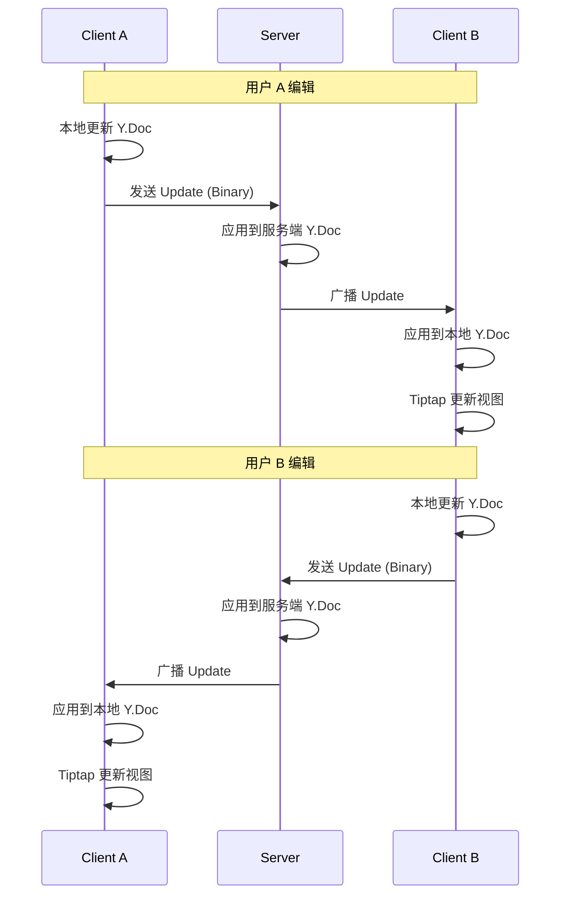

# 协同机制总览

## 概述

本文档概述协同文档编辑的核心机制，基于 **CRDT（Conflict-free Replicated Data Types）** 理论实现无冲突的多人实时协同。

## 核心概念

### CRDT 是什么？

CRDT 是一种数据结构，允许多个副本独立更新，并最终收敛到相同状态，无需中央协调。

**特点：**
- 无需锁定
- 自动合并冲突
- 最终一致性
- 支持离线编辑

### YATA 算法

Yjs 基于 **YATA（Yet Another Transformation Approach）** 算法，是一种专为文本编辑设计的 CRDT。

## 协同架构

```
┌─────────────────────────────────────────────────────────────────┐
│                      协同编辑架构                                │
├─────────────────────────────────────────────────────────────────┤
│                                                                 │
│  ┌──────────┐     ┌──────────┐     ┌──────────┐               │
│  │ Client A │     │ Client B │     │ Client C │               │
│  │          │     │          │     │          │               │
│  │  Y.Doc   │     │  Y.Doc   │     │  Y.Doc   │               │
│  │  Tiptap  │     │  Tiptap  │     │  Tiptap  │               │
│  └────┬─────┘     └────┬─────┘     └────┬─────┘               │
│       │                │                │                      │
│       └────────────────┼────────────────┘                      │
│                        │                                       │
│                        ▼                                       │
│              ┌─────────────────┐                               │
│              │   Hocuspocus    │                               │
│              │   (WebSocket)   │                               │
│              └────────┬────────┘                               │
│                       │                                        │
│                       ▼                                        │
│              ┌─────────────────┐                               │
│              │   PostgreSQL    │                               │
│              │   (持久化)       │                               │
│              └─────────────────┘                               │
│                                                                 │
└─────────────────────────────────────────────────────────────────┘
```

## 文档目录

| 文档 | 说明 |
|------|------|
| [crdt-yjs.md](./crdt-yjs.md) | CRDT 与 Yjs 原理 |
| [awareness-protocol.md](./awareness-protocol.md) | Awareness 协议 |
| [version-workflow.md](./version-workflow.md) | 版本管理流程 |
| [conflict-resolution.md](./conflict-resolution.md) | 冲突解决机制 |

## 协同流程



## 核心组件

### 1. Yjs 文档 (Y.Doc)

每个客户端和服务端都有一个 Y.Doc 实例，存储文档的完整状态。

```typescript
import * as Y from 'yjs';

const ydoc = new Y.Doc();

// 共享类型
const ytext = ydoc.getText('content');    // 文本
const ymap = ydoc.getMap('metadata');     // 键值对
const yarray = ydoc.getArray('versions'); // 数组
```

### 2. Provider

Provider 负责同步 Y.Doc 状态。

```typescript
import { WebsocketProvider } from 'y-websocket';

const provider = new WebsocketProvider(
  'wss://server.com',
  'document-id',
  ydoc
);
```

### 3. Awareness

Awareness 协议用于共享临时状态，如光标位置。

```typescript
const awareness = provider.awareness;

awareness.setLocalState({
  user: { name: 'Alice', color: '#3b82f6' },
  cursor: { from: 10, to: 20 }
});
```

### 4. Tiptap 集成

```typescript
import { Collaboration } from '@tiptap/extension-collaboration';
import { CollaborationCursor } from '@tiptap/extension-collaboration-cursor';

const editor = new Editor({
  extensions: [
    Collaboration.configure({ document: ydoc }),
    CollaborationCursor.configure({ provider }),
  ],
});
```

## 关键特性

### 无冲突合并

CRDT 自动处理并发编辑冲突，无需用户干预。

### 离线支持

本地编辑在离线时继续工作，重新连接后自动同步。

### 增量同步

只传输变更部分，减少网络流量。

### 历史记录

Yjs 记录所有更新，支持撤销/重做操作。

## 性能考虑

| 考虑点 | 策略 |
|--------|------|
| 大文档 | 分块加载、虚拟滚动 |
| 高频编辑 | 防抖持久化 |
| 多用户 | Awareness 优化 |
| 网络延迟 | 本地优先 |

## 相关文档

- [系统架构](../01-architecture/README.md)
- [数据流向设计](../01-architecture/data-flow.md)
- [后端开发](../04-backend/README.md)
