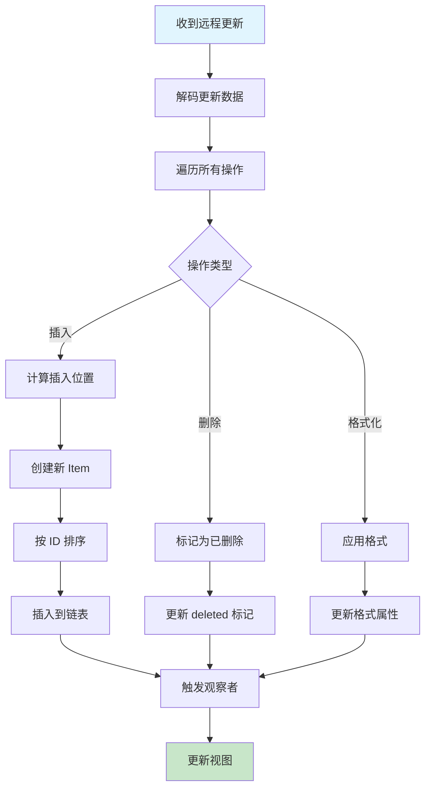

# 冲突解决机制

## 概述

本文档描述基于 CRDT 的冲突解决机制，解释 Yjs 如何自动处理并发编辑冲突。

## 为什么需要冲突解决？

在多人协同编辑中，多个用户可能同时编辑同一位置：

```
初始状态: "Hello"

用户 A 在位置 5 插入 "!"  →  "Hello!"
用户 B 在位置 5 插入 "?"  →  "Hello?"

最终应该是什么？
```

传统解决方案需要复杂的锁定或变换算法，而 CRDT 提供了更优雅的方式。

## CRDT 冲突解决原理

### 核心思想

1. **每个操作都有唯一 ID**
2. **操作可以独立执行**
3. **最终结果与顺序无关**

### YATA 算法

Yjs 基于 YATA 算法，为每个字符分配结构化 ID：

```typescript
interface ItemID {
    client: string; // 客户端唯一标识
    clock: number; // 逻辑时钟
}

interface Item {
    id: ItemID;
    origin: ItemID | null; // 前一个字符的 ID
    content: string;
    deleted: boolean;
}
```

### 排序规则

当两个字符在相同位置插入时，YATA 使用以下规则排序：

1. **优先保持原点顺序**：origin 相同的字符保持插入顺序
2. **时钟较小优先**：clock 值小的优先
3. **客户端 ID 较小优先**：作为最后排序依据

```typescript
function compare(a: Item, b: Item): number {
    // 1. 比较原点
    if (a.origin === b.origin) {
        // 2. 比较时钟
        if (a.id.clock < b.id.clock) return -1;
        if (a.id.clock > b.id.clock) return 1;

        // 3. 比较客户端 ID
        return a.id.client < b.id.client ? -1 : 1;
    }

    // 复杂的 origin 链比较...
}
```

## 并发编辑示例

### 场景：同时插入

```
初始: "AC"

用户 1: 在 A 和 C 之间插入 "B"  →  "ABC"
用户 2: 在 A 和 C 之间插入 "D"  →  "ADC"
```

**Yjs 处理：**

1. 用户 1 的 "B" 获得 ID `{ client: 'user1', clock: 1 }`
2. 用户 2 的 "D" 获得 ID `{ client: 'user2', clock: 1 }`
3. 合并时，比较时钟和客户端 ID
4. 假设 user1 < user2，结果为 "ABC" + "D" = "ABDC" 或 "ABDC"

### 场景：插入和删除

```
初始: "Hello World"

用户 1: 删除 " World"  →  "Hello"
用户 2: 在 "World" 前插入 "Beautiful "  →  "Hello Beautiful World"
```

**Yjs 处理：**

1. 删除操作标记字符为 `deleted: true`
2. 插入操作在指定位置添加新字符
3. 合并后：
    - "Hello" 保留
    - "Beautiful " 插入
    - "World" 被标记删除
4. 结果：用户看到 "Hello Beautiful "

## 冲突解决流程



## 代码示例

### 处理并发更新

```typescript
import * as Y from 'yjs';

// 创建两个独立文档
const doc1 = new Y.Doc();
const doc2 = new Y.Doc();

const text1 = doc1.getText('content');
const text2 = doc2.getText('content');

// 初始内容
text1.insert(0, 'Hello');

// 同步到 doc2
const update1 = Y.encodeStateAsUpdate(doc1);
Y.applyUpdate(doc2, update1);

console.log(text2.toString()); // "Hello"

// 并发编辑
doc1.transact(() => {
    text1.insert(5, '!'); // "Hello!"
});

doc2.transact(() => {
    text2.insert(5, '?'); // "Hello?"
});

// 同步
const update1b = Y.encodeStateAsUpdate(doc1);
const update2b = Y.encodeStateAsUpdate(doc2);

Y.applyUpdate(doc1, update2b);
Y.applyUpdate(doc2, update1b);

// 两个文档现在一致
console.log(text1.toString()); // "Hello!?" 或 "Hello?!"
console.log(text2.toString()); // 相同
```

### 观察冲突解决

```typescript
const ytext = ydoc.getText('content');

ytext.observe((event) => {
    event.changes.delta.forEach((change) => {
        if ('insert' in change) {
            console.log(`Inserted: "${change.insert}" at position ${change.retain || 0}`);
        }
        if ('delete' in change) {
            console.log(`Deleted: ${change.delete} characters`);
        }
        if ('retain' in change) {
            console.log(`Retained: ${change.retain} characters`);
        }
    });
});
```

## 特殊情况处理

### 格式冲突

```typescript
// 用户 1：加粗
ytext.format(0, 5, { bold: true });

// 用户 2：斜体
ytext.format(0, 5, { italic: true });

// 合并后：同时具有两种格式
// Yjs 格式是可组合的，不会冲突
```

### 嵌套结构冲突

```typescript
const ymap = ydoc.getMap('data');

// 用户 1
ymap.set('key', 'value1');

// 用户 2
ymap.set('key', 'value2');

// 合并：最后写入者胜出（基于时间戳）
// 或者使用自定义合并逻辑
```

### 大规模并发

```typescript
// 处理大量并发更新
ydoc.on('update', (update, origin) => {
    // 批量处理
    pendingUpdates.push(update);

    // 防抖合并
    debounce(() => {
        const merged = mergeUpdates(pendingUpdates);
        broadcast(merged);
        pendingUpdates = [];
    }, 100);
});
```

## 冲突解决保证

### 一致性保证

1. **强最终一致性**：所有副本最终收敛到相同状态
2. **无数据丢失**：所有操作都会被保留（即使被标记删除）
3. **可撤销性**：所有操作都可以撤销

### 不保证的内容

1. **操作顺序**：不同用户可能看到不同顺序
2. **中间状态**：合并过程中可能看到临时状态
3. **实时一致性**：网络延迟可能导致临时不一致

## 最佳实践

### 1. 使用事务

```typescript
// ✅ 原子操作
ydoc.transact(() => {
    ytext.insert(0, 'Hello');
    ytext.format(0, 5, { bold: true });
});

// ❌ 分散操作
ytext.insert(0, 'Hello');
ytext.format(0, 5, { bold: true });
```

### 2. 避免过度格式化

```typescript
// ✅ 批量格式化
ytext.format(0, 100, { bold: true });

// ❌ 逐字符格式化
for (let i = 0; i < 100; i++) {
    ytext.format(i, 1, { bold: true });
}
```

### 3. 处理大文档

```typescript
// 分块加载
const chunkSize = 10000;
for (let i = 0; i < largeContent.length; i += chunkSize) {
    const chunk = largeContent.slice(i, i + chunkSize);
    ytext.insert(ytext.length, chunk);
}
```

### 4. 错误恢复

```typescript
try {
    Y.applyUpdate(ydoc, remoteUpdate);
} catch (error) {
    console.error('Merge error:', error);
    // 重新同步
    requestFullSync();
}
```

## 相关文档

- [CRDT 与 Yjs 原理](./crdt-yjs.md)
- [版本管理流程](./version-workflow.md)
- [Yjs 客户端配置](../03-frontend/yjs-client.md)
