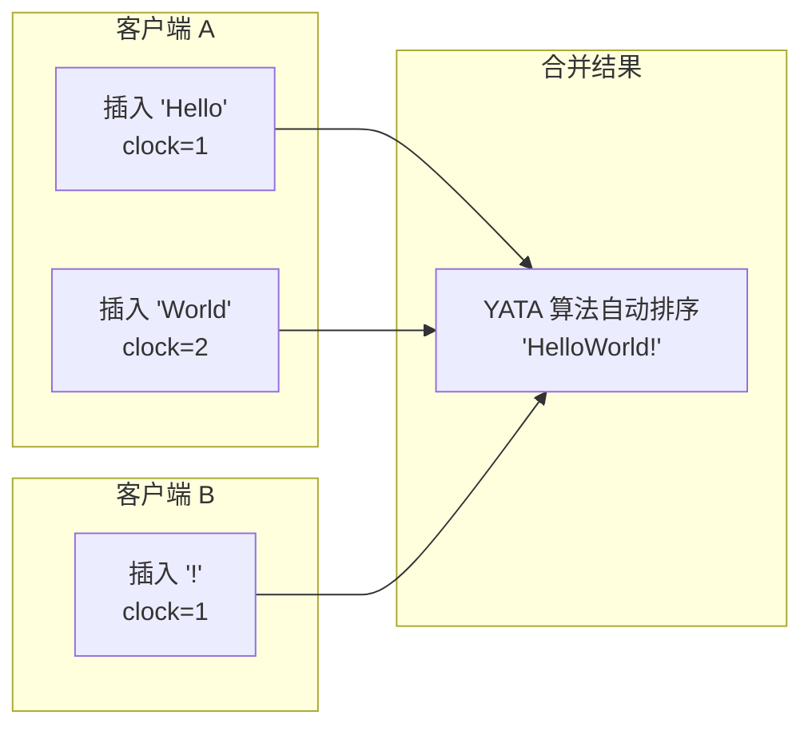

# CRDT 与 Yjs 原理

## 概述

本文档深入讲解 CRDT 理论和 Yjs 的实现原理，帮助理解协同编辑的核心机制。

## CRDT 基础

### 什么是 CRDT？

**CRDT（Conflict-free Replicated Data Types）** 是一类可以在网络中的多个节点上独立复制和修改的数据结构，最终能够自动合并到一致状态，无需协调。

### CRDT 分类

| 类型 | 说明 | 示例 |
|------|------|------|
| **State-based** | 传输完整状态 | G-Counter, PN-Counter |
| **Operation-based** | 传输操作 | Yjs, Automerge |

### 核心性质

1. **交换律 (Commutativity)**：操作顺序不影响最终结果
2. **结合律 (Associativity)**：分组合并不影响结果
3. **幂等性 (Idempotency)**：重复应用操作不影响结果

## YATA 算法

Yjs 基于 **YATA 算法**，专为文本协同编辑设计。

### 问题：并发插入

```
初始状态: "Hello"

用户 A 在位置 5 插入 "!"  →  "Hello!"
用户 B 在位置 5 插入 "?"  →  "Hello?"

如何合并？
```

### 传统 OT 方案

需要变换矩阵，复杂的冲突处理逻辑。

### YATA 方案

为每个字符分配唯一 ID，包含：
- **origin**：前一个字符的 ID
- **clock**：逻辑时钟

```
客户端 A:
  插入 "!" → ID = { client: A, clock: 1, origin: "o" }

客户端 B:
  插入 "?" → ID = { client: B, clock: 1, origin: "o" }

合并时按 ID 排序
```

### 排序规则

```typescript
function compare(a: Item, b: Item): number {
  // 1. 比较时钟
  if (a.id.clock < b.id.clock) return -1;
  if (a.id.clock > b.id.clock) return 1;

  // 2. 比较客户端 ID
  if (a.id.client < b.id.client) return -1;
  if (a.id.client > b.id.client) return 1;

  return 0;
}
```

## Yjs 核心概念

### 1. Y.Doc

文档的根容器，管理所有共享数据。

```typescript
import * as Y from 'yjs';

const ydoc = new Y.Doc();

// 事务
ydoc.transact(() => {
  ytext.insert(0, 'Hello');
  ytext.insert(5, ' World');
});
```

### 2. 共享类型

#### Y.Text

```typescript
const ytext = ydoc.getText('content');

// 插入
ytext.insert(0, 'Hello');

// 删除
ytext.delete(5, 3); // 从位置 5 删除 3 个字符

// 格式化
ytext.format(0, 5, { bold: true });

// 观察
ytext.observe((event) => {
  console.log('Changes:', event.changes);
});
```

#### Y.Map

```typescript
const ymap = ydoc.getMap('metadata');

// 设置
ymap.set('title', 'My Document');
ymap.set('author', 'Alice');

// 获取
ymap.get('title'); // 'My Document'

// 删除
ymap.delete('author');

// 观察
ymap.observe((event) => {
  event.changes.keys.forEach((change, key) => {
    console.log(`${key}: ${change.action}`);
  });
});
```

#### Y.Array

```typescript
const yarray = ydoc.getArray('list');

// 插入
yarray.insert(0, ['a', 'b', 'c']);

// 推入
yarray.push(['d']);

// 删除
yarray.delete(0, 1);

// 获取
yarray.toArray(); // ['b', 'c', 'd']
```

### 3. 更新机制

```typescript
import { encodeStateAsUpdate, encodeStateVector, applyUpdate } from 'yjs';

// 编码更新
const update = encodeStateAsUpdate(ydoc);

// 编码状态向量
const sv = encodeStateVector(ydoc);

// 应用更新
applyUpdate(ydoc, update);

// 增量更新（只获取对方没有的部分）
const diffUpdate = encodeStateAsUpdate(ydoc, remoteStateVector);
```

### 4. 状态向量

状态向量记录每个客户端的最后时钟值。

```typescript
// 状态向量示例
{
  'client-A': 5,  // 客户端 A 的最后时钟
  'client-B': 3,  // 客户端 B 的最后时钟
}

// 用途：
// 1. 判断缺失的更新
// 2. 实现增量同步
```

## 合并原理



### 合并示例

```typescript
// 客户端 A
const docA = new Y.Doc();
const textA = docA.getText('content');
textA.insert(0, 'Hello');

// 客户端 B
const docB = new Y.Doc();
const textB = docB.getText('content');
textB.insert(0, 'World');

// 同步
const updateA = encodeStateAsUpdate(docA);
const updateB = encodeStateAsUpdate(docB);

applyUpdate(docA, updateB);
applyUpdate(docB, updateA);

// 两个文档现在状态一致
textA.toString(); // 'HelloWorld' 或 'WorldHello'（取决于时钟）
```

## Yjs 内部结构

### Item 结构

```typescript
interface Item {
  id: ID;           // { client: string, clock: number }
  origin: ID | null; // 前一个 item 的 ID
  left: Item | null; // 左邻居
  right: Item | null; // 右邻居
  content: Content;  // 内容
  deleted: boolean;  // 是否删除
}
```

### 双向链表

Yjs 使用双向链表存储字符，支持高效插入和删除。

```
Head <-> [Item1] <-> [Item2] <-> [Item3] <-> Tail
```

### GC 机制

删除的 Item 不会立即移除，而是标记为 `deleted: true`。

```typescript
// 压缩时移除已删除的 Item
import { compact } from 'yjs';

// 或在快照时
const snapshot = Y.snapshot(ydoc);
```

## 性能特性

### 时间复杂度

| 操作 | 复杂度 |
|------|--------|
| 插入 | O(log n) |
| 删除 | O(1) |
| 查找 | O(log n) |
| 合并 | O(n) |

### 空间优化

- **结构共享**：相同内容只存储一次
- **增量编码**：只传输变更
- **压缩**：支持二进制压缩

## 实际应用

### Tiptap 集成

```typescript
import { Collaboration } from '@tiptap/extension-collaboration';
import * as Y from 'yjs';

const ydoc = new Y.Doc();
const ytext = ydoc.getText('content');

const editor = new Editor({
  extensions: [
    Collaboration.configure({
      document: ydoc,
      field: 'content',
    }),
  ],
});

// 编辑器操作自动同步到 ytext
// ytext 的变更自动反映到编辑器
```

### WebSocket 同步

```typescript
import { WebsocketProvider } from 'y-websocket';

const provider = new WebsocketProvider(
  'wss://server.com',
  'room-id',
  ydoc
);

// 自动同步
provider.on('sync', (isSynced) => {
  console.log('Synced:', isSynced);
});
```

## 调试技巧

### 日志更新

```typescript
ydoc.on('update', (update, origin) => {
  console.log('Update:', update);
  console.log('Origin:', origin);
});
```

### 查看文档状态

```typescript
import { encodeStateVector, encodeStateAsUpdate } from 'yjs';

const sv = encodeStateVector(ydoc);
const state = encodeStateAsUpdate(ydoc);

console.log('State Vector:', sv);
console.log('Full State:', state);
```

### 合并冲突调试

```typescript
import { applyUpdate } from 'yjs';

try {
  applyUpdate(ydoc, update);
} catch (error) {
  console.error('Merge error:', error);
  // 处理冲突
}
```

## 相关文档

- [Awareness 协议](./awareness-protocol.md)
- [冲突解决机制](./conflict-resolution.md)
- [Yjs 客户端配置](../03-frontend/yjs-client.md)
