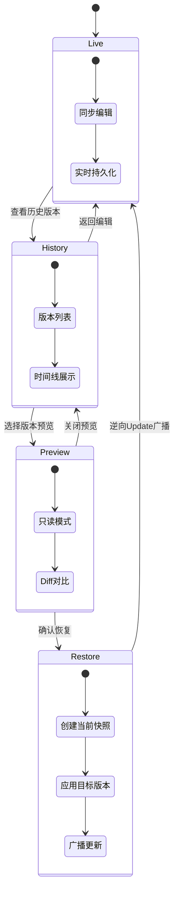
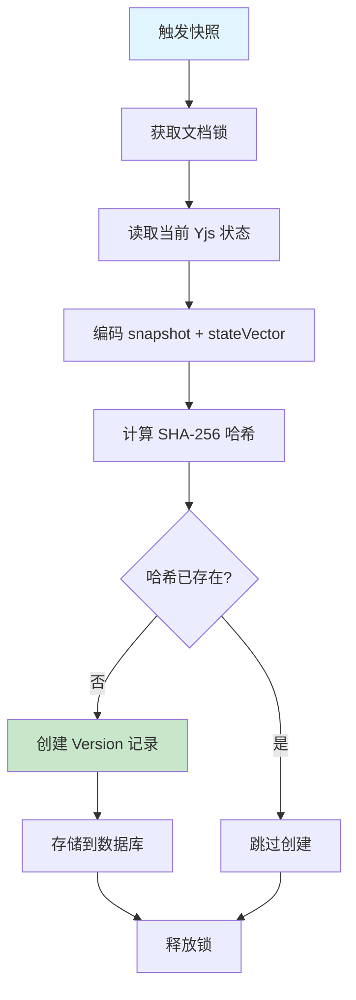
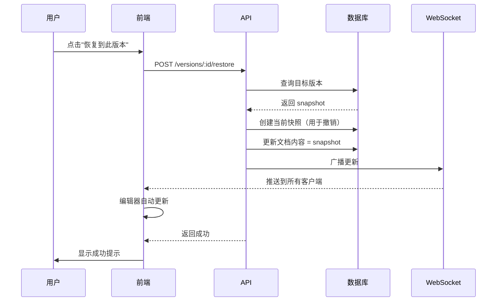

# 版本管理流程

## 概述

本文档描述类 Git 的版本管理流程，包括快照创建、版本浏览、预览和恢复。

## 版本状态机



## 快照创建

### 触发条件

| 触发方式       | 条件                 | 说明                |
| -------------- | -------------------- | ------------------- |
| **自动快照**   | 操作次数 >= 100      | Hocuspocus 钩子触发 |
| **自动快照**   | 距上次快照 >= 5 分钟 | 定时检查            |
| **手动快照**   | 用户点击保存         | API 调用            |
| **恢复前快照** | 版本恢复前           | 自动创建            |

### 快照流程



### 代码实现

```typescript
// src/modules/versions/snapshot.service.ts
async createSnapshot(
  documentId: string,
  userId: string,
  message?: string,
) {
  // 1. 获取锁
  const lockKey = `lock:snapshot:${documentId}`;
  const acquired = await this.redis.set(lockKey, '1', 'PX', 5000, 'NX');
  if (!acquired) {
    throw new Error('Snapshot creation in progress');
  }

  try {
    // 2. 加载文档
    const document = await this.prisma.document.findUnique({
      where: { id: documentId },
      select: { content: true },
    });

    if (!document?.content) {
      throw new Error('Document content not found');
    }

    // 3. 解析 Yjs 文档
    const ydoc = new Y.Doc();
    Y.applyUpdate(ydoc, new Uint8Array(document.content));

    // 4. 生成快照
    const snapshot = Y.encodeStateAsUpdate(ydoc);
    const stateVector = Y.encodeStateVector(ydoc);

    // 5. 计算哈希
    const hash = createHash('sha256').update(snapshot).digest('hex');

    // 6. 检查重复
    const existing = await this.prisma.version.findUnique({
      where: { hash },
    });

    if (existing) {
      return { version: existing, isNew: false };
    }

    // 7. 创建记录
    const version = await this.prisma.version.create({
      data: {
        documentId,
        snapshot: Buffer.from(snapshot),
        stateVector: Buffer.from(stateVector),
        hash,
        message,
        creatorId: userId,
      },
    });

    return { version, isNew: true };
  } finally {
    await this.redis.del(lockKey);
  }
}
```

## 版本浏览

### 版本列表 API

```typescript
// GET /documents/:id/versions
async findByDocument(documentId: string, page = 1, limit = 20) {
  const skip = (page - 1) * limit;

  const [versions, total] = await Promise.all([
    this.prisma.version.findMany({
      where: { documentId },
      skip,
      take: limit,
      orderBy: { createdAt: 'desc' },
      include: {
        creator: {
          select: { id: true, name: true, avatar: true },
        },
      },
    }),
    this.prisma.version.count({ where: { documentId } }),
  ]);

  return { versions, meta: { page, limit, total } };
}
```

### 前端组件

```tsx
// components/version/version-list.tsx
import { useQuery } from '@tanstack/react-query';
import { formatDistanceToNow } from 'date-fns';

interface Props {
    documentId: string;
    onSelect: (versionId: string) => void;
}

export function VersionList({ documentId, onSelect }: Props) {
    const { data, isLoading } = useQuery({
        queryKey: ['versions', documentId],
        queryFn: () => api.get(`/documents/${documentId}/versions`),
    });

    if (isLoading) {
        return <VersionListSkeleton />;
    }

    return (
        <div className="space-y-2">
            {data?.versions.map((version) => (
                <button
                    key={version.id}
                    onClick={() => onSelect(version.id)}
                    className="w-full p-4 text-left border rounded-lg hover:bg-gray-50 transition"
                >
                    <div className="flex items-center justify-between">
                        <div>
                            <p className="font-medium">{version.message || 'Auto-saved'}</p>
                            <p className="text-sm text-gray-500">
                                {formatDistanceToNow(new Date(version.createdAt))} ago
                            </p>
                        </div>
                        <div className="flex items-center gap-2">
                            
                            <span className="text-sm">{version.creator.name}</span>
                        </div>
                    </div>
                </button>
            ))}
        </div>
    );
}
```

## 版本预览

### 预览模式

预览版本时，编辑器进入只读模式，显示历史版本内容。

```tsx
// components/version/version-preview.tsx
import { useQuery } from '@tanstack/react-query';
import { Editor } from '@tiptap/react';

interface Props {
    documentId: string;
    versionId: string;
    onClose: () => void;
    onRestore: () => void;
}

export function VersionPreview({ documentId, versionId, onClose, onRestore }: Props) {
    const { data: version, isLoading } = useQuery({
        queryKey: ['version', versionId],
        queryFn: () => api.get(`/documents/${documentId}/versions/${versionId}`),
    });

    const [previewEditor, setPreviewEditor] = useState<Editor | null>(null);

    useEffect(() => {
        if (!version?.snapshot) return;

        // 创建只读编辑器
        const editor = new Editor({
            editable: false,
            content: '', // 从 snapshot 加载
        });

        // 应用快照内容
        const ydoc = new Y.Doc();
        Y.applyUpdate(ydoc, new Uint8Array(version.snapshot));
        const content = ydoc.getText('content').toString();
        editor.commands.setContent(content);

        setPreviewEditor(editor);

        return () => editor.destroy();
    }, [version]);

    if (isLoading) {
        return <PreviewSkeleton />;
    }

    return (
        <div className="flex flex-col h-full">
            {/* 预览头 */}
            <div className="flex items-center justify-between p-4 border-b bg-yellow-50">
                <div className="flex items-center gap-2">
                    <Eye className="w-4 h-4" />
                    <span className="font-medium">Previewing version</span>
                    <span className="text-sm text-gray-500">
                        {format(new Date(version.createdAt), 'PPpp')}
                    </span>
                </div>
                <div className="flex gap-2">
                    <Button variant="outline" onClick={onClose}>
                        Close
                    </Button>
                    <Button onClick={onRestore}>
                        <RotateCcw className="w-4 h-4 mr-2" />
                        Restore
                    </Button>
                </div>
            </div>

            {/* 预览内容 */}
            <div className="flex-1 overflow-auto">
                <EditorContent editor={previewEditor} />
            </div>
        </div>
    );
}
```

## 版本恢复

### 恢复流程



### 恢复代码

```typescript
async restore(versionId: string, userId: string) {
  // 1. 获取目标版本
  const version = await this.prisma.version.findUnique({
    where: { id: versionId },
  });

  if (!version) {
    throw new NotFoundException('Version not found');
  }

  // 2. 创建当前状态快照（用于撤销）
  const currentSnapshot = await this.createSnapshot(
    version.documentId,
    userId,
    `Before restore to ${versionId}`,
  );

  // 3. 恢复到目标版本
  await this.prisma.document.update({
    where: { id: version.documentId },
    data: {
      content: version.snapshot,
      updatedAt: new Date(),
    },
  });

  // 4. 通知所有客户端（通过 Hocuspocus）
  await this.broadcastRestore(version.documentId, version.snapshot);

  return {
    success: true,
    newVersionId: currentSnapshot.version.id,
  };
}
```

### 客户端同步

```typescript
// 恢复后客户端自动同步
// Hocuspocus 会广播更新给所有连接的客户端

// 前端处理
provider.on('sync', () => {
    // 文档内容已更新到恢复的版本
    // Tiptap 自动反映变化
});
```

## 版本对比

### Diff 算法

```typescript
async diff(fromVersionId: string, toVersionId: string) {
  const [from, to] = await Promise.all([
    this.prisma.version.findUnique({ where: { id: fromVersionId } }),
    this.prisma.version.findUnique({ where: { id: toVersionId } }),
  ]);

  if (!from || !to) {
    throw new NotFoundException('Version not found');
  }

  // 解析两个版本
  const fromDoc = new Y.Doc();
  const toDoc = new Y.Doc();

  Y.applyUpdate(fromDoc, new Uint8Array(from.snapshot));
  Y.applyUpdate(toDoc, new Uint8Array(to.snapshot));

  // 获取文本内容
  const fromText = fromDoc.getText('content').toString();
  const toText = toDoc.getText('content').toString();

  // 计算 diff（使用 diff-match-patch 或类似库）
  const changes = this.computeDiff(fromText, toText);

  return {
    from: { id: fromVersionId, createdAt: from.createdAt },
    to: { id: toVersionId, createdAt: to.createdAt },
    changes,
    stats: {
      additions: changes.filter((c) => c.type === 'add').length,
      deletions: changes.filter((c) => c.type === 'delete').length,
    },
  };
}
```

### Diff 展示

```tsx
// components/version/version-diff.tsx
interface DiffViewProps {
    changes: Array<{
        type: 'add' | 'delete' | 'equal';
        value: string;
        position: number;
    }>;
}

export function VersionDiff({ changes }: DiffViewProps) {
    return (
        <div className="font-mono text-sm">
            {changes.map((change, index) => (
                <div
                    key={index}
                    className={cn(
                        'px-2 py-1',
                        change.type === 'add' && 'bg-green-100 text-green-800',
                        change.type === 'delete' && 'bg-red-100 text-red-800 line-through',
                        change.type === 'equal' && 'text-gray-600'
                    )}
                >
                    <span className="mr-2 text-gray-400">
                        {change.type === 'add' && '+'}
                        {change.type === 'delete' && '-'}
                        {change.type === 'equal' && ' '}
                    </span>
                    {change.value}
                </div>
            ))}
        </div>
    );
}
```

## 相关文档

- [版本管理逻辑](../04-backend/version-management.md)
- [数据模型设计](../04-backend/prisma-schema.md)
- [CRDT 与 Yjs 原理](./crdt-yjs.md)
