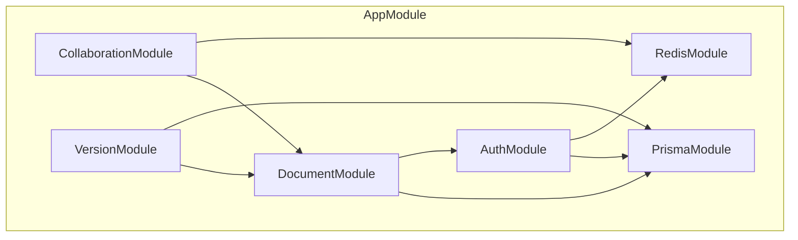

# 协同文档编辑与版本回溯系统

## 架构设计与说明文档

> 基于 CRDT（Yjs）的工业级实时协同编辑系统，支持毫秒级同步、无冲突合并、离线编辑和类 Git 版本管理。

---

## 目录

- [1. 项目概述](#1-项目概述)
- [2. 系统架构总览](#2-系统架构总览)
- [3. 前后端架构详解](#3-前后端架构详解)
- [4. 核心技术方案](#4-核心技术方案)
- [5. 性能与扩展性](#5-性能与扩展性)
- [6. 开发规范](#6-开发规范)
- [7. 部署与运维](#7-部署与运维)
- [8. 开发路线图](#8-开发路线图)
- [9. 文档导航](#9-文档导航)

---

## 1. 项目概述

### 1.1 业务背景

传统文档协作工具存在以下痛点：

| 问题 | 影响 |
|------|------|
| **实时性差** | 多人编辑时延迟明显，影响协作效率 |
| **冲突处理弱** | 最后写入覆盖，导致内容丢失 |
| **离线不可用** | 网络断开即无法编辑 |
| **版本管理粗糙** | 缺乏细粒度的版本回溯能力 |
| **数据主权弱** | 数据完全依赖服务端，用户无本地控制权 |

### 1.2 解决方案

本系统基于 **CRDT（Conflict-free Replicated Data Types）** 理论，使用 **Yjs** 作为协同引擎，实现：

```
┌─────────────────────────────────────────────────────────────────┐
│                      核心能力矩阵                                │
├─────────────────────────────────────────────────────────────────┤
│                                                                 │
│  ┌─────────────┐  ┌─────────────┐  ┌─────────────┐            │
│  │  实时协同   │  │  离线支持   │  │  版本管理   │            │
│  │             │  │             │  │             │            │
│  │  毫秒级同步 │  │  本地优先   │  │  快照回溯   │            │
│  │  无冲突合并 │  │  断网可编辑 │  │  Diff 对比  │            │
│  └─────────────┘  └─────────────┘  └─────────────┘            │
│                                                                 │
│  ┌─────────────┐  ┌─────────────┐  ┌─────────────┐            │
│  │  安全可靠   │  │  高性能     │  │  可扩展     │            │
│  │             │  │             │  │             │            │
│  │  JWT 认证   │  │  增量同步   │  │  水平扩展   │            │
│  │  RBAC 权限  │  │  压缩传输   │  │  多实例部署 │            │
│  └─────────────┘  └─────────────┘  └─────────────┘            │
│                                                                 │
└─────────────────────────────────────────────────────────────────┘
```

### 1.3 核心价值主张

| 价值 | 说明 |
|------|------|
| **毫秒级同步** | WebSocket + Yjs 二进制协议，延迟 < 50ms |
| **无冲突合并** | CRDT 自动处理并发编辑，无需用户干预 |
| **离线可用** | 本地优先架构，断网后继续编辑，重连自动同步 |
| **版本可控** | 类 Git 版本管理，支持快照、回溯、Diff 对比 |

---

## 2. 系统架构总览

### 2.1 四层架构图

```
┌─────────────────────────────────────────────────────────────────────────┐
│                           客户端层 (Client Layer)                        │
│  ┌───────────────────────────────────────────────────────────────────┐  │
│  │  Next.js 15 App Router                                            │  │
│  │  ├── React Server Components (SSR)                               │  │
│  │  ├── Tiptap 3 Editor (Client Component)                          │  │
│  │  ├── Yjs Provider (WebSocket)                                    │  │
│  │  ├── Awareness State Manager                                     │  │
│  │  └── IndexedDB (离线存储)                                         │  │
│  └───────────────────────────────────────────────────────────────────┘  │
└─────────────────────────────────────────────────────────────────────────┘
                              │ WebSocket (Yjs Binary)
                              ▼
┌─────────────────────────────────────────────────────────────────────────┐
│                           网关层 (Gateway Layer)                         │
│  ┌───────────────────────────────────────────────────────────────────┐  │
│  │  NestJS 11 + Hocuspocus 3                                         │  │
│  │  ├── onAuthenticate (JWT 验证)                                    │  │
│  │  ├── onConnect (房间管理)                                         │  │
│  │  ├── onApply (更新广播)                                           │  │
│  │  ├── onStoreDocument (持久化)                                     │  │
│  │  └── onDisconnect (清理资源)                                      │  │
│  └───────────────────────────────────────────────────────────────────┘  │
└─────────────────────────────────────────────────────────────────────────┘
                              │
                              ▼
┌─────────────────────────────────────────────────────────────────────────┐
│                           服务层 (Service Layer)                         │
│  ┌──────────────┐  ┌──────────────┐  ┌──────────────┐  ┌────────────┐ │
│  │ AuthService  │  │ DocService   │  │ VersionSvc   │  │ CollabSvc  │ │
│  │              │  │              │  │              │  │            │ │
│  │ 认证授权     │  │ 文档管理     │  │ 版本快照     │  │ 协作者管理  │ │
│  └──────────────┘  └──────────────┘  └──────────────┘  └────────────┘ │
└─────────────────────────────────────────────────────────────────────────┘
                              │
                              ▼
┌─────────────────────────────────────────────────────────────────────────┐
│                           数据层 (Data Layer)                            │
│  ┌────────────────────────────┐  ┌────────────────────────────┐        │
│  │ PostgreSQL 17              │  │ Redis 8                    │        │
│  │ ├── Documents (文档)       │  │ ├── Session Cache (会话)   │        │
│  │ ├── Versions (版本)        │  │ ├── Pub/Sub (消息广播)     │        │
│  │ ├── Users (用户)           │  │ ├── Rate Limit (限流)      │        │
│  │ └── Collaborators (协作者) │  │ └── Distributed Lock (锁)  │        │
│  └────────────────────────────┘  └────────────────────────────┘        │
└─────────────────────────────────────────────────────────────────────────┘
```

### 2.2 技术栈选型

| 层级 | 技术 | 版本 | 选型理由 |
|------|------|------|----------|
| **前端框架** | Next.js | 15+ | App Router 成熟，RSC 支持，Turbopack 快速构建 |
| **UI 组件** | React | 19+ | 最新特性，性能优化 |
| **样式方案** | Tailwind CSS | 4.x | 原子化 CSS，AI 生成友好 |
| **组件库** | ShadcnUI | 1.x | 可复制组件，完全可控 |
| **编辑器内核** | Tiptap | 3.x | 无头编辑器，Yjs 深度集成 |
| **协同引擎** | Yjs | 13.x | CRDT YATA 算法，工业级 |
| **后端框架** | NestJS | 11+ | 模块化，TypeScript 原生 |
| **协同中继** | Hocuspocus | 3.x | Tiptap 官方，钩子式开发 |
| **ORM** | Prisma | 6+ | 类型安全，迁移完善 |
| **主存储** | PostgreSQL | 17 | BYTEA 支持，JSONB 优化 |
| **缓存/消息** | Redis | 8+ | Pub/Sub，分布式锁 |
| **运行时** | Node.js | 22 LTS | 性能优化，长期支持 |

### 2.3 五大架构原则

```
┌─────────────────────────────────────────────────────────────────┐
│                      架构设计原则                                │
├─────────────────────────────────────────────────────────────────┤
│                                                                 │
│  1. 本地优先 (Local-First)                                      │
│     客户端持有完整文档状态，操作优先在本地执行，异步同步服务端     │
│     → 离线可用、低延迟、数据主权                                 │
│                                                                 │
│  2. 事件溯源 (Event Sourcing)                                   │
│     文档状态由变更事件累积而成，而非仅存储最终状态                │
│     → 完整历史、时间旅行、审计追踪                               │
│                                                                 │
│  3. 最终一致性 (Eventual Consistency)                           │
│     基于 CRDT，所有客户端最终收敛到相同状态，无需中央锁机制       │
│     → 无冲突合并、高可用、分布式友好                             │
│                                                                 │
│  4. 关注点分离 (Separation of Concerns)                         │
│     前后端职责清晰，模块边界明确，依赖单向流动                    │
│     → 可维护性、可测试性、可扩展性                               │
│                                                                 │
│  5. 安全默认 (Secure by Default)                                │
│     所有 API 默认需认证，敏感操作需权限检查                       │
│     → 最小权限原则、纵深防御                                     │
│                                                                 │
└─────────────────────────────────────────────────────────────────┘
```

---

## 3. 前后端架构详解

### 3.1 前端架构

#### 目录结构

```
frontend/
├── app/                        # Next.js App Router
│   ├── (auth)/                # 认证路由组
│   │   ├── login/page.tsx
│   │   └── register/page.tsx
│   ├── (main)/                # 主应用路由组
│   │   ├── documents/         # 文档列表与编辑
│   │   │   ├── page.tsx       # 文档列表
│   │   │   └── [id]/          # 文档详情
│   │   │       ├── page.tsx   # 编辑页面
│   │   │       └── versions/  # 版本历史
│   │   └── settings/          # 用户设置
│   ├── layout.tsx             # 根布局
│   └── page.tsx               # 首页
│
├── components/                 # React 组件
│   ├── ui/                    # ShadcnUI 基础组件
│   ├── editor/                # 编辑器组件
│   │   ├── editor.tsx         # 主编辑器
│   │   ├── menu-bar.tsx       # 菜单栏
│   │   ├── bubble-menu.tsx    # 浮动菜单
│   │   └── status-bar.tsx     # 状态栏
│   ├── collaboration/         # 协同组件
│   │   ├── collaboration-cursor.tsx
│   │   ├── awareness-panel.tsx
│   │   └── connection-status.tsx
│   ├── version/               # 版本管理组件
│   │   ├── version-list.tsx
│   │   ├── version-preview.tsx
│   │   └── version-diff.tsx
│   └── common/                # 通用组件
│
├── hooks/                      # 自定义 Hooks
│   ├── use-document.ts        # 文档操作
│   ├── use-collaboration.ts   # 协同状态
│   ├── use-versions.ts        # 版本管理
│   └── use-auth.ts            # 认证状态
│
├── lib/                        # 工具函数
│   ├── api/                   # API 客户端
│   ├── auth/                  # 认证工具
│   └── yjs/                   # Yjs 工具
│
├── providers/                  # Context Providers
├── stores/                     # Zustand Stores
├── types/                      # TypeScript 类型
└── styles/                     # 全局样式
```

#### 核心模块

| 模块 | 职责 | 关键技术 |
|------|------|----------|
| **编辑器模块** | Tiptap 初始化、扩展管理 | Tiptap、Collaboration 扩展 |
| **协同模块** | Yjs Provider、Awareness | y-websocket、IndexedDB |
| **版本模块** | 版本列表、预览、恢复 | TanStack Query |
| **认证模块** | 登录、注册、Token 管理 | JWT、Zustand |

#### 前端数据流

```
用户输入
    │
    ▼
┌──────────┐    ┌──────────┐    ┌─────────────┐    ┌──────────┐
│  Tiptap  │───▶│  Y.Doc   │───▶│ WebSocket   │───▶│Hocuspocus│
│  Editor  │    │ (本地状态)│    │  Provider   │    │  Server  │
└──────────┘    └──────────┘    └─────────────┘    └──────────┘
    │                                                   │
    │              ┌────────────────────────────────────┘
    │              │
    │              ▼
    │        ┌──────────┐    ┌──────────┐
    │        │  Redis   │◀──▶│PostgreSQL│
    │        │ (PubSub) │    │ (持久化) │
    │        └──────────┘    └──────────┘
    │
    └──────────▶ UI 更新（通过 Yjs 观察者）
```

### 3.2 后端架构

#### 目录结构

```
backend/
├── src/
│   ├── modules/                # 业务模块
│   │   ├── auth/              # 认证模块
│   │   │   ├── auth.module.ts
│   │   │   ├── auth.service.ts
│   │   │   ├── auth.controller.ts
│   │   │   └── strategies/
│   │   ├── documents/         # 文档模块
│   │   ├── versions/          # 版本模块
│   │   └── collaboration/     # 协同模块
│   │
│   ├── common/                # 公共模块
│   │   ├── decorators/        # 装饰器
│   │   ├── guards/            # 守卫
│   │   ├── interceptors/      # 拦截器
│   │   ├── filters/           # 过滤器
│   │   └── pipes/             # 管道
│   │
│   ├── config/                # 配置
│   ├── prisma/                # Prisma 服务
│   ├── redis/                 # Redis 服务
│   └── hocuspocus/            # Hocuspocus 配置
│
├── prisma/
│   ├── schema.prisma          # 数据模型
│   └── migrations/            # 迁移文件
│
└── test/                      # 测试
```

#### 模块依赖



#### 数据模型

```prisma
// 核心数据模型

model User {
  id        String   @id @default(cuid())
  email     String   @unique
  username  String   @unique
  password  String
  nickname  String?
  avatar    String?
  status    UserStatus @default(ACTIVE)
  createdAt DateTime @default(now())
  updatedAt DateTime @updatedAt

  documents     Document[]
  collaborations DocumentCollaborator[]
  versions      DocumentVersion[]
  sessions      Session[]
}

model Document {
  id          String        @id @default(cuid())
  title       String
  description String?
  content     Json?         // Yjs document state
  isPublic    Boolean       @default(false)
  status      DocumentStatus @default(DRAFT)
  createdAt   DateTime      @default(now())
  updatedAt   DateTime      @updatedAt

  authorId       String
  author         User                @relation(fields: [authorId], references: [id])
  collaborators  DocumentCollaborator[]
  versions       DocumentVersion[]
  edits          DocumentEdit[]
}

model DocumentVersion {
  id          String   @id @default(cuid())
  documentId  String
  version     Int
  content     Json     // Yjs snapshot
  changeLog   String?
  createdBy   String
  createdAt   DateTime @default(now())

  document Document @relation(fields: [documentId], references: [id])
  author   User     @relation(fields: [createdBy], references: [id])

  @@unique([documentId, version])
}

model DocumentCollaborator {
  id         String         @id @default(cuid())
  documentId String
  userId     String
  role       CollaboratorRole @default(VIEWER)
  addedAt    DateTime       @default(now())

  document Document @relation(fields: [documentId], references: [id])
  user     User     @relation(fields: [userId], references: [id])

  @@unique([documentId, userId])
}

enum CollaboratorRole {
  OWNER
  EDITOR
  VIEWER
}
```

### 3.3 前后端对接规范

#### API 统一响应格式

```typescript
// 成功响应
interface SuccessResponse<T> {
  success: true;
  data: T;
  meta?: {
    page?: number;
    limit?: number;
    total?: number;
  };
}

// 错误响应
interface ErrorResponse {
  success: false;
  error: {
    code: string;      // e.g., 'AUTH_INVALID_TOKEN'
    message: string;   // 用户友好的错误信息
    details?: Record<string, unknown>;
  };
}
```

#### JWT 认证流程

```
┌─────────────┐                    ┌─────────────┐
│   客户端    │                    │   服务端    │
└──────┬──────┘                    └──────┬──────┘
       │                                  │
       │  POST /auth/login                │
       │  { email, password }             │
       │─────────────────────────────────▶│
       │                                  │ 验证凭证
       │                                  │ 生成 JWT
       │  { accessToken, refreshToken }   │
       │◀─────────────────────────────────│
       │                                  │
       │  WebSocket 连接                  │
       │  ws://...?token=accessToken      │
       │─────────────────────────────────▶│
       │                                  │ 验证 Token
       │  连接成功                         │
       │◀─────────────────────────────────│
       │                                  │
```

#### WebSocket 协议

```
// 连接建立
ws://server.com/document/{documentId}?token={jwt}

// 消息格式（Yjs 二进制）
┌─────────────────────────────────────────┐
│ 消息类型 (1 byte) │ 载荷 (变长)          │
├─────────────────────────────────────────┤
│ 0x00 │ Sync Step 1 (State Vector)       │
│ 0x01 │ Sync Step 2 (Update)             │
│ 0x02 │ Sync Update                      │
│ 0x03 │ Awareness Update                 │
└─────────────────────────────────────────┘
```

---

## 4. 核心技术方案

### 4.1 CRDT 协同机制

#### Yjs 核心概念

```typescript
import * as Y from 'yjs';

// 创建文档
const ydoc = new Y.Doc();

// 共享类型
const ytext = ydoc.getText('content');    // 文本内容
const ymap = ydoc.getMap('metadata');     // 元数据
const yarray = ydoc.getArray('versions'); // 版本列表

// 监听变更
ytext.observe(event => {
  console.log('Text changed:', event.changes);
});

// 本地操作
ytext.insert(0, 'Hello World');  // 插入文本
ytext.delete(5, 1);               // 删除字符
```

#### State Vector 与增量同步

```typescript
// State Vector 记录每个客户端的已知状态
interface StateVector {
  [clientId: number]: number;  // clientId → clock
}

// 增量同步：只传输差异部分
const serverStateVector = Y.encodeStateVector(serverDoc);
const clientStateVector = Y.encodeStateVector(clientDoc);

// 计算需要同步的更新
const diff = Y.encodeStateAsUpdate(serverDoc, clientStateVector);
// 发送 diff 给客户端
```

### 4.2 WebSocket 实时通信

#### Hocuspocus 配置

```typescript
import { Server } from '@hocuspocus/server';
import { Database } from '@hocuspocus/extension-database';
import { Redis } from '@hocuspocus/extension-redis';

const server = Server.configure({
  port: 1234,

  extensions: [
    new Redis({
      host: process.env.REDIS_HOST,
      port: 6379,
    }),
    new Database({
      fetch: async ({ documentName }) => {
        return await documentService.loadDocument(documentName);
      },
      store: async ({ documentName, state }) => {
        await documentService.saveDocument(documentName, state);
      },
    }),
  ],

  async onAuthenticate({ token, documentName }) {
    const user = await authService.verifyToken(token);
    const hasAccess = await documentService.checkAccess(documentName, user.id);
    if (!hasAccess) throw new Error('Unauthorized');
    return { user };
  },

  async onStoreDocument({ documentName, document }) {
    // 防抖持久化：2 秒无新变更后写入
    await documentService.debouncedSave(documentName, document);
  },
});

server.listen();
```

### 4.3 版本管理策略

#### 快照创建流程

```
编辑操作累积
    │
    ▼
┌─────────────────┐
│  达到阈值?       │  触发条件：
│  - 50 次编辑    │  - 编辑次数
│  - 手动触发     │  - 时间间隔
│  - 用户请求     │  - 用户操作
└────────┬────────┘
         │ 是
         ▼
┌─────────────────┐
│ 提取 State Vector│
│ 计算 SHA-256     │
└────────┬────────┘
         │
         ▼
┌─────────────────┐     是
│  哈希已存在?     │────────▶ 跳过（去重）
└────────┬────────┘
         │ 否
         ▼
┌─────────────────┐
│ 创建 Version    │
│ 存储 snapshot   │
│ 记录版本历史     │
└─────────────────┘
```

#### 版本恢复流程

```typescript
async function restoreVersion(versionId: string) {
  // 1. 获取目标版本快照
  const version = await prisma.documentVersion.findUnique({
    where: { id: versionId },
  });

  // 2. 创建当前状态快照（恢复点）
  await createSnapshot(documentId, 'auto-before-restore');

  // 3. 计算差异并生成逆向更新
  const currentDoc = await loadDocument(documentId);
  const targetDoc = new Y.Doc();
  Y.applyUpdate(targetDoc, version.content);

  // 4. 应用目标状态
  const restoreUpdate = Y.encodeStateAsUpdate(targetDoc);
  await broadcastUpdate(documentId, restoreUpdate);
}
```

### 4.4 认证授权方案

#### JWT + RBAC

```typescript
// JWT Payload
interface JwtPayload {
  sub: string;      // 用户 ID
  email: string;
  role: 'USER' | 'ADMIN';
  iat: number;
  exp: number;
}

// RBAC 权限矩阵
const permissions = {
  OWNER:  ['read', 'write', 'delete', 'share', 'version'],
  EDITOR: ['read', 'write', 'version'],
  VIEWER: ['read'],
};

// 权限检查装饰器
@RequirePermission('write')
@Post(':id/content')
async updateContent(@Param('id') id: string, @Body() content: UpdateDto) {
  // 只有 OWNER 和 EDITOR 可以执行
}
```

---

## 5. 性能与扩展性

### 5.1 前端优化策略

| 策略 | 实现方式 | 效果 |
|------|----------|------|
| **代码分割** | 动态 import、路由级分割 | 首屏加载 < 100KB |
| **虚拟列表** | @tanstack/virtual | 大文档渲染流畅 |
| **懒加载** | React.lazy、Suspense | 按需加载组件 |
| **缓存策略** | TanStack Query + IndexedDB | 离线可用、快速响应 |

```typescript
// 编辑器懒加载示例
const Editor = lazy(() => import('@/components/editor/editor'));

// 使用
<Suspense fallback={<EditorSkeleton />}>
  <Editor documentId={id} />
</Suspense>
```

### 5.2 后端优化策略

| 策略 | 实现方式 | 效果 |
|------|----------|------|
| **连接池** | Prisma 连接池管理 | 数据库连接复用 |
| **Redis 缓存** | 会话缓存、热点数据 | 减少数据库查询 |
| **防抖持久化** | 2 秒无变更后写入 | 减少写入频率 |
| **压缩传输** | zlib 压缩大更新 | 减少网络传输 |

```typescript
// 防抖持久化
const debouncedSave = debounce(async (documentId: string, doc: Y.Doc) => {
  const state = Y.encodeStateAsUpdate(doc);
  await prisma.document.update({
    where: { id: documentId },
    data: { content: state, updatedAt: new Date() },
  });
}, 2000);
```

### 5.3 水平扩展

#### 多实例部署架构

```
                    ┌─────────────────┐
                    │   Load Balancer │
                    │   (Nginx/ALB)   │
                    └────────┬────────┘
                             │
              ┌──────────────┼──────────────┐
              │              │              │
              ▼              ▼              ▼
        ┌─────────┐    ┌─────────┐    ┌─────────┐
        │ Node 1  │    │ Node 2  │    │ Node 3  │
        │Hocuspocus│   │Hocuspocus│   │Hocuspocus│
        └────┬────┘    └────┬────┘    └────┬────┘
             │              │              │
             └──────────────┼──────────────┘
                            │
                    ┌───────┴───────┐
                    │               │
                    ▼               ▼
              ┌──────────┐   ┌──────────┐
              │PostgreSQL│   │  Redis   │
              │  (Primary)│   │(Pub/Sub) │
              └──────────┘   └──────────┘
```

#### Redis Pub/Sub 同步

```typescript
// 跨实例消息同步
redis.subscribe('channel:document:*', (message) => {
  const { documentId, update } = JSON.parse(message);
  // 广播给本实例的所有连接客户端
  broadcastToLocalClients(documentId, update);
});
```

### 5.4 缓存策略

```
┌─────────────────────────────────────────────────────────────────┐
│                      四级缓存架构                                │
├─────────────────────────────────────────────────────────────────┤
│                                                                 │
│  L1: IndexedDB (客户端持久化)                                   │
│      → 离线可用，快速恢复                                        │
│                                                                 │
│  L2: Memory (客户端内存)                                        │
│      → Y.Doc 状态，毫秒级访问                                   │
│                                                                 │
│  L3: Redis (服务端缓存)                                         │
│      → 热点数据，分布式共享                                      │
│                                                                 │
│  L4: PostgreSQL (持久化存储)                                    │
│      → 最终数据源，ACID 保证                                    │
│                                                                 │
└─────────────────────────────────────────────────────────────────┘
```

---

## 6. 开发规范

### 6.1 代码规范

#### TypeScript 严格模式

```json
{
  "compilerOptions": {
    "strict": true,
    "noImplicitAny": true,
    "strictNullChecks": true,
    "noUnusedLocals": true,
    "noUnusedParameters": true
  }
}
```

#### 文件组织

```
// 单个文件 < 400 行，函数 < 50 行
// 高内聚、低耦合

// 组件结构示例
components/
├── editor/
│   ├── index.ts           # 统一导出
│   ├── editor.tsx         # 主组件
│   ├── menu-bar.tsx       # 子组件
│   ├── extensions.ts      # 扩展配置
│   └── types.ts           # 类型定义
```

#### 命名约定

| 类型 | 约定 | 示例 |
|------|------|------|
| 组件文件 | PascalCase | `DocumentEditor.tsx` |
| Hook 文件 | camelCase + use 前缀 | `useDocument.ts` |
| 工具函数 | camelCase | `formatDate.ts` |
| 类型文件 | camelCase | `document.ts` |
| 常量 | UPPER_SNAKE_CASE | `MAX_FILE_SIZE` |
| 接口/类型 | PascalCase | `Document` / `CreateDocumentInput` |

### 6.2 Git 工作流

#### 分支策略

```
main (生产)
  │
  └── develop (开发)
        │
        ├── feature/auth (功能分支)
        ├── feature/editor
        └── fix/websocket-reconnect (修复分支)
```

#### Commit 规范

```
<type>: <description>

Types:
- feat:     新功能
- fix:      修复 bug
- refactor: 重构
- docs:     文档更新
- test:     测试相关
- chore:    构建/工具
- perf:     性能优化

示例:
feat: 添加版本快照功能
fix: 修复 WebSocket 重连问题
refactor: 优化编辑器性能
```

### 6.3 测试要求

#### 覆盖率要求

| 类型 | 覆盖率 | 工具 |
|------|--------|------|
| 单元测试 | 80%+ | Vitest |
| 集成测试 | 关键路径 | Supertest |
| E2E 测试 | 核心流程 | Playwright |

#### TDD 工作流

```
1. RED:   编写失败的测试
2. GREEN: 编写最小实现使测试通过
3. REFACTOR: 重构代码，保持测试通过
4. REPEAT: 循环上述步骤
```

```typescript
// 测试示例
describe('DocumentService', () => {
  it('should create document with valid data', async () => {
    const dto = { title: 'Test Document', content: '' };
    const result = await service.create(dto, userId);
    expect(result.title).toBe('Test Document');
  });

  it('should throw error when title is empty', async () => {
    const dto = { title: '', content: '' };
    await expect(service.create(dto, userId)).rejects.toThrow();
  });
});
```

---

## 7. 部署与运维

### 7.1 免费生态部署方案

```
┌─────────────────────────────────────────────────────────────────┐
│                    GitHub 免费生态部署架构                        │
├─────────────────────────────────────────────────────────────────┤
│                                                                 │
│  ┌─────────────┐    ┌─────────────┐    ┌─────────────┐        │
│  │   GitHub    │    │   Vercel    │    │  Railway/   │        │
│  │   (代码托管) │───▶│  (前端部署)  │    │  Render     │        │
│  │             │    │             │    │  (后端部署)  │        │
│  └─────────────┘    └─────────────┘    └─────────────┘        │
│         │                                       │               │
│         │ GitHub Actions                        │               │
│         ▼                                       ▼               │
│  ┌─────────────┐    ┌─────────────┐    ┌─────────────┐        │
│  │   Neon /    │    │  Upstash    │    │  Cloudflare │        │
│  │  Supabase   │◀───│   (Redis)   │    │    (CDN)    │        │
│  │ (PostgreSQL)│    │             │    │             │        │
│  └─────────────┘    └─────────────┘    └─────────────┘        │
│                                                                 │
└─────────────────────────────────────────────────────────────────┘
```

### 7.2 平台选型

| 平台 | 用途 | 免费额度 |
|------|------|----------|
| **GitHub** | 代码托管、CI/CD | 无限私有仓库 |
| **Vercel** | Next.js 前端 | 100GB 带宽/月 |
| **Railway** | NestJS 后端 | $5/月额度 |
| **Render** | 后端备选 | 750 小时/月 |
| **Neon** | PostgreSQL | 0.5GB 存储 |
| **Upstash** | Redis | 10,000 命令/天 |
| **Cloudflare** | CDN + DNS | 无限 |

### 7.3 CI/CD 流程

```yaml
# .github/workflows/ci.yml
name: CI/CD Pipeline

on:
  push:
    branches: [main, develop]
  pull_request:
    branches: [main]

jobs:
  test:
    runs-on: ubuntu-latest
    steps:
      - uses: actions/checkout@v4
      - uses: pnpm/action-setup@v2
      - run: pnpm install
      - run: pnpm test
      - run: pnpm build

  deploy-frontend:
    needs: test
    if: github.ref == 'refs/heads/main'
    runs-on: ubuntu-latest
    steps:
      - uses: amondnet/vercel-action@v25
        with:
          vercel-token: ${{ secrets.VERCEL_TOKEN }}

  deploy-backend:
    needs: test
    if: github.ref == 'refs/heads/main'
    runs-on: ubuntu-latest
    steps:
      - uses: bervProject/railway-deploy@v1.0.0
        with:
          railway-token: ${{ secrets.RAILWAY_TOKEN }}
```

### 7.4 监控告警

| 监控类型 | 工具 | 说明 |
|----------|------|------|
| **错误监控** | Sentry | 实时错误追踪 |
| **性能监控** | Vercel Analytics | Web Vitals |
| **可用性监控** | Uptime Robot | 服务健康检查 |
| **日志管理** | Axiom / Logflare | 结构化日志 |

---

## 8. 开发路线图

### 8.1 阶段划分

| 阶段 | 周期 | 核心任务 | 交付物 |
|------|------|----------|--------|
| **P0: 文档编写** | 1 周 | 完成全部技术文档 | docs/ 目录完整文档 |
| **P1: 基础架构** | 1 周 | 项目初始化、数据库设计 | 可运行的空壳项目 |
| **P2: 协同内核** | 2 周 | Hocuspocus 集成、Tiptap 绑定 | 实时协同编辑可用 |
| **P3: 版本管理** | 1.5 周 | 版本快照、回溯、Diff | 版本功能完整 |
| **P4: 交互打磨** | 1 周 | Awareness、UI 优化 | 产品级体验 |
| **P5: 部署上线** | 0.5 周 | CI/CD、监控配置 | 生产环境可用 |

**总周期：约 7 周**

### 8.2 里程碑

| 里程碑 | 时间 | 标志 |
|--------|------|------|
| **M1: 文档完成** | 第 1 周结束 | 所有技术文档编写完成 |
| **M2: 项目骨架** | 第 2 周结束 | 前后端项目可运行 |
| **M3: 协同可用** | 第 4 周结束 | 实时协同编辑功能可用 |
| **M4: 版本完整** | 第 6 周结束 | 版本管理功能完整 |
| **M5: 产品级** | 第 7 周结束 | 交互体验达到产品级 |
| **M6: 上线** | 第 8 周结束 | 生产环境部署完成 |

### 8.3 风险与缓解

| 风险 | 可能性 | 影响 | 缓解措施 |
|------|--------|------|----------|
| Yjs 学习曲线 | 高 | 中 | 提前学习，参考示例 |
| WebSocket 稳定性 | 中 | 高 | 完善重连机制 |
| 性能问题 | 中 | 中 | 早期性能测试 |
| 部署问题 | 低 | 中 | 使用成熟平台 |

---

## 9. 文档导航

### 9.1 快速导航

| 文档 | 说明 | 路径 |
|------|------|------|
| **系统架构** | 架构设计、技术选型 | [01-architecture/README.md](./01-architecture/README.md) |
| **安全设计** | 认证授权、数据加密 | [02-security/README.md](./02-security/README.md) |
| **前端开发** | 组件设计、状态管理 | [03-frontend/README.md](./03-frontend/README.md) |
| **后端开发** | API 设计、数据库模型 | [04-backend/README.md](./04-backend/README.md) |
| **协同核心** | CRDT 原理、版本管理 | [05-collaboration/README.md](./05-collaboration/README.md) |
| **部署运维** | CI/CD、监控告警 | [06-deployment/README.md](./06-deployment/README.md) |
| **开发排期** | 阶段划分、里程碑 | [07-schedule/development-schedule.md](./07-schedule/development-schedule.md) |

### 9.2 架构子文档

| 文档 | 说明 |
|------|------|
| [技术栈选型](./01-architecture/tech-stack.md) | 2026 视角的技术选型分析 |
| [整体架构设计](./01-architecture/system-architecture.md) | 系统架构详细设计 |
| [数据流向设计](./01-architecture/data-flow.md) | 数据流动方式详解 |
| [编码规范](./01-architecture/coding-standards.md) | 代码风格与最佳实践 |
| [测试指南](./01-architecture/testing-guide.md) | 测试策略与覆盖率要求 |
| [Git 工作流](./01-architecture/git-workflow.md) | 分支策略与提交规范 |

### 9.3 代码仓库

```
collab-editor/
├── frontend/          # Next.js 前端项目
├── backend/           # NestJS 后端项目
└── docs/              # 技术文档
```

---

> **文档版本**: v1.0
> **最后更新**: 2026-03
> **维护者**: 开发团队
